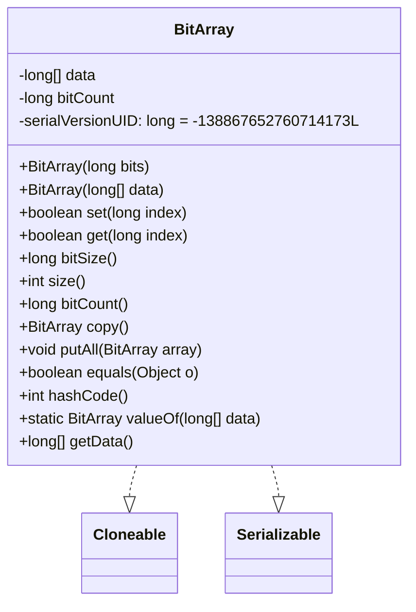

# 基础信息

|      |      |
|------|------|
| 名称 | BitArray |
| 编码语言 | .java |
| 代码路径 | WeFe/fusion/fusion-service/src/main/java/com/welab/wefe/data/fusion/service/utils/bf/BitArray.java |
| 包名 | com.welab.wefe.data.fusion.service.utils.bf |
| 依赖项 | ['java.math.RoundingMode', 'java.util.Arrays', 'javax.annotation.Nullable', 'com.google.common.base.Preconditions', 'com.google.common.math.LongMath', 'com.google.common.primitives.Ints'] |
| 概述说明 | BitArray类实现位数组功能，支持设置、获取、复制、合并等操作，使用long数组存储数据，包含位计数和大小查询方法。 |

# 说明

BitArray类是一个实现Cloneable和Serializable接口的位数组数据结构，使用long数组存储位数据。构造函数支持按位数或直接传入long数组初始化，自动计算已设置的位数。提供设置、获取位状态的方法，支持位数组复制、合并操作。包含计算位大小、数组长度、已设置位数的方法。重写了equals和hashCode方法用于比较位数组内容。包含静态工厂方法valueOf用于从long数组创建实例，并自动去除末尾的零值。

# 类列表 Class Summary

| 名称   | 类型  | 说明 |
|-------|------|-------------|
| BitArray | class | BitArray类实现位数组功能，支持设置、获取、复制、合并等操作，使用long数组存储数据，包含位计数和大小计算，重写equals和hashCode方法。 |

## 类 BitArray

|      |      |
|------|------|
| 访问范围 | public |
| 类型 | class |
| 名称 | BitArray |
| 说明 | BitArray类实现位数组功能，支持设置、获取、复制、合并等操作，使用long数组存储数据，包含位计数和大小计算，重写equals和hashCode方法。 |

### UML类图

类图描述：BitArray类实现了Cloneable和Serializable接口，用于高效处理位操作。核心数据结构是long数组data，每个元素存储64位。提供位设置(set)、获取(get)、计数(bitCount)等操作，支持复制(copy)、合并(putAll)等功能。valueOf方法可创建优化后的实例，去除尾部零值。equals和hashCode基于data数组实现。注释中的toByteArray方法被保留但未实现。

### 内部方法调用关系图

```mermaid
graph TD
    A["类BitArray"]
    B["属性: long[] data"]
    C["属性: long bitCount"]
    D["构造方法: BitArray(long bits)"]
    E["构造方法: BitArray(long[] data)"]
    F["方法: boolean set(long index)"]
    G["方法: boolean get(long index)"]
    H["方法: long bitSize()"]
    I["方法: int size()"]
    J["方法: long bitCount()"]
    K["方法: BitArray copy()"]
    L["方法: void putAll(BitArray array)"]
    M["方法: boolean equals(Object o)"]
    N["方法: int hashCode()"]
    O["静态方法: BitArray valueOf(long[] data)"]
    P["方法: long[] getData()"]

    A --> B
    A --> C
    A --> D
    A --> E
    A --> F
    A --> G
    A --> H
    A --> I
    A --> J
    A --> K
    A --> L
    A --> M
    A --> N
    A --> O
    A --> P
```

流程图描述了BitArray类的完整结构，包含两个构造方法和12个成员方法。核心功能包括位操作(set/get)、容量计算(bitSize/size)、位计数(bitCount)、数据复制(copy)、数组合并(putAll)以及对象比较(equals/hashCode)。该类通过long数组实现位存储，每个long可存储64位，构造方法会自动计算初始位数量，valueOf方法会优化去除尾部零值。

### 字段列表 Field List

| 名称  | 类型  | 说明 |
|-------|-------|------|
| serialVersionUID = -138867652760714173L | long | 定义了一个私有静态不可变的序列化版本ID，值为-138867652760714173L，用于确保类版本兼容性。 |
| data | long[] | 声明一个不可变的长整型数组data。 |
| bitCount | long | 变量bitCount用于存储长整型位数计数。 |

### 方法列表

| 名称  | 类型  | 说明 |
|-------|-------|------|
| valueOf | BitArray | 静态方法将长整型数组转为BitArray，跳过末尾的零值元素，仅复制非零部分生成新对象。 |
| size | int | 该方法返回当前对象数据数组的长度。 |
| getData | long[] | 方法返回长整型数组data。 |
| equals | boolean | 该方法检查对象是否为BitArray类型，若是则比较数据数组是否相同，否则返回false。 |
| hashCode | int | 该方法返回对象数据的哈希码，基于数组内容计算。 |
| bitCount | long | 方法返回bitCount的值。 |
| set | boolean | 设置指定索引位为1，若原值为0则更新数据并返回true，否则返回false。 |
| putAll | void | 合并两个等长BitArray的数据，更新bitCount为总位数。 |
| bitSize | long | 方法返回数据长度乘以64的长整型值，表示总比特数。 |
| get | boolean | 检查长整型索引对应位是否为1，通过位运算获取数据数组中的值并判断。 |
| copy | BitArray | 创建一个新的BitArray对象，其数据是当前对象数据的克隆副本。 |

