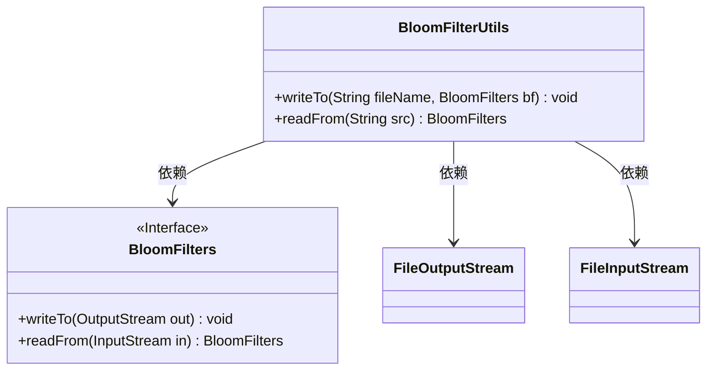
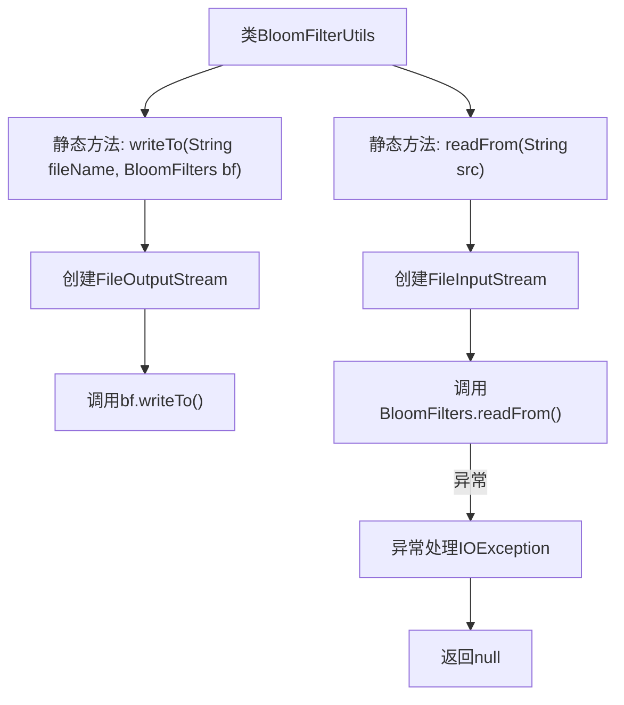

# 基础信息

|      |      |
|------|------|
| 名称 | BloomFilterUtils |
| 编码语言 | .java |
| 代码路径 | WeFe/fusion/fusion-service/src/main/java/com/welab/wefe/data/fusion/service/utils/bf/BloomFilterUtils.java |
| 包名 | com.welab.wefe.data.fusion.service.utils.bf |
| 依赖项 | ['java.io.FileInputStream', 'java.io.FileOutputStream', 'java.io.IOException'] |
| 概述说明 | BloomFilterUtils类提供写入和读取布隆过滤器的方法，分别通过writeTo和readFrom实现文件操作。 |

# 说明

BloomFilterUtils类提供了两个静态方法用于布隆过滤器的文件读写操作。writeTo方法将布隆过滤器对象序列化后写入指定文件，使用FileOutputStream实现，文件以覆盖模式打开。readFrom方法从指定文件读取数据并反序列化为布隆过滤器对象，使用FileInputStream实现，若发生IO异常会打印堆栈信息并返回null。这两个方法都处理了基本的IO操作，但readFrom方法的异常处理较为简单。

# 类列表 Class Summary

| 名称   | 类型  | 说明 |
|-------|------|-------------|
| BloomFilterUtils | class | BloomFilterUtils类提供读写布隆过滤器的方法：writeTo将布隆过滤器写入文件，readFrom从文件读取布隆过滤器。 |

## 类 BloomFilterUtils

|      |      |
|------|------|
| 访问范围 | public |
| 类型 | class |
| 名称 | BloomFilterUtils |
| 说明 | BloomFilterUtils类提供读写布隆过滤器的方法：writeTo将布隆过滤器写入文件，readFrom从文件读取布隆过滤器。 |

### UML类图

这段代码展示了一个工具类`BloomFilterUtils`，它提供了将布隆过滤器(`BloomFilters`)序列化到文件以及从文件反序列化的静态方法。类图中`BloomFilters`被标记为接口，包含读写方法。工具类依赖于`BloomFilters`接口和Java IO类(`FileOutputStream`/`FileInputStream`)来实现文件操作功能，其中写操作强制覆盖文件，读操作在异常时返回null。

### 内部方法调用关系图

该流程图展示了BloomFilterUtils工具类的两个核心方法。writeTo方法接收文件名和布隆过滤器对象，通过文件输出流将过滤器数据写入文件；readFrom方法从指定文件读取数据并重建布隆过滤器对象，包含完整的异常处理流程。两个方法都涉及文件IO操作，分别使用输出流和输入流进行数据持久化和恢复，其中readFrom方法在发生IO异常时会打印堆栈并返回null。整个流程清晰地呈现了类方法的调用链和异常处理路径。

### 字段列表 Field List

| 名称  | 类型  | 说明 |
|-------|-------|------|

### 方法列表

| 名称  | 类型  | 说明 |
|-------|-------|------|
| writeTo | void | 静态方法writeTo将BloomFilters对象写入指定文件，覆盖已有内容，可能抛出IOException。 |
| readFrom | BloomFilters | 静态方法从文件路径读取布隆过滤器，异常时返回空。 |

