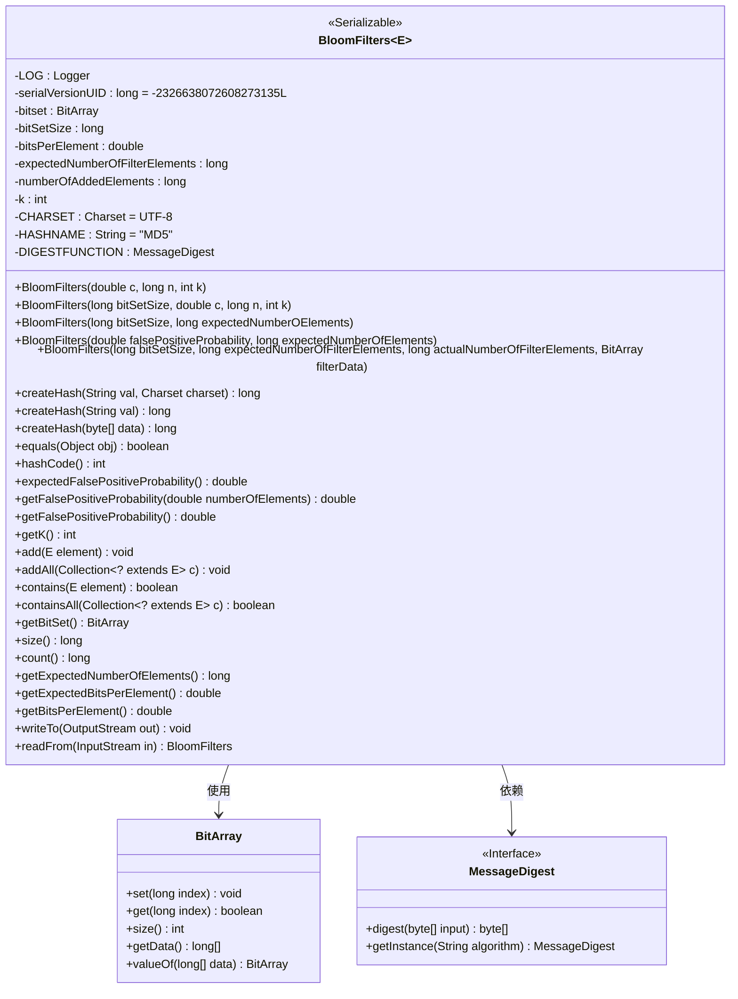

# 基础信息

|      |      |
|------|------|
| 名称 | BloomFilters |
| 编码语言 | .java |
| 代码路径 | WeFe/fusion/fusion-service/src/main/java/com/welab/wefe/data/fusion/service/utils/bf/BloomFilters.java |
| 包名 | com.welab.wefe.data.fusion.service.utils.bf |
| 依赖项 | ['java.io.DataInputStream', 'java.io.DataOutputStream', 'java.io.IOException', 'java.io.InputStream', 'java.io.OutputStream', 'java.io.Serializable', 'java.nio.charset.Charset', 'java.security.MessageDigest', 'java.security.NoSuchAlgorithmException', 'java.util.Collection', 'org.slf4j.Logger', 'org.slf4j.LoggerFactory', 'com.google.common.base.Preconditions'] |
| 概述说明 | BloomFilters类实现了一个可序列化的布隆过滤器，包含位数组、哈希函数、元素添加和查询功能，支持计算误判率和序列化操作。 |

# 说明

这是一个实现布隆过滤器（Bloom Filter）的Java类，用于高效判断元素是否存在。类包含核心属性如位数组、元素数量、哈希函数数量等，支持通过不同参数构造过滤器。提供添加元素、检查存在性、计算误判率等功能，并实现序列化接口以便存储和读取。使用MD5哈希算法生成摘要，支持批量操作和自定义参数配置，适用于大规模数据去重场景。

# 类列表 Class Summary

| 名称   | 类型  | 说明 |
|-------|------|-------------|
| BloomFilters | class | BloomFilters类实现了一个可序列化的布隆过滤器，包含位数组、哈希函数、元素添加和查询功能，支持计算误判率和序列化操作。 |

## 类 BloomFilters

|      |      |
|------|------|
| 访问范围 | public |
| 类型 | class |
| 名称 | BloomFilters |
| 说明 | BloomFilters类实现了一个可序列化的布隆过滤器，包含位数组、哈希函数、元素添加和查询功能，支持计算误判率和序列化操作。 |

### UML类图

类图描述：该图展示了一个泛型BloomFilters类的结构，实现了Serializable接口，包含核心位数组操作、哈希计算和误判率计算功能。类中封装了BitArray用于位操作，依赖MessageDigest进行哈希计算，提供多种构造方法以适应不同场景，支持元素添加、查询和序列化操作。关键属性包括位集大小、哈希函数数量、元素数量等，通过静态方法实现哈希生成和反序列化功能。

### 内部方法调用关系图

```mermaid
graph TD
    A["类BloomFilters<E>"]
    B["静态属性: Logger LOG"]
    C["静态属性: long serialVersionUID"]
    D["静态属性: Charset CHARSET"]
    E["静态属性: String HASHNAME"]
    F["静态属性: MessageDigest DIGESTFUNCTION"]
    G["静态初始化块: 初始化DIGESTFUNCTION"]
    H["实例属性: BitArray bitset"]
    I["实例属性: long bitSetSize"]
    J["实例属性: double bitsPerElement"]
    K["实例属性: long expectedNumberOfFilterElements"]
    L["实例属性: long numberOfAddedElements"]
    M["实例属性: int k"]
    N["构造方法: BloomFilters(double c, long n, int k)"]
    O["构造方法: BloomFilters(long bitSetSize, double c, long n, int k)"]
    P["构造方法: BloomFilters(long bitSetSize, long expectedNumberOElements)"]
    Q["构造方法: BloomFilters(double falsePositiveProbability, long expectedNumberOfElements)"]
    R["构造方法: BloomFilters(long bitSetSize, long expectedNumberOfFilterElements, long actualNumberOfFilterElements, BitArray filterData)"]
    S["静态方法: long createHash(String val, Charset charset)"]
    T["静态方法: long createHash(String val)"]
    U["静态方法: long createHash(byte[] data)"]
    V["实例方法: boolean equals(Object obj)"]
    W["实例方法: int hashCode()"]
    X["实例方法: double expectedFalsePositiveProbability()"]
    Y["实例方法: double getFalsePositiveProbability(double numberOfElements)"]
    Z["实例方法: double getFalsePositiveProbability()"]
    AA["实例方法: int getK()"]
    AB["实例方法: void add(E element)"]
    AC["实例方法: void addAll(Collection<? extends E> c)"]
    AD["实例方法: boolean contains(E element)"]
    AE["实例方法: boolean containsAll(Collection<? extends E> c)"]
    AF["实例方法: BitArray getBitSet()"]
    AG["实例方法: long size()"]
    AH["实例方法: long count()"]
    AI["实例方法: long getExpectedNumberOfElements()"]
    AJ["实例方法: double getExpectedBitsPerElement()"]
    AK["实例方法: double getBitsPerElement()"]
    AL["实例方法: void writeTo(OutputStream out)"]
    AM["静态方法: BloomFilters readFrom(InputStream in)"]

    A --> B
    A --> C
    A --> D
    A --> E
    A --> F
    A --> G
    A --> H
    A --> I
    A --> J
    A --> K
    A --> L
    A --> M
    A --> N
    A --> O
    A --> P
    A --> Q
    A --> R
    A --> S
    A --> T
    A --> U
    A --> V
    A --> W
    A --> X
    A --> Y
    A --> Z
    A --> AA
    A --> AB
    A --> AC
    A --> AD
    A --> AE
    A --> AF
    A --> AG
    A --> AH
    A --> AI
    A --> AJ
    A --> AK
    A --> AL
    A --> AM
```

这段代码实现了一个泛型布隆过滤器(Bloom Filter)数据结构，主要用于高效判断元素是否存在于集合中。类中包含多个构造方法，支持通过不同参数(如误判率、预期元素数量等)初始化过滤器，提供元素添加(add/addAll)和查询(contains/containsAll)功能，并实现序列化接口支持读写操作。核心逻辑通过位数组(BitArray)和多个哈希函数实现空间高效的概率型数据存储，同时包含误判率计算、哈希生成等辅助方法。静态初始化块确保哈希算法实例的安全初始化。

### 字段列表 Field List

| 名称  | 类型  | 说明 |
|-------|-------|------|
| DIGESTFUNCTION | MessageDigest | 声明一个静态不可变的MessageDigest对象DIGESTFUNCTION。 |
| expectedNumberOfFilterElements | long | 私有长整型变量，用于记录预期过滤器元素数量。 |
| bitsPerElement | double | 私有双精度浮点数变量，表示每个元素的位数。 |
| bitset | BitArray | 私有位数组变量bitset。 |
| k | int | 声明一个私有整型变量k。 |
| HASHNAME = "MD5" | String | 定义静态常量字符串HASHNAME，值为MD5。 |
| CHARSET = Charset.forName("UTF-8") | Charset | 定义UTF-8字符集常量CHARSET。 |
| serialVersionUID = -2326638072608273135L | long | 私有静态常量序列化ID，值为-2326638072608273135L。 |
| LOG = LoggerFactory.getLogger(BloomFilters.class) | Logger | BloomFilters类中定义了一个受保护静态常量LOG，用于日志记录。 |
| numberOfAddedElements | long | 私有长整型变量，记录新增元素数量。 |
| bitSetSize | long | 私有长整型变量bitSetSize，用于存储位集大小。 |

### 方法列表

| 名称  | 类型  | 说明 |
|-------|-------|------|
| size | long | 该方法返回bitSetSize的值，表示位集的大小。 |
| createHash | long | 静态方法createHash接收字符串参数val，调用重载方法createHash并返回长整型哈希值，默认使用CHARSET字符集。 |
| getFalsePositiveProbability | double | 方法返回基于已添加元素数量的假阳性概率。 |
| expectedFalsePositiveProbability | double | 方法返回预期误判概率，基于预设的过滤器元素数量计算。 |
| equals | boolean | equals方法检查对象是否为null、类是否相同、预期元素数量、哈希函数数量、位集大小和位集内容是否一致，全部匹配则返回true。 |
| getBitSet | BitArray | 方法返回BitArray类型的bitset对象。 |
| getK | int | 方法返回整型变量k的值。 |
| contains | boolean | 检查元素是否存在于布隆过滤器中，通过k次哈希计算验证位集对应位是否全为1，全为1则存在，否则不存在。 |
| containsAll | boolean | 该方法检查当前集合是否包含指定集合中的所有元素。遍历指定集合，若任一元素不存在则返回false，否则返回true。 |
| addAll | void | 该方法遍历集合c中的每个元素，并逐个调用add方法将它们添加到当前集合中。 |
| getFalsePositiveProbability | double | 计算布隆过滤器误判概率，公式为(1 - e^(-k * n / m))^k，其中n为元素数量，m为位集大小，k为哈希函数数量。 |
| add | void | 该方法将元素转换为字符串，生成k个哈希值并映射到位集中，最后增加元素计数。 |
| createHash | long | 静态方法createHash通过同步调用摘要函数处理字节数组，生成并返回一个由前4字节组成的64位长整型哈希值。 |
| count | long | 该方法返回已添加元素的数量。 |
| getExpectedNumberOfElements | long | 方法返回预期过滤器元素数量。 |
| getExpectedBitsPerElement | double | 方法返回每个元素的预期比特数，值为bitsPerElement。 |
| getBitsPerElement | double | 该方法计算每个元素的平均比特数，结果为bitSetSize除以numberOfAddedElements的浮点值。 |
| writeTo | void | 该方法将数据写入输出流，包括位集大小、预期元素数量、底层数组大小及数组数据，操作前后记录日志。 |
| readFrom | BloomFilters | 从输入流读取布隆过滤器数据，包括位数、元素个数和底层数组，构造对象返回。异常时抛出IO异常。 |
| hashCode | int | 该方法重写hashCode，基于bitset、预期元素数、位集大小和k值计算哈希值，使用61作为乘数确保分布均匀。 |
| createHash | long | 该方法通过指定字符集将字符串转换为字节数组，并调用内部方法生成哈希值。 |

