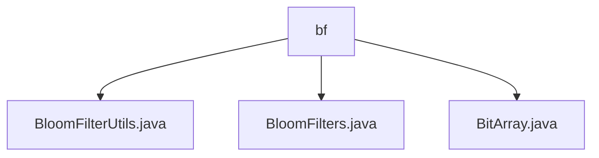

# 基础信息

|      |      |
|------|------|
| 名称 | bf |
| 编码语言 | .java |
| 代码路径 | WeFe/fusion/fusion-service/src/main/java/com/welab/wefe/data/fusion/service/utils/bf |
| 包名 | docs.fusion.fusion-service.src.main.java.com.welab.wefe.data.fusion.service.utils.bf |
| 概述说明 | BloomFilterUtils类提供布隆过滤器文件读写方法，支持序列化和反序列化。BloomFilters类实现布隆过滤器核心功能，含位数组、哈希计算等。BitArray类封装位数组操作，支持初始化、复制和合并。 |

# 说明

## 概述  
该模块核心职责是实现高性能布隆过滤器及其配套工具，支持元素存在性判断和大规模数据去重。接口规范包括序列化读写（writeTo/readFrom）、元素操作（add/contains）和位数组管理（set/get/merge）。关键数据结构包含位数组（BitArray）、哈希配置和误判率计算参数。外部依赖仅涉及Java标准IO和序列化库。例如，BloomFilterUtils提供文件持久化功能，BitArray实现底层位操作优化。

## 主要业务场景  
典型应用包括数据预处理去重和快速存在性校验，类似事件总线模式的消息过滤。完整流程为：初始化布隆过滤器→批量添加元素→序列化存储→反序列化加载→查询判断。例如，BloomFilters类支持MD5哈希批量处理，BitArray通过long数组优化存储效率。集成案例展示文件IO与内存位操作的高效结合，适用于分布式环境下的数据一致性维护。

### 包内部结构视图

该流程图展示了WeFe项目中BloomFilter工具类的文件结构关系。bf作为父级目录节点，下辖三个Java工具类文件：BloomFilterUtils.java、BloomFilters.java和BitArray.java。这些文件都属于数据融合服务中的布隆过滤器工具包，用于实现高效的位数组操作和布隆过滤器算法。

# 文件列表

| 名称   | 类型  | 说明 |
|-------|------|-------------|
| [BloomFilterUtils.java](BloomFilterUtils.md) | file | BloomFilterUtils类提供写入和读取布隆过滤器的方法，分别通过writeTo和readFrom实现文件操作。 |
| [BloomFilters.java](BloomFilters.md) | file | BloomFilters类实现了一个可序列化的布隆过滤器，包含位数组、哈希函数、元素添加和查询功能，支持计算误判率和序列化操作。 |
| [BitArray.java](BitArray.md) | file | BitArray类实现位数组功能，支持设置、获取、复制、合并等操作，使用long数组存储数据，包含位计数和大小查询方法。 |

