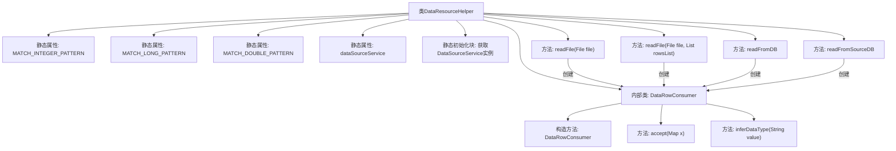

# 基础信息

|      |      |
|------|------|
| 名称 | DataResouceHelper |
| 编码语言 | .java |
| 代码路径 | WeFe/fusion/fusion-service/src/main/java/com/welab/wefe/data/fusion/service/utils/dataresouce/DataResouceHelper.java |
| 包名 | com.welab.wefe.data.fusion.service.utils.dataresouce |
| 依赖项 | ['com.welab.wefe.common.StatusCode', 'com.welab.wefe.common.exception.StatusCodeWithException', 'com.welab.wefe.common.util.StringUtil', 'com.welab.wefe.common.web.Launcher', 'com.welab.wefe.common.wefe.enums.ColumnDataType', 'com.welab.wefe.data.fusion.service.database.entity.DataSetColumnOutputModel', 'com.welab.wefe.data.fusion.service.database.entity.DataSourceMySqlModel', 'com.welab.wefe.data.fusion.service.dto.entity.dataset.DataSetPreviewOutputModel', 'com.welab.wefe.data.fusion.service.manager.JdbcManager', 'com.welab.wefe.data.fusion.service.service.DataSourceService', 'com.welab.wefe.data.fusion.service.utils.AbstractDataSetReader', 'com.welab.wefe.data.fusion.service.utils.CsvDataSetReader', 'com.welab.wefe.data.fusion.service.utils.ExcelDataSetReader', 'java.io.File', 'java.io.IOException', 'java.sql.Connection', 'java.util.ArrayList', 'java.util.LinkedHashMap', 'java.util.List', 'java.util.Map', 'java.util.function.Consumer', 'java.util.regex.Pattern', 'java.util.stream.Collectors'] |
| 概述说明 | DataResouceHelper类提供读取文件和数据库数据的方法，支持CSV/Excel格式，推断数据类型并生成预览输出模型。 |

# 说明

DataResouceHelper类提供数据集文件解析和数据库查询功能。包含两个主要方法：readFile用于解析CSV或Excel文件，自动推断列数据类型；readFromDB和readFromSourceDB用于从数据库读取数据。内部类DataRowConsumer处理数据行，通过正则表达式推断整数、长整型、浮点数和字符串类型。类使用单例模式获取DataSourceService实例，支持带行筛选的文件读取和数据库查询，输出包含元数据和原始数据的DataSetPreviewOutputModel对象。

# 类列表 Class Summary

| 名称   | 类型  | 说明 |
|-------|------|-------------|
| DataResouceHelper | class | DataResouceHelper类提供数据集文件解析功能，支持CSV/Excel格式，推断数据类型，并可从数据库读取数据。包含两个readFile方法和两个readFromDB方法，处理数据预览和元数据生成。 |

## 类 DataResouceHelper

|      |      |
|------|------|
| 访问范围 | public |
| 类型 | class |
| 名称 | DataResouceHelper |
| 说明 | DataResouceHelper类提供数据集文件解析功能，支持CSV/Excel格式，推断数据类型，并可从数据库读取数据。包含两个readFile方法和两个readFromDB方法，处理数据预览和元数据生成。 |

### UML类图

```mermaid
classDiagram
    class DataResouceHelper {
        -Pattern MATCH_INTEGER_PATTERN
        -Pattern MATCH_LONG_PATTERN
        -Pattern MATCH_DOUBLE_PATTERN
        -static DataSourceService dataSourceService
        +static DataSetPreviewOutputModel readFile(File file) throws IOException, StatusCodeWithException
        +static DataSetPreviewOutputModel readFile(File file, List~String~ rowsList) throws IOException, StatusCodeWithException
        +static DataSetPreviewOutputModel readFromDB(String dataSourceId, String sql, List~String~ rowList) throws Exception
        +static DataSetPreviewOutputModel readFromSourceDB(String dataSourceId, String sql) throws Exception
    }

    class DataSetPreviewOutputModel {
        +List~String~ header
        +List~Map~String,Object~~ rawDataList
        +List~DataSetColumnOutputModel~ metadataList
        +setHeader(List~String~ header)
        +setMetadataList(List~DataSetColumnOutputModel~ metadataList)
    }

    class DataSetColumnOutputModel {
        +String name
        +ColumnDataType dataType
        +setName(String name)
        +setDataType(ColumnDataType dataType)
        +getDataType() ColumnDataType
    }

    class DataRowConsumer {
        -Map~String, DataSetColumnOutputModel~ metadata
        -DataSetPreviewOutputModel output
        -boolean allColumnKnowDataType
        +DataRowConsumer(Map~String, DataSetColumnOutputModel~ metadata, DataSetPreviewOutputModel output)
        +accept(Map~String, Object~ x)
        -inferDataType(String value) ColumnDataType
    }

    class AbstractDataSetReader {
        <<Interface>>
        +getHeader() List~String~
        +read(Consumer~Map~String,Object~~ consumer, int batchSize, int maxCount)
        +readWithSelectRow(Consumer~Map~String,Object~~ consumer, int batchSize, int maxCount, List~String~ rowsList)
        +close()
    }

    class CsvDataSetReader {
        +CsvDataSetReader(File file)
    }

    class ExcelDataSetReader {
        +ExcelDataSetReader(File file)
    }

    class DataSourceService {
        <<Interface>>
        +getDataSourceById(String dataSourceId) DataSourceMySqlModel
    }

    class DataSourceMySqlModel {
        +String databaseType
        +String host
        +int port
        +String userName
        +String password
        +String databaseName
    }

    class JdbcManager {
        +getConnection(String databaseType, String host, int port, String userName, String password, String databaseName) Connection
        +getRowHeaders(Connection conn, String sql) List~String~
        +readWithFieldRow(Connection conn, String sql, Consumer~Map~String,Object~~ consumer, int limit, List~String~ fields)
    }

    DataResouceHelper --> DataSetPreviewOutputModel : 使用
    DataResouceHelper --> DataRowConsumer : 创建
    DataResouceHelper --> AbstractDataSetReader : 依赖
    DataResouceHelper --> DataSourceService : 依赖
    DataResouceHelper --> JdbcManager : 使用
    DataRowConsumer --> DataSetColumnOutputModel : 操作
    DataRowConsumer --> DataSetPreviewOutputModel : 更新
    AbstractDataSetReader <|-- CsvDataSetReader : 实现
    AbstractDataSetReader <|-- ExcelDataSetReader : 实现
    JdbcManager --> DataSourceMySqlModel : 使用
    DataSourceService --> DataSourceMySqlModel : 返回
```

类图描述：该图展示了DataResourceHelper工具类的核心结构，它通过文件读取（CSV/Excel）和数据库查询两种方式获取数据，并使用内部类DataRowConsumer处理数据行。主要包含数据集预览模型(DataSetPreviewOutputModel)、列模型(DataSetColumnOutputModel)、数据读取器接口(AbstractDataSetReader)及其实现类，以及与数据库交互的JdbcManager组件。系统通过正则表达式进行数据类型推断，并支持从不同数据源获取结构化数据。

### 内部方法调用关系图

流程图描述：该流程图展示了DataResourceHelper类的结构，包含静态属性、初始化块、主要文件读取方法和数据库读取方法，以及内部类DataRowConsumer的实现。DataRowConsumer负责处理数据行并推断数据类型，通过正则表达式模式匹配确定数值类型。所有读取方法都会创建DataRowConsumer实例来处理数据，最终返回包含元数据和预览数据的DataSetPreviewOutputModel对象。

### 字段列表 Field List

| 名称  | 类型  | 说明 |
|-------|-------|------|
| MATCH_INTEGER_PATTERN = Pattern.compile("^-?\\d{1,9}$") | Pattern | 定义静态常量正则表达式，匹配1到9位可选负整数。 |
| MATCH_LONG_PATTERN = Pattern.compile("^-?\\d{10,}$") | Pattern | 定义静态常量MATCH_LONG_PATTERN，使用正则匹配10位及以上数字（可含负号）。 |
| MATCH_DOUBLE_PATTERN = Pattern.compile("^-?\\d+\\.\\d+$") | Pattern | 定义静态常量MATCH_DOUBLE_PATTERN，使用正则表达式匹配带可选负号的浮点数。 |
| dataSourceService | DataSourceService | 私有静态数据源服务实例。 |

### 方法列表

| 名称  | 类型  | 说明 |
|-------|-------|------|
| readFile | DataSetPreviewOutputModel | 读取文件数据并生成预览输出模型，处理CSV或Excel格式，包含列头和数据行，最后返回带元数据的输出结果。 |
| readFile | DataSetPreviewOutputModel | 该方法读取文件数据并生成预览输出模型。根据文件类型选择CSV或Excel读取器，处理表头和数据行，最终返回包含表头、元数据和部分数据的预览模型。 |
| readFromDB | DataSetPreviewOutputModel | 从数据库读取数据，检查数据源是否存在，验证字段唯一性，返回数据集预览模型。 |
| readFromSourceDB | DataSetPreviewOutputModel | 静态方法readFromSourceDB从指定数据源执行SQL查询，验证数据存在性、SQL非空及字段唯一性，处理后返回包含表头和元数据的DataSetPreviewOutputModel对象。 |

