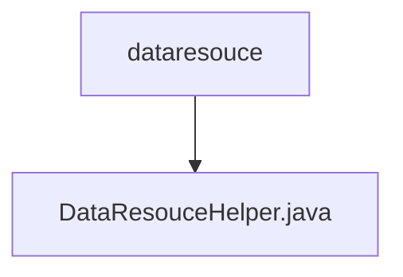

# 基础信息

|      |      |
|------|------|
| 名称 | dataresouce |
| 编码语言 | .java |
| 代码路径 | WeFe/fusion/fusion-service/src/main/java/com/welab/wefe/data/fusion/service/utils/dataresouce |
| 包名 | docs.fusion.fusion-service.src.main.java.com.welab.wefe.data.fusion.service.utils.dataresouce |
| 概述说明 | DataResouceHelper类提供读取文件和数据库数据的方法，支持CSV/Excel格式，推断数据类型并生成预览输出模型。 |

# 说明

DataResouceHelper类提供数据集文件解析和数据库查询功能。包含两个主要方法：readFile用于解析CSV或Excel文件，自动推断列数据类型；readFromDB和readFromSourceDB用于从数据库读取数据。内部类DataRowConsumer处理数据行，通过正则表达式推断整数、长整型、浮点数和字符串类型。类使用单例模式获取DataSourceService实例，支持带行筛选的文件读取和数据库查询，输出包含元数据和原始数据的DataSetPreviewOutputModel对象。

### 包内部结构视图

该流程图展示了dataresouce目录与其包含的DataResouceHelper.java文件之间的层级关系。dataresouce作为父级目录，DataResouceHelper.java是其唯一的子节点文件，体现了简单的单层目录结构。这种结构常见于工具类或辅助功能的代码组织方式。

# 文件列表

| 名称   | 类型  | 说明 |
|-------|------|-------------|
| [DataResouceHelper.java](DataResouceHelper.md) | file | DataResouceHelper类提供读取文件和数据库数据的方法，支持CSV/Excel格式，推断数据类型并生成预览输出模型。 |

