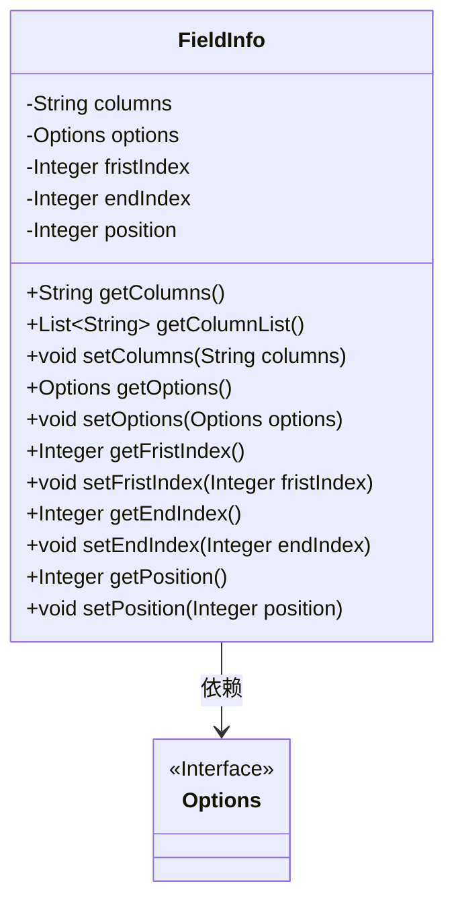

# 基础信息

|      |      |
|------|------|
| 名称 | FieldInfo |
| 编码语言 | .java |
| 代码路径 | WeFe/fusion/fusion-service/src/main/java/com/welab/wefe/data/fusion/service/utils/primarykey/FieldInfo.java |
| 包名 | com.welab.wefe.data.fusion.service.utils.primarykey |
| 依赖项 | ['com.welab.wefe.data.fusion.service.enums.Options', 'java.util.Arrays', 'java.util.List'] |
| 概述说明 | FieldInfo类包含columns、options、fristIndex、endIndex和position字段，提供getter和setter方法，支持将columns转为列表。 |

# 说明

FieldInfo类包含五个私有属性：columns字符串、options对象、fristIndex整数、endIndex整数和position整数。提供了各属性的getter和setter方法，其中getColumnList方法将columns按逗号分割为字符串列表。该类用于管理字段信息，支持设置和获取字段列、选项及索引位置等数据。

# 类列表 Class Summary

| 名称   | 类型  | 说明 |
|-------|------|-------------|
| FieldInfo | class | FieldInfo类包含columns、options、fristIndex、endIndex和position属性，提供对应的getter和setter方法，其中columns可转换为列表。 |

## 类 FieldInfo

|      |      |
|------|------|
| 访问范围 | public |
| 类型 | class |
| 名称 | FieldInfo |
| 说明 | FieldInfo类包含columns、options、fristIndex、endIndex和position属性，提供对应的getter和setter方法，其中columns可转换为列表。 |

### UML类图

这段代码定义了一个FieldInfo类，用于存储字段信息，包含列名、选项配置、索引位置等属性。该类提供了对私有字段的标准getter/setter方法，其中getColumnList()方法将逗号分隔的列名字符串转换为列表。FieldInfo依赖于Options接口，但代码中未给出Options的具体实现。注意"fristIndex"可能存在拼写错误（应为firstIndex）。整体设计符合JavaBean规范，适合作为数据载体使用。

### 内部方法调用关系图

```mermaid
graph TD
    A["类FieldInfo"]
    B["属性: String columns"]
    C["属性: Options options"]
    D["属性: Integer fristIndex"]
    E["属性: Integer endIndex"]
    F["属性: Integer position"]
    G["方法: String getColumns()"]
    H["方法: List<String> getColumnList()"]
    I["方法: void setColumns(String columns)"]
    J["方法: Options getOptions()"]
    K["方法: void setOptions(Options options)"]
    L["方法: Integer getFristIndex()"]
    M["方法: void setFristIndex(Integer fristIndex)"]
    N["方法: Integer getEndIndex()"]
    O["方法: void setEndIndex(Integer endIndex)"]
    P["方法: Integer getPosition()"]
    Q["方法: void setPosition(Integer position)"]

    A --> B
    A --> C
    A --> D
    A --> E
    A --> F
    A --> G
    A --> H
    A --> I
    A --> J
    A --> K
    A --> L
    A --> M
    A --> N
    A --> O
    A --> P
    A --> Q
```

这段代码定义了一个名为FieldInfo的类，包含5个私有属性和对应的getter/setter方法。主要功能包括：存储以逗号分隔的列名字符串（columns）并提供分割为列表的方法（getColumnList），管理Options类型的配置项（options），以及记录索引范围（fristIndex/endIndex）和位置信息（position）。所有属性都通过标准JavaBean规范进行封装，确保数据访问的安全性。

### 字段列表 Field List

| 名称  | 类型  | 说明 |
|-------|-------|------|
| fristIndex | Integer | 私有整型变量，用于存储首个索引。 |
| options | Options | 私有成员变量options，类型为Options。 |
| position | Integer | 私有整型变量position |
| endIndex | Integer | 私有整型变量，表示结束索引。 |
| columns | String | 私有字符串变量columns。 |

### 方法列表

| 名称  | 类型  | 说明 |
|-------|-------|------|
| getFristIndex | Integer | 方法`getFristIndex`返回整型变量`fristIndex`的值。 |
| getColumnList | List<String> | 该方法将字符串按逗号分割并转为列表返回。 |
| setColumns | void | 设置列字段的方法，将参数columns赋值给当前对象的columns属性。 |
| getOptions | Options | 方法返回options对象。 |
| getColumns | String | 方法返回字符串变量columns的值。 |
| getEndIndex | Integer | 获取结束索引的整数值。 |
| setEndIndex | void | 设置结束索引的方法，将参数endIndex赋值给类的成员变量endIndex。 |
| setFristIndex | void | 设置整数类型变量fristIndex的值。 |
| setOptions | void | 设置选项方法，将传入的options参数赋值给当前对象的options属性。 |
| getPosition | Integer | 方法返回整型变量position的值。 |
| setPosition | void | 设置对象位置属性的方法，参数为整型position。 |

