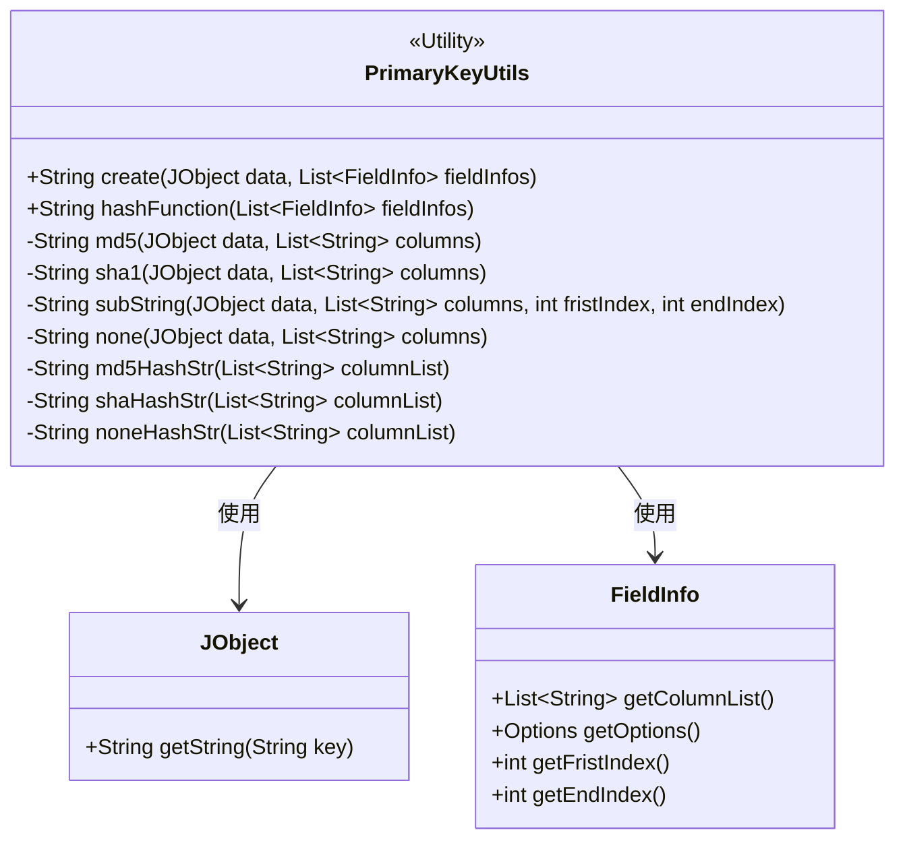
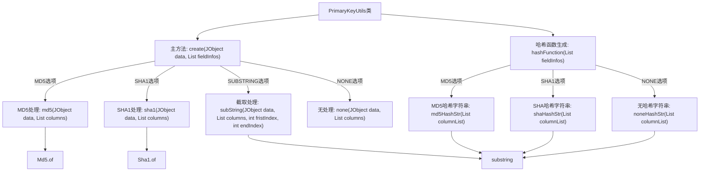

# 基础信息

|      |      |
|------|------|
| 名称 | PrimaryKeyUtils |
| 编码语言 | .java |
| 代码路径 | WeFe/fusion/fusion-service/src/main/java/com/welab/wefe/data/fusion/service/utils/primarykey/PrimaryKeyUtils.java |
| 包名 | com.welab.wefe.data.fusion.service.utils.primarykey |
| 依赖项 | ['com.welab.wefe.common.util.JObject', 'com.welab.wefe.common.util.Md5', 'com.welab.wefe.common.util.Sha1', 'java.util.List'] |
| 概述说明 | PrimaryKeyUtils类提供主键生成功能，支持MD5、SHA1、子串截取和原始拼接四种方式，根据字段配置处理数据生成主键。 |

# 说明

PrimaryKeyUtils类提供主键生成功能，支持MD5、SHA1、SUBSTRING和NONE四种处理方式。create方法根据FieldInfo配置对JObject数据中的指定列进行相应处理并拼接结果。hashFunction方法生成描述处理规则的字符串，包含列名和算法类型。内部方法md5、sha1、subString和none分别实现不同算法逻辑，均通过拼接指定列值后进行处理。辅助方法md5HashStr、shaHashStr和noneHashStr用于构建规则描述字符串。

# 类列表 Class Summary

| 名称   | 类型  | 说明 |
|-------|------|-------------|
| PrimaryKeyUtils | class | PrimaryKeyUtils类提供主键生成功能，支持MD5、SHA1、子串截取和原始拼接四种方式，并包含对应的哈希函数描述方法。 |

## 类 PrimaryKeyUtils

|      |      |
|------|------|
| 访问范围 | public |
| 类型 | class |
| 名称 | PrimaryKeyUtils |
| 说明 | PrimaryKeyUtils类提供主键生成功能，支持MD5、SHA1、子串截取和原始拼接四种方式，并包含对应的哈希函数描述方法。 |

### UML类图

这段代码展示了一个主键生成工具类`PrimaryKeyUtils`，它提供了多种主键生成方式（MD5、SHA1、子字符串截取等）。该类通过接收`JObject`数据和`FieldInfo`列表，根据字段配置选择不同的处理方式。类图中清晰地展示了工具类与数据对象`JObject`和字段信息类`FieldInfo`之间的依赖关系，以及工具类内部的各种私有处理方法。这是一个典型的实用工具类设计，封装了多种主键生成算法，具有良好的扩展性和灵活性。

### 内部方法调用关系图

这段代码是PrimaryKeyUtils类，主要用于根据不同的规则生成主键。主方法create根据FieldInfo的选项（MD5、SHA1、SUBSTRING、NONE）调用相应的处理方法，将结果拼接后返回。hashFunction方法则生成描述哈希规则的字符串。流程图展示了类中方法的调用关系，从主方法到各个处理方法的逻辑分支，以及最终结果的生成路径。

### 字段列表 Field List

| 名称  | 类型  | 说明 |
|-------|-------|------|

### 方法列表

| 名称  | 类型  | 说明 |
|-------|-------|------|
| hashFunction | String | 静态方法hashFunction根据字段选项对列列表进行MD5、SHA1或无哈希处理，拼接结果后返回去除末尾加号的字符串。 |
| shaHashStr | String | 该方法将字符串列表拼接后用SHA哈希处理，返回格式为"SHA(拼接后字符串)"。 |
| md5 | String | 静态方法md5接收JObject和列名列表，拼接指定列值后返回MD5哈希值。 |
| none | String | 静态方法none接收JObject和字符串列表，遍历列表并拼接JObject中对应字段的字符串值，返回拼接结果。 |
| create | String | 静态方法根据字段选项处理数据，支持MD5、SHA1、截取或无操作，返回拼接结果。 |
| subString | String | 静态方法subString从JObject提取指定列数据拼接成字符串，并截取fristIndex到endIndex间的子串。 |
| sha1 | String | 该方法通过拼接指定列的数据生成字符串，并返回其SHA1哈希值。输入为JSON对象和列名列表，输出为哈希字符串。 |
| noneHashStr | String | 静态方法noneHashStr接收字符串列表，用"+"连接所有元素并返回结果字符串。 |
| md5HashStr | String | 该方法将字符串列表拼接为以加号分隔的字符串，并添加MD5前缀。输入列表如["a","b"]，输出"MD5(a+b)"。 |

