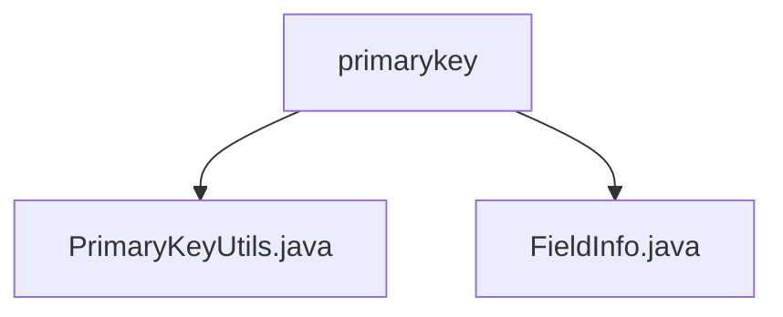

# 基础信息

|      |      |
|------|------|
| 名称 | primarykey |
| 编码语言 | .java |
| 代码路径 | WeFe/fusion/fusion-service/src/main/java/com/welab/wefe/data/fusion/service/utils/primarykey |
| 包名 | docs.fusion.fusion-service.src.main.java.com.welab.wefe.data.fusion.service.utils.primarykey |
| 概述说明 | PrimaryKeyUtils类提供主键生成功能，支持四种处理方式。FieldInfo类管理字段信息，包含列名、选项和索引等属性。两者协同处理数据生成主键。 |

# 说明

## 概述  
该模块核心职责是提供主键生成与字段信息管理功能，支持多种哈希算法处理。PrimaryKeyUtils类实现MD5/SHA1/SUBSTRING/NONE四种主键生成方式，通过拼接指定列值后应用算法；FieldInfo类管理字段列名、索引及处理选项等元数据。关键数据结构包括FieldInfo的columns字符串列表和算法选项对象。外部依赖仅为Java标准库的哈希算法实现。例如create方法可对JObject数据按列名提取值后生成MD5哈希主键。

## 主要业务场景  
典型应用是数据融合时生成唯一主键，类似ETL中的键值转换流程。业务流程为：配置FieldInfo的列名和算法类型→PrimaryKeyUtils按规则处理数据→输出哈希字符串或子串。交互模式通过getColumnList获取列名列表，结合hashFunction生成规则描述。例如对用户姓名和身份证列拼接后做SHA1哈希，生成融合数据主键。

### 包内部结构视图

该流程图展示了primarykey目录下的文件结构关系。primarykey作为父节点，包含两个子文件节点：PrimaryKeyUtils.java和FieldInfo.java。这两个Java文件位于同一层级，共同构成了该工具包的核心功能组件，用于处理数据融合服务中的主键相关操作。

# 文件列表

| 名称   | 类型  | 说明 |
|-------|------|-------------|
| [PrimaryKeyUtils.java](PrimaryKeyUtils.md) | file | PrimaryKeyUtils类提供主键生成功能，支持MD5、SHA1、子串截取和原始拼接四种方式，根据字段配置处理数据生成主键。 |
| [FieldInfo.java](FieldInfo.md) | file | FieldInfo类包含columns、options、fristIndex、endIndex和position字段，提供getter和setter方法，支持将columns转为列表。 |

