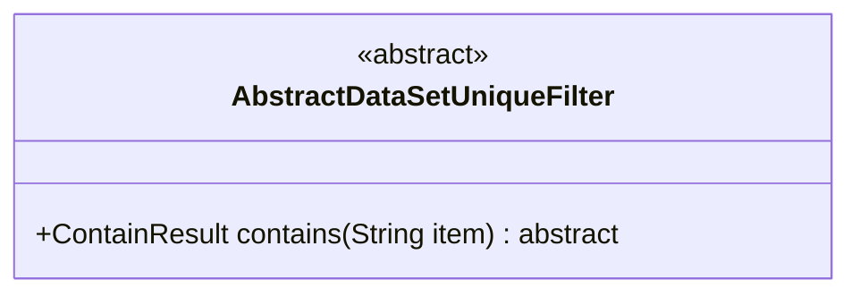
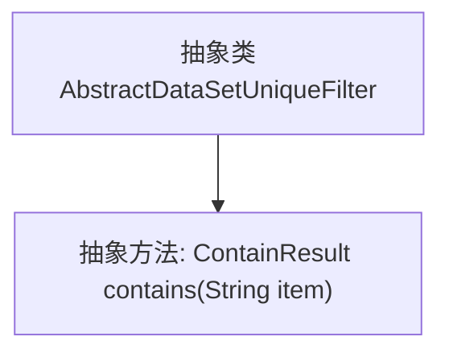

# 基础信息

|      |      |
|------|------|
| 名称 | AbstractDataSetUniqueFilter |
| 编码语言 | .java |
| 代码路径 | WeFe/fusion/fusion-service/src/main/java/com/welab/wefe/data/fusion/service/utils/unique/AbstractDataSetUniqueFilter.java |
| 包名 | com.welab.wefe.data.fusion.service.utils.unique |
| 依赖项 | [] |
| 概述说明 | 抽象类AbstractDataSetUniqueFilter定义了一个判断元素是否存在的抽象方法contains，参数为字符串item，返回ContainResult类型结果。 |

# 说明

这是一个名为AbstractDataSetUniqueFilter的抽象类，定义了一个用于判断元素是否存在的抽象方法。该类包含一个名为contains的抽象方法，接收字符串类型参数item，返回ContainResult类型结果。该方法用于确定过滤器是否包含指定元素。该抽象类为数据集唯一性过滤提供了基础框架，具体实现需由子类完成。

# 类列表 Class Summary

| 名称   | 类型  | 说明 |
|-------|------|-------------|
| AbstractDataSetUniqueFilter | class | 抽象类AbstractDataSetUniqueFilter定义了一个检查元素是否存在的抽象方法contains，参数为字符串item，返回ContainResult类型结果。 |

## 类 AbstractDataSetUniqueFilter

|      |      |
|------|------|
| 访问范围 | public abstract |
| 类型 | class |
| 名称 | AbstractDataSetUniqueFilter |
| 说明 | 抽象类AbstractDataSetUniqueFilter定义了一个检查元素是否存在的抽象方法contains，参数为字符串item，返回ContainResult类型结果。 |

### UML类图

这段类图展示了一个抽象类AbstractDataSetUniqueFilter，它定义了一个抽象方法contains()用于检查过滤器中是否包含指定元素。该类被标记为<<abstract>>表示不能被直接实例化，必须由子类实现。方法返回ContainResult类型（虽然图中未显示该类型），参数为String类型的item。这个设计为数据集的唯一性过滤提供了基础框架，具体实现需要子类完成。

### 内部方法调用关系图

这段代码定义了一个名为`AbstractDataSetUniqueFilter`的抽象类，其中包含一个抽象方法`contains`，用于判断过滤器是否包含指定元素。流程图清晰地展示了类与方法之间的从属关系，抽象类作为父节点，抽象方法作为其子节点。该设计为后续具体过滤器实现提供了统一的接口规范，强制子类必须实现`contains`方法。

### 字段列表 Field List

| 名称  | 类型  | 说明 |
|-------|-------|------|

### 方法列表

| 名称  | 类型  | 说明 |
|-------|-------|------|
| contains | ContainResult | 抽象方法检查字符串是否包含指定项，返回结果对象。 |

