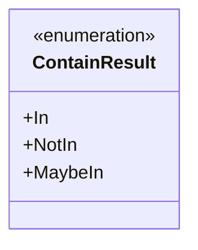
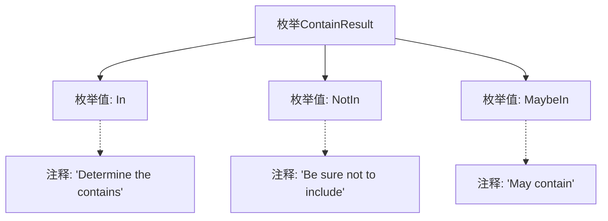

# 基础信息

|      |      |
|------|------|
| 名称 | ContainResult |
| 编码语言 | .java |
| 代码路径 | WeFe/fusion/fusion-service/src/main/java/com/welab/wefe/data/fusion/service/utils/unique/ContainResult.java |
| 包名 | com.welab.wefe.data.fusion.service.utils.unique |
| 依赖项 | [] |
| 概述说明 | 枚举ContainResult定义三种状态：In表示包含，NotIn表示不包含，MaybeIn表示可能包含。 |

# 说明

这是一个名为ContainResult的枚举类型，定义了三种可能的状态：In表示确定包含，NotIn表示确定不包含，MaybeIn表示可能包含。每种状态都有对应的注释说明其含义。

# 类列表 Class Summary

| 名称   | 类型  | 说明 |
|-------|------|-------------|
| ContainResult | enum | 枚举ContainResult定义三种状态：In表示包含，NotIn表示不包含，MaybeIn表示可能包含。 |

## 类 ContainResult

|      |      |
|------|------|
| 访问范围 | public |
| 类型 | enum |
| 名称 | ContainResult |
| 说明 | 枚举ContainResult定义三种状态：In表示包含，NotIn表示不包含，MaybeIn表示可能包含。 |

### UML类图

这段代码定义了一个名为ContainResult的枚举类型，用于表示包含关系的三种可能状态：明确包含(In)、明确不包含(NotIn)和可能包含(MaybeIn)。枚举类型在类图中用<<enumeration>>标记，展示了三个固定的枚举常量。这种设计常用于需要明确区分确定性和不确定性包含状态的场景，如集合操作、权限检查或模糊匹配等业务逻辑中。

### 内部方法调用关系图

该流程图展示了ContainResult枚举的结构，包含三个枚举值In、NotIn和MaybeIn，每个枚举值都有对应的注释说明其含义。In表示确定包含，NotIn表示确定不包含，MaybeIn表示可能包含。通过箭头连接清晰地展现了枚举类与其成员之间的层级关系，注释与对应枚举值的关联也通过虚线箭头标明。

### 字段列表 Field List

| 名称  | 类型  | 说明 |
|-------|-------|------|

### 方法列表

| 名称  | 类型  | 说明 |
|-------|-------|------|

