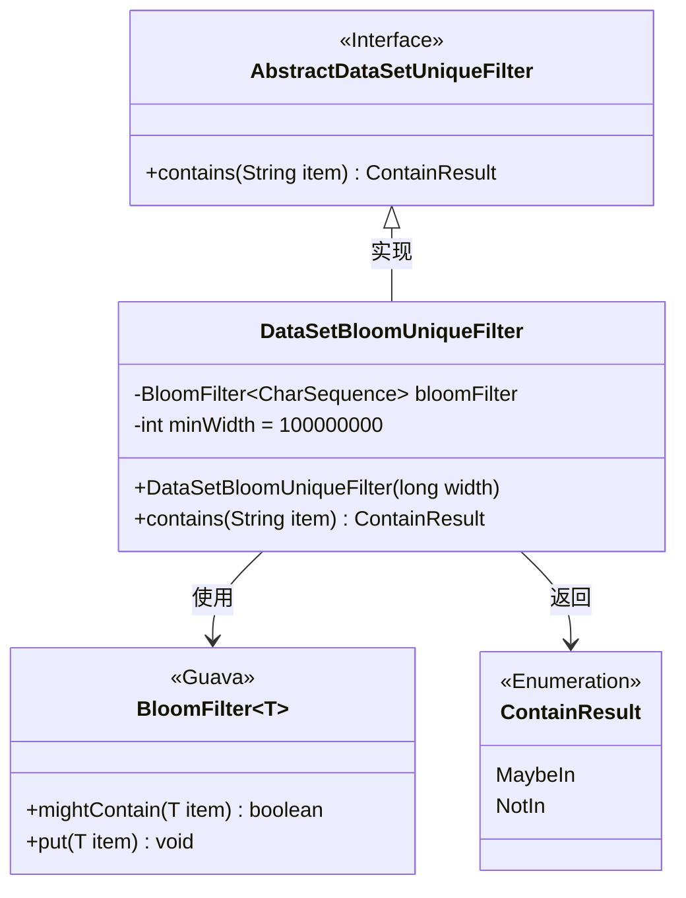
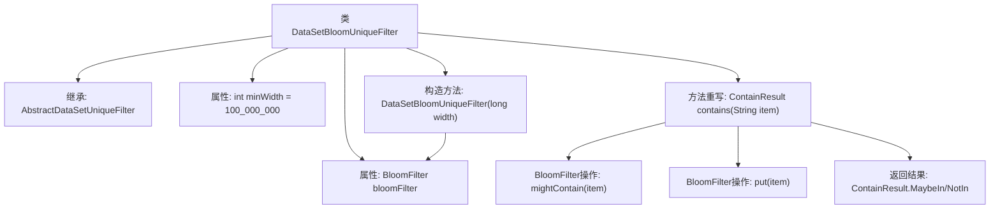

# 基础信息

|      |      |
|------|------|
| 名称 | DataSetBloomUniqueFilter |
| 编码语言 | .java |
| 代码路径 | WeFe/fusion/fusion-service/src/main/java/com/welab/wefe/data/fusion/service/utils/unique/DataSetBloomUniqueFilter.java |
| 包名 | com.welab.wefe.data.fusion.service.utils.unique |
| 依赖项 | ['com.google.common.base.Charsets', 'com.google.common.hash.BloomFilter', 'com.google.common.hash.Funnels'] |
| 概述说明 | DataSetBloomUniqueFilter类继承AbstractDataSetUniqueFilter，使用布隆过滤器判断字符串唯一性。构造函数设置初始容量，最小1亿。contains方法检查字符串是否存在，不存在则加入过滤器，返回可能存在或不存在的结果。 |

# 说明

DataSetBloomUniqueFilter是一个继承自AbstractDataSetUniqueFilter的类，用于基于布隆过滤器实现数据去重功能。它包含一个BloomFilter成员变量，默认最小容量为1亿。构造函数接受一个宽度参数，自动将其翻倍并确保不小于最小容量，同时初始化布隆过滤器，设置字符集为UTF-8，错误率为0.01。contains方法检查字符串是否可能存在于过滤器中，无论结果如何都会将字符串加入过滤器。若可能存在则返回MaybeIn，否则返回NotIn。

# 类列表 Class Summary

| 名称   | 类型  | 说明 |
|-------|------|-------------|
| DataSetBloomUniqueFilter | class | DataSetBloomUniqueFilter类继承AbstractDataSetUniqueFilter，使用布隆过滤器判断字符串是否存在。构造时设置最小宽度1亿，默认误判率1%。contains方法检查并添加元素，返回可能存在或不存在的结果。 |

## 类 DataSetBloomUniqueFilter

|      |      |
|------|------|
| 访问范围 | public |
| 类型 | class |
| 名称 | DataSetBloomUniqueFilter |
| 说明 | DataSetBloomUniqueFilter类继承AbstractDataSetUniqueFilter，使用布隆过滤器判断字符串是否存在。构造时设置最小宽度1亿，默认误判率1%。contains方法检查并添加元素，返回可能存在或不存在的结果。 |

### UML类图

类图描述：  
该图展示了DataSetBloomUniqueFilter类继承自AbstractDataSetUniqueFilter接口，并依赖Guava的BloomFilter泛型类和ContainResult枚举。DataSetBloomUniqueFilter通过布隆过滤器实现高效去重功能，包含构造方法初始化布隆过滤器容量，以及contains方法判断元素是否存在并返回枚举结果。BloomFilter提供mightContain和put方法支持概率性判重，ContainResult枚举定义两种可能状态。整体结构体现了接口实现与工具类组合的设计模式。

### 内部方法调用关系图

这段代码实现了一个基于布隆过滤器的去重过滤器。流程图展示了类继承关系、属性定义和核心方法调用链。构造方法会初始化布隆过滤器，设置最小容量为1亿，并根据输入动态调整大小。contains()方法先检查元素可能存在性，然后插入元素，最后根据检查结果返回枚举值。整个过程实现了高效的概率性去重功能，适用于海量数据场景。

### 字段列表 Field List

| 名称  | 类型  | 说明 |
|-------|-------|------|
| bloomFilter | BloomFilter<CharSequence> | 私有布隆过滤器，泛型为字符序列类型。 |
| minWidth = 100_000_000 | int | 定义私有整型变量minWidth，初始值为1亿。 |

### 方法列表

| 名称  | 类型  | 说明 |
|-------|-------|------|
| contains | ContainResult | 方法检查布隆过滤器是否包含某元素。若可能存在返回MaybeIn，否则返回NotIn，并添加该元素到过滤器中。 |

