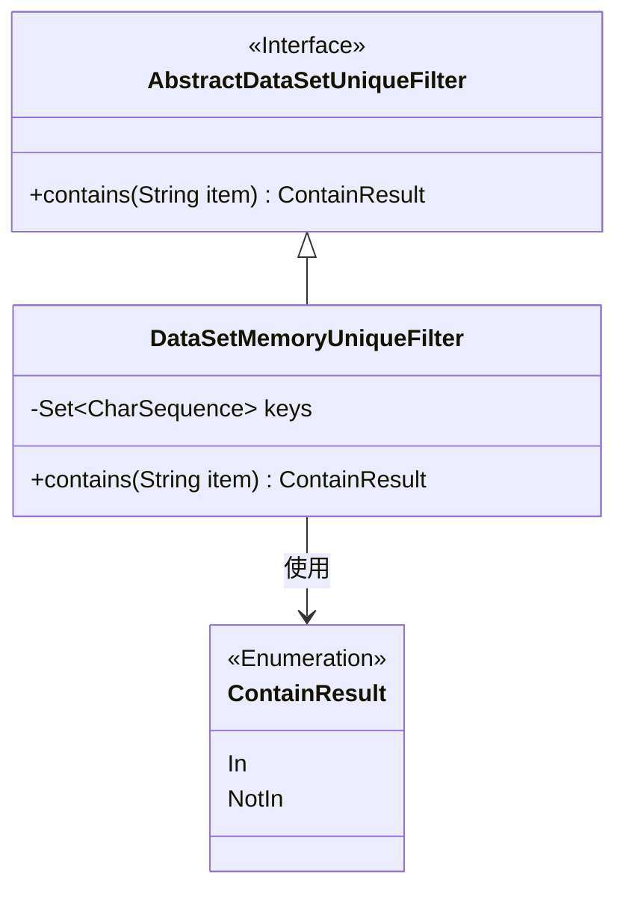
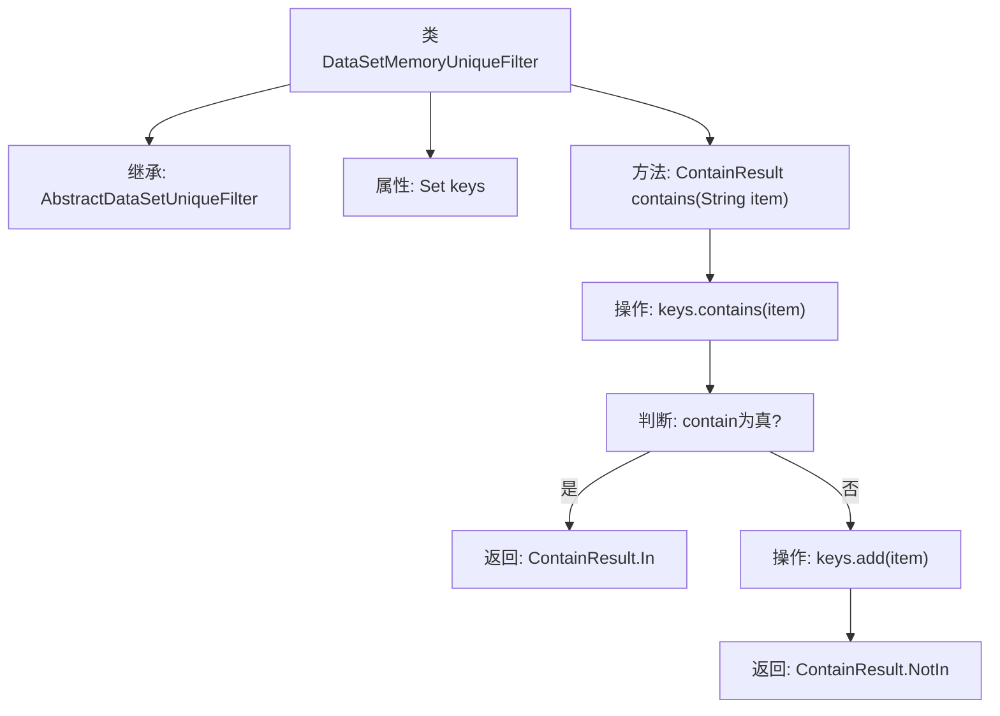

# 基础信息

|      |      |
|------|------|
| 名称 | DataSetMemoryUniqueFilter |
| 编码语言 | .java |
| 代码路径 | WeFe/fusion/fusion-service/src/main/java/com/welab/wefe/data/fusion/service/utils/unique/DataSetMemoryUniqueFilter.java |
| 包名 | com.welab.wefe.data.fusion.service.utils.unique |
| 依赖项 | ['java.util.HashSet', 'java.util.Set'] |
| 概述说明 | 数据集内存去重过滤器，使用HashSet存储键值，检查项存在返回In，不存在则添加并返回NotIn。 |

# 说明

DataSetMemoryUniqueFilter是一个继承自AbstractDataSetUniqueFilter的类，用于检测并过滤重复数据。它使用HashSet存储CharSequence类型的键值，通过contains方法检查输入字符串是否已存在集合中。若存在返回ContainResult.In，否则将字符串加入集合并返回ContainResult.NotIn。该实现基于内存操作，适合处理需要快速去重的场景。

# 类列表 Class Summary

| 名称   | 类型  | 说明 |
|-------|------|-------------|
| DataSetMemoryUniqueFilter | class | 数据集内存唯一过滤器，通过HashSet存储键值，检查字符串是否存在，不存在则添加并返回NotIn，存在则返回In。 |

## 类 DataSetMemoryUniqueFilter

|      |      |
|------|------|
| 访问范围 | public |
| 类型 | class |
| 名称 | DataSetMemoryUniqueFilter |
| 说明 | 数据集内存唯一过滤器，通过HashSet存储键值，检查字符串是否存在，不存在则添加并返回NotIn，存在则返回In。 |

### UML类图

该代码实现了一个基于内存的数据集唯一性过滤器，继承自抽象过滤器类。核心功能是通过HashSet存储已处理的字符串键，contains()方法检查输入项是否存在：若存在返回In枚举值，否则将项加入集合并返回NotIn。类图展示了继承关系、枚举依赖和关键数据结构，体现了内存去重的核心机制。

### 内部方法调用关系图

该流程图展示了DataSetMemoryUniqueFilter类的结构和核心方法contains的执行逻辑。类继承自AbstractDataSetUniqueFilter，通过HashSet实现字符串去重功能。contains方法首先检查元素是否存在集合中，存在则返回In状态，不存在则添加元素到集合并返回NotIn状态。整个流程清晰展现了内存级去重过滤器的决策过程，适用于需要快速判断数据唯一性的场景。

### 字段列表 Field List

| 名称  | 类型  | 说明 |
|-------|-------|------|
| keys = new HashSet<>() | Set<CharSequence> | 声明一个私有Set变量keys，存储CharSequence类型元素，初始化为HashSet实例。 |

### 方法列表

| 名称  | 类型  | 说明 |
|-------|-------|------|
| contains | ContainResult | 检查集合是否包含某元素，存在返回In，否则添加元素并返回NotIn。 |

