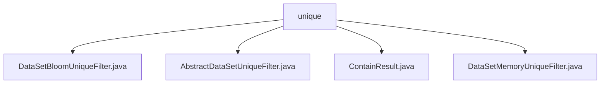

# 基础信息

|      |      |
|------|------|
| 名称 | unique |
| 编码语言 | .java |
| 代码路径 | WeFe/fusion/fusion-service/src/main/java/com/welab/wefe/data/fusion/service/utils/unique |
| 包名 | docs.fusion.fusion-service.src.main.java.com.welab.wefe.data.fusion.service.utils.unique |
| 概述说明 | DataSetBloomUniqueFilter基于布隆过滤器实现数据去重，默认容量1亿，支持UTF-8，错误率0.01。AbstractDataSetUniqueFilter是抽象基类，定义contains方法。ContainResult枚举包含In、NotIn、MaybeIn三种状态。DataSetMemoryUniqueFilter基于HashSet实现内存去重。 |

# 说明

## 概述  
该模块提供基于不同策略的数据去重功能，核心职责是通过布隆过滤器或内存集合实现高效元素判重。接口规范统一为AbstractDataSetUniqueFilter定义的contains方法，返回ContainResult枚举结果（In/NotIn/MaybeIn）。关键数据结构包括BloomFilter（默认容量1亿，错误率0.01）和HashSet。外部依赖仅涉及Java基础库。例如DataSetBloomUniqueFilter采用概率判重，而DataSetMemoryUniqueFilter提供精确匹配。

## 主要业务场景  
模块支持两种典型应用模式：大数据量场景使用布隆过滤器（类似缓存穿透防护），通过MaybeIn状态容忍误判；小数据量场景采用内存HashSet实现精确去重。业务流程均遵循"检查-写入"模式，例如布隆过滤器会无条件写入新元素。集成案例显示，该模块可灵活适配不同性能与精度需求，如DataSetMemoryUniqueFilter适用于实时性要求高的内存计算场景。

### 包内部结构视图

该流程图展示了WeFe项目中unique工具包的文件结构，包含4个Java类文件。AbstractDataSetUniqueFilter作为抽象基类，DataSetBloomUniqueFilter和DataSetMemoryUniqueFilter是具体实现类，ContainResult是辅助类。所有文件都位于unique目录下，形成清晰的工具类层级关系。

# 文件列表

| 名称   | 类型  | 说明 |
|-------|------|-------------|
| [DataSetBloomUniqueFilter.java](DataSetBloomUniqueFilter.md) | file | DataSetBloomUniqueFilter类继承AbstractDataSetUniqueFilter，使用布隆过滤器判断字符串唯一性。构造函数设置初始容量，最小1亿。contains方法检查字符串是否存在，不存在则加入过滤器，返回可能存在或不存在的结果。 |
| [AbstractDataSetUniqueFilter.java](AbstractDataSetUniqueFilter.md) | file | 抽象类AbstractDataSetUniqueFilter定义了一个判断元素是否存在的抽象方法contains，参数为字符串item，返回ContainResult类型结果。 |
| [ContainResult.java](ContainResult.md) | file | 枚举ContainResult定义三种状态：In表示包含，NotIn表示不包含，MaybeIn表示可能包含。 |
| [DataSetMemoryUniqueFilter.java](DataSetMemoryUniqueFilter.md) | file | 数据集内存去重过滤器，使用HashSet存储键值，检查项存在返回In，不存在则添加并返回NotIn。 |

