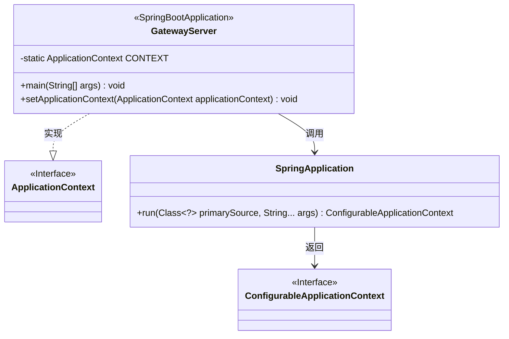
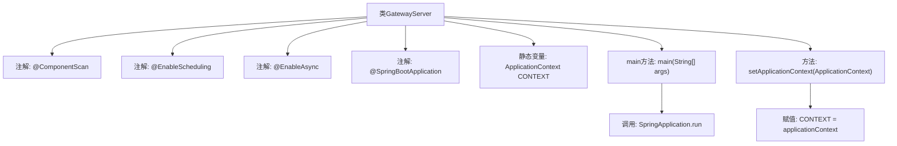

# 基础信息

|      |      |
|------|------|
| 名称 | GatewayServer |
| 编码语言 | .java |
| 代码路径 | WeFe/gateway/src/main/java/com/welab/wefe/gateway/GatewayServer.java |
| 包名 | com.welab.wefe.gateway |
| 依赖项 | ['com.welab.wefe.common.wefe.checkpoint.CheckpointManager', 'org.springframework.beans.BeansException', 'org.springframework.boot.SpringApplication', 'org.springframework.boot.autoconfigure.SpringBootApplication', 'org.springframework.boot.autoconfigure.jdbc.DataSourceAutoConfiguration', 'org.springframework.context.ApplicationContext', 'org.springframework.context.ApplicationContextAware', 'org.springframework.context.annotation.ComponentScan', 'org.springframework.scheduling.annotation.EnableAsync', 'org.springframework.scheduling.annotation.EnableScheduling'] |
| 概述说明 | SpringBoot网关服务主类，启用组件扫描、定时任务和异步处理，排除数据源自动配置，提供全局应用上下文访问。 |

# 说明

这是一个Spring Boot网关服务器主类，使用@ComponentScan扫描GatewayServer和CheckpointManager所在包。通过@EnableScheduling启用定时任务，@EnableAsync支持异步处理。排除了数据源自动配置。该类实现了ApplicationContextAware接口以获取应用上下文，并通过静态变量CONTEXT暴露上下文。main方法启动Spring应用。

# 类列表 Class Summary

| 名称   | 类型  | 说明 |
|-------|------|-------------|
| GatewayServer | class | SpringBoot网关服务主类，排除数据源自动配置，启用组件扫描、定时任务和异步处理，保存应用上下文。 |

## 类 GatewayServer

|      |      |
|------|------|
| 访问范围 | @ComponentScan(basePackageClasses = {GatewayServer.class, CheckpointManager.class});@EnableScheduling;@EnableAsync;@SpringBootApplication(exclude = {DataSourceAutoConfiguration.class});public |
| 类型 | class |
| 名称 | GatewayServer |
| 说明 | SpringBoot网关服务主类，排除数据源自动配置，启用组件扫描、定时任务和异步处理，保存应用上下文。 |

### UML类图

这段代码展示了一个基于Spring Boot的网关服务器主类GatewayServer，它通过@ComponentScan扫描指定类所在的包，使用@EnableScheduling和@EnableAsync启用定时和异步功能，并排除了数据源自动配置。该类实现了ApplicationContextAware接口来获取Spring应用上下文，并通过静态main方法启动Spring应用。类图中清晰地展示了GatewayServer与Spring核心类(ApplicationContext、SpringApplication)之间的关系及其主要功能结构。

### 内部方法调用关系图

该流程图展示了Spring Boot网关服务器类`GatewayServer`的核心结构。类通过四个关键注解配置组件扫描、定时任务、异步处理和排除数据源自动配置。静态变量`CONTEXT`存储应用上下文，主方法通过`SpringApplication.run`启动应用，`setApplicationContext`方法实现`ApplicationContextAware`接口以注入上下文。整体体现了Spring Boot应用的典型启动流程和上下文管理机制。

### 字段列表 Field List

| 名称  | 类型  | 说明 |
|-------|-------|------|
| CONTEXT = null | ApplicationContext | 静态应用上下文变量，初始值为空。 |

### 方法列表

| 名称  | 类型  | 说明 |
|-------|-------|------|
| main | void | Java Spring Boot应用启动入口，运行GatewayServer主类。 |
| setApplicationContext | void | 重写setApplicationContext方法，将传入的ApplicationContext赋值给静态变量CONTEXT。 |

