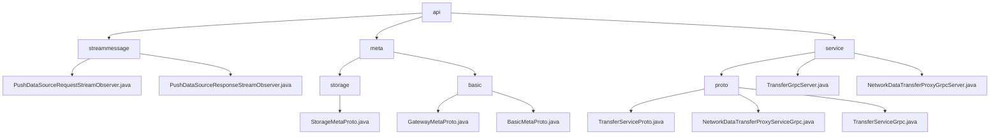

# 基础信息

|      |      |
|------|------|
| 名称 | api |
| 编码语言 | .java |
| 代码路径 | WeFe/gateway/src/main/java/com/welab/wefe/gateway/api |
| 包名 | docs.gateway.src.main.java.com.welab.wefe.gateway.api |
| 概述说明 | 模块1实现双向流式数据传输，处理TransferMeta数据，含请求/响应流接口，依赖异步协调机制。模块2定义Protobuf存储协议，含类型标识和资源定位，支持跨语言数据交换。模块3提供gRPC数据传输服务，支持单向和流式RPC，含元数据传输和状态检查功能。 |

# 说明

## 概述  
该模块核心职责是实现跨网络的流式数据传输与存储资源管理，包含双向流式处理（基于StreamObserver）、存储定位协议（Protobuf规范）和gRPC代理服务三大功能。接口规范统一为GatewayMetaProto协议，支持异步流式（如PushDataSourceRequestStreamObserver）和同步RPC（如TransferService.send）。关键数据结构包括TransferMeta（传输元数据）、StorageLocator（四元组存储定位器）和ReturnStatus（状态反馈），依赖Protobuf序列化库和gRPC框架。例如StorageLocator通过构建器模式初始化LMDB存储类型，TransferMeta则用于流式传输的元数据封装。

## 主要业务场景  
模块支撑分布式系统间的数据同步与存储管理，典型场景为：客户端通过双向流（类似管道传输）推送TransferMeta数据，服务端根据StorageLocator定位存储引擎（如CLICK_HOUSE）并返回状态码。交互模式涵盖生产者-消费者模型（流式处理）、构建器模式（存储定位）和拦截器机制（gRPC安全传输）。例如pushDataSource实现端到端状态追踪，StorageLocator.newBuilder()动态配置分片存储。功能完整性体现在全链路管理，从流式传输、存储寻址到安全代理，典型应用包括跨系统迁移（切换StorageType）和分片查询（使用fragment字段）。

### 包内部结构视图

该流程图展示了WeFe网关API模块的层级结构，包含streammessage、meta和service三个主要子模块。streammessage下有两个流式消息处理器，meta分为storage和basic两个子模块，service包含proto定义和Grpc服务实现。整个结构清晰地反映了网关API的功能划分和依赖关系。

# 文件列表

| 名称   | 类型  | 说明 |
|-------|------|-------------|
| [service](service/_module.md) | package | 基于gRPC和Protobuf的跨网络数据传输服务，提供单向和流式RPC接口（send/recv/push等），支持元数据传输和状态检查，含拦截器和日志功能。 |
| [meta](meta/_module.md) | package | Protobuf协议文件定义StorageType枚举和StorageLocator消息，支持LMDB和CLICK_HOUSE存储类型。网关元数据协议包含GatewayMetaProto和BasicMetaProto，用于结构化数据传输和状态管理，支持分片传输和多种数据载体。 |
| [streammessage](streammessage/_module.md) | package | PushDataSourceRequestStreamObserver处理数据流，保存数据并反馈状态，含异常处理。PushDataSourceResponseStreamObserver处理流式响应，分类存储结果并标记完成状态。 |

