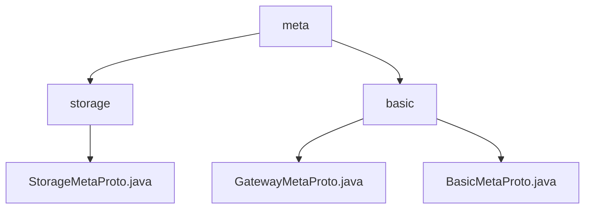

# 基础信息

|      |      |
|------|------|
| 名称 | meta |
| 编码语言 | .java |
| 代码路径 | WeFe/gateway/src/main/java/com/welab/wefe/gateway/api/meta |
| 包名 | docs.gateway.src.main.java.com.welab.wefe.gateway.api.meta |
| 概述说明 | Protobuf协议文件定义StorageType枚举和StorageLocator消息，支持LMDB和CLICK_HOUSE存储类型。网关元数据协议包含GatewayMetaProto和BasicMetaProto，用于结构化数据传输和状态管理，支持分片传输和多种数据载体。 |

# 说明

## 概述  
该模块定义了基于Protobuf的跨语言数据交换协议，核心职责包括存储类型标识(StorageType)和资源定位(StorageLocator)，类似URI规范但专用于分布式存储场景。接口规范统一为GatewayMetaProto协议，包含枚举类型和消息体，例如StorageLocator支持构建器模式初始化type/namespace/name/fragment字段。  

关键数据结构包括存储类型枚举(LMDB/CLICK_HOUSE)和四元组定位消息体，与基础元数据模块的TransferMeta形成互补。外部依赖仅为Protobuf序列化库，例如StorageLocator通过标准编解码实现跨进程传输。  

## 主要业务场景  
模块支撑存储资源的标准化寻址，典型流程为：服务方通过StorageType指定存储引擎，填充StorageLocator的命名空间(namespace)和分片标识(fragment)后序列化传输。交互采用构建器模式，例如StorageLocator.newBuilder().setType(StorageType.LMDB)创建定位器。  

功能完整性体现在存储全生命周期管理，从类型选择到分片定位。典型应用包括跨系统数据迁移（通过type字段切换存储引擎）、分片查询（使用fragment定位数据块）。API类型包含枚举选择接口和定位器构造接口，例如CLICK_HOUSE类型对应数值1的存储实例。

### 包内部结构视图

该流程图展示了WeFe网关项目中API元数据模块的层级结构。顶层为meta目录，下分storage和basic两个子目录。storage目录包含StorageMetaProto.java文件，basic目录则包含GatewayMetaProto.java和BasicMetaProto.java两个协议文件。整个结构清晰地反映了元数据管理的模块化设计。

# 文件列表

| 名称   | 类型  | 说明 |
|-------|------|-------------|
| [basic](basic/_module.md) | package | 网关元数据协议包含传输状态枚举、成员信息、内容载体和传输元数据主结构，支持序列化/反序列化。基础元数据协议定义端点、返回状态和键值对结构，均使用Protocol Buffers实现。 |
| [storage](storage/_module.md) | package | StorageMetaProto定义了存储元数据协议，包含StorageLocator消息和StorageType枚举。StorageLocator包含类型、命名空间、名称和分片字段。StorageType枚举支持LMDB和CLICK_HOUSE两种存储类型。 |

