# 基础信息

|      |      |
|------|------|
| 名称 | BasicMetaProto |
| 编码语言 | .java |
| 代码路径 | WeFe/gateway/src/main/java/com/welab/wefe/gateway/api/meta/basic/BasicMetaProto.java |
| 包名 | com.welab.wefe.gateway.api.meta.basic |
| 依赖项 | [] |
| 概述说明 | BasicMetaProto定义了网络端点、状态返回和键值数据的基本结构。包含Endpoint（IP、端口、主机名）、Endpoints（端点列表）、ReturnStatus（状态码、消息、会话ID和数据）以及KeyValueData（键值对）等核心消息类型。 |

# 说明

该内容定义了一个基于Google Protocol Buffers的协议文件，包含四个主要数据结构：

1. Endpoint：表示网络端点信息，包含ip地址(字符串)、端口号(整型)和主机名(字符串)三个字段。

2. Endpoints：包含多个Endpoint的集合，使用repeated修饰符表示可重复字段。

3. ReturnStatus：通用返回状态结构，包含：
   - 状态码(整型)
   - 消息(字符串)
   - 会话ID(字符串)
   - 数据内容(字符串)

4. KeyValueData：键值对数据结构，包含：
   - key(字节数组)
   - value(字节数组)

文件还包含完整的Java类定义，每个数据结构都有对应的Builder类用于构造对象，并实现了序列化/反序列化方法。所有类都位于com.welab.wefe.gateway.api.meta.basic包中，主要用于网关API的基础元数据定义。

# 类列表 Class Summary

| 名称   | 类型  | 说明 |
|-------|------|-------------|
| BasicMetaProto | class | BasicMetaProto定义了网络端点、返回状态和键值数据的基本数据结构。包含Endpoint（IP、端口、主机名）、Endpoints（端点列表）、ReturnStatus（状态码、消息、会话ID、数据）和KeyValueData（键值对）。用于网关API的元数据传输。 |


## 类 BasicMetaProto

|      |      |
|------|------|
| 访问范围 | public final |
| 类型 | class |
| 名称 | BasicMetaProto |
| 说明 | BasicMetaProto定义了网络端点、返回状态和键值数据的基本数据结构。包含Endpoint（IP、端口、主机名）、Endpoints（端点列表）、ReturnStatus（状态码、消息、会话ID、数据）和KeyValueData（键值对）。用于网关API的元数据传输。 |


### UML类图

```mermaid
classDiagram
    class BasicMetaProto {
        <<final>>
        -BasicMetaProto()
        +registerAllExtensions(ExtensionRegistryLite registry) void
        +registerAllExtensions(ExtensionRegistry registry) void
    }

    class EndpointOrBuilder {
        <<Interface>>
        +getIp() String
        +getIpBytes() ByteString
        +getPort() int
        +getHostname() String
        +getHostnameBytes() ByteString
    }

    class Endpoint {
        -String ip_
        -int port_
        -String hostname_
        +Endpoint(GeneratedMessageV3.Builder<?> builder)
        +getIp() String
        +getIpBytes() ByteString
        +getPort() int
        +getHostname() String
        +getHostnameBytes() ByteString
    }
    Endpoint --|> GeneratedMessageV3
    Endpoint ..|> EndpointOrBuilder

    class EndpointsOrBuilder {
        <<Interface>>
        +getEndpointsList() List~Endpoint~
        +getEndpointsCount() int
    }

    class Endpoints {
        -List~Endpoint~ endpoints_
        +Endpoints(GeneratedMessageV3.Builder<?> builder)
        +getEndpointsList() List~Endpoint~
    }
    Endpoints --|> GeneratedMessageV3
    Endpoints ..|> EndpointsOrBuilder

    class ReturnStatusOrBuilder {
        <<Interface>>
        +getCode() int
        +getMessage() String
        +getSessionId() String
        +getData() String
    }

    class ReturnStatus {
        -int code_
        -String message_
        -String sessionId_
        -String data_
        +ReturnStatus(GeneratedMessageV3.Builder<?> builder)
        +getCode() int
        +getMessage() String
        +getSessionId() String
        +getData() String
    }
    ReturnStatus --|> GeneratedMessageV3
    ReturnStatus ..|> ReturnStatusOrBuilder

    class KeyValueDataOrBuilder {
        <<Interface>>
        +getKey() ByteString
        +getValue() ByteString
    }

    class KeyValueData {
        -ByteString key_
        -ByteString value_
        +KeyValueData(GeneratedMessageV3.Builder<?> builder)
        +getKey() ByteString
        +getValue() ByteString
    }
    KeyValueData --|> GeneratedMessageV3
    KeyValueData ..|> KeyValueDataOrBuilder

    // Relationships
    Endpoints "1" *-- "*" Endpoint : contains
```

该代码定义了一个Protobuf协议文件，主要包含四个核心类：Endpoint（网络端点）、Endpoints（端点集合）、ReturnStatus（通用返回状态）和KeyValueData（键值数据）。每个类都实现了对应的OrBuilder接口，并继承自GeneratedMessageV3基类。其中Endpoints与Endpoint是聚合关系（一个Endpoints包含多个Endpoint），所有类都通过Builder模式构造，并提供了字段的getter方法。这些类用于定义网络通信中的元数据结构和状态返回格式。


### 内部方法调用关系图

```mermaid
graph TD
    A["类BasicMetaProto"]
    B["方法: registerAllExtensions(ExtensionRegistryLite)"]
    C["方法: registerAllExtensions(ExtensionRegistry)"]
    D["接口: EndpointOrBuilder"]
    E["方法: getIp()"]
    F["方法: getIpBytes()"]
    G["方法: getPort()"]
    H["方法: getHostname()"]
    I["方法: getHostnameBytes()"]
    J["类: Endpoint"]
    K["构造方法: Endpoint(GeneratedMessageV3.Builder)"]
    L["方法: getIp()"]
    M["方法: getIpBytes()"]
    N["方法: getPort()"]
    O["方法: getHostname()"]
    P["方法: getHostnameBytes()"]
    Q["接口: EndpointsOrBuilder"]
    R["类: Endpoints"]
    S["构造方法: Endpoints(GeneratedMessageV3.Builder)"]
    T["方法: getEndpointsList()"]
    U["接口: ReturnStatusOrBuilder"]
    V["类: ReturnStatus"]
    W["构造方法: ReturnStatus(GeneratedMessageV3.Builder)"]
    X["方法: getCode()"]
    Y["方法: getMessage()"]
    Z["方法: getSessionId()"]
    AA["方法: getData()"]
    AB["接口: KeyValueDataOrBuilder"]
    AC["类: KeyValueData"]
    AD["构造方法: KeyValueData(GeneratedMessageV3.Builder)"]
    AE["方法: getKey()"]
    AF["方法: getValue()"]

    A --> B
    A --> C
    A --> D
    D --> E
    D --> F
    D --> G
    D --> H
    D --> I
    A --> J
    J --> K
    J --> L
    J --> M
    J --> N
    J --> O
    J --> P
    A --> Q
    A --> R
    R --> S
    R --> T
    A --> U
    A --> V
    V --> W
    V --> X
    V --> Y
    V --> Z
    V --> AA
    A --> AB
    A --> AC
    AC --> AD
    AC --> AE
    AC --> AF
```



这段代码定义了一个Protobuf协议文件，包含多个消息类型和接口。主要结构包括Endpoint（网络端点）、Endpoints（端点集合）、ReturnStatus（通用返回状态）和KeyValueData（键值数据）等核心组件。流程图展示了类之间的继承关系和主要方法调用链，其中Endpoint作为基础网络地址描述，Endpoints管理多个Endpoint，ReturnStatus提供标准化响应格式，KeyValueData处理二进制键值存储。所有消息类型都实现了对应的OrBuilder接口以支持Protobuf的构建器模式。

### 字段列表 Field List

| 名称  | 类型  | 说明 |
|-------|-------|------|
| internal_static_com_welab_wefe_gateway_api_meta_basic_KeyValueData_descriptor | com.google.protobuf.Descriptors.Descriptor | Protobuf描述符定义，用于KeyValueData类的元数据。 |
| internal_static_com_welab_wefe_gateway_api_meta_basic_ReturnStatus_fieldAccessorTable | com.google.protobuf.GeneratedMessageV3.FieldAccessorTable | 声明一个私有静态不可变的字段访问器表，用于管理ReturnStatus类的元数据访问。 |
| internal_static_com_welab_wefe_gateway_api_meta_basic_KeyValueData_fieldAccessorTable | com.google.protobuf.GeneratedMessageV3.FieldAccessorTable | Protobuf生成的KeyValueData字段访问器表，用于内部元数据操作。 |
| internal_static_com_welab_wefe_gateway_api_meta_basic_Endpoints_fieldAccessorTable | com.google.protobuf.GeneratedMessageV3.FieldAccessorTable | Protobuf生成的Endpoints消息字段访问器表，用于内部元数据操作。 |
| internal_static_com_welab_wefe_gateway_api_meta_basic_Endpoint_fieldAccessorTable | com.google.protobuf.GeneratedMessageV3.FieldAccessorTable | 私有静态终态字段，类型为Protobuf的FieldAccessorTable，用于Endpoint元数据访问。 |
| internal_static_com_welab_wefe_gateway_api_meta_basic_Endpoint_descriptor | com.google.protobuf.Descriptors.Descriptor | 私有静态终态描述符变量，定义Endpoint类的协议缓冲区元数据描述。 |
| internal_static_com_welab_wefe_gateway_api_meta_basic_Endpoints_descriptor | com.google.protobuf.Descriptors.Descriptor | 私有静态终态描述符，定义Endpoints类的元数据结构。 |
| descriptor | com.google.protobuf.Descriptors.FileDescriptor | 私有静态变量descriptor，类型为com.google.protobuf.Descriptors.FileDescriptor。 |
| internal_static_com_welab_wefe_gateway_api_meta_basic_ReturnStatus_descriptor | com.google.protobuf.Descriptors.Descriptor | 私有静态最终变量，描述ReturnStatus的内部协议缓冲区结构。 |

### 方法列表

| 名称  | 类型  | 说明 |
|-------|-------|------|
| registerAllExtensions | void | 静态方法registerAllExtensions用于向Protobuf的ExtensionRegistryLite注册扩展，当前实现为空。 |
| registerAllExtensions | void | 注册所有Protobuf扩展至指定注册表，支持完整和精简版注册表。 |
| getDescriptor | com.google.protobuf.Descriptors.FileDescriptor | 这是一个静态方法，返回Protocol Buffers文件描述符对象descriptor。 |


