# 基础信息

|      |      |
|------|------|
| 名称 | GatewayMetaProto |
| 编码语言 | .java |
| 代码路径 | WeFe/gateway/src/main/java/com/welab/wefe/gateway/api/meta/basic/GatewayMetaProto.java |
| 包名 | com.welab.wefe.gateway.api.meta.basic |
| 依赖项 | [] |
| 概述说明 | GatewayMetaProto定义了网关传输元数据的协议结构，包含Member、Content、TransferMeta三个核心消息类型和TransferStatus枚举。关键点如下：1. Member表示成员信息，包含memberId、memberName和endpoint字段2. Content是传输内容载体，支持字符串(strData)、二进制(byteData)和键值对列表(keyValueDatas)三种数据形式3. TransferMeta是网关传输的主消息结构，包含：   - 发送方(src)和接收方(dst)   - 传输内容(content)   - 处理器名称(processor)   - 传输状态(transferStatus)   - 会话ID(sessionId)   - 时间戳(receiveDate/expireDate)   - 大数据分片信息(sequenceNo/sequenceIsEnd)TransferStatus枚举定义了6种传输状态：未处理、初始化中、处理中、完成、错误和已取消。 |

# 说明

该内容定义了一个网关元数据协议，包含以下核心组件：

1. TransferStatus枚举：定义了6种传输状态（未处理/初始化中/处理中/完成/错误/已取消）

2. Member消息体：表示成员信息，包含：
- 成员ID(memberId)
- 成员名称(memberName) 
- 终端节点(endpoint)

3. Content消息体：表示传输内容，支持三种数据载体：
- 字符串数据(strData)
- 二进制数据(byteData) 
- 键值对列表(keyValueDatas)

4. TransferMeta主消息体：网关传输元数据，包含：
- 发送方(src)和接收方(dst)成员信息
- 内容体(content)
- 处理器名称(processor)
- 传输状态(transferStatus)
- 会话ID(sessionId)
- 时间戳(receiveDate/expireDate)
- 大数据分片信息(sequenceNo/sequenceIsEnd)
- 扩展字段(tag/extField等)

该协议使用Protocol Buffers实现，提供了完整的Java类定义和构建器模式，支持数据序列化和反序列化。主要用于网关服务间的结构化数据传输，支持大数据分片传输和状态跟踪。

# 类列表 Class Summary

| 名称   | 类型  | 说明 |
|-------|------|-------------|
| GatewayMetaProto | class | GatewayMetaProto定义了网关元数据协议，包含Member、Content和TransferMeta三个主要结构。Member表示成员信息，包含ID、名称和端点；Content用于传输数据，支持字符串、二进制和键值对数据；TransferMeta是网关收发消息的元数据结构，包含发送方、接收方、内容、处理器、状态、会话ID等信息。TransferStatus枚举定义了传输状态，如未处理、初始化、处理中、完成、错误和取消。 |


## 类 GatewayMetaProto

|      |      |
|------|------|
| 访问范围 | public final |
| 类型 | class |
| 名称 | GatewayMetaProto |
| 说明 | GatewayMetaProto定义了网关元数据协议，包含Member、Content和TransferMeta三个主要结构。Member表示成员信息，包含ID、名称和端点；Content用于传输数据，支持字符串、二进制和键值对数据；TransferMeta是网关收发消息的元数据结构，包含发送方、接收方、内容、处理器、状态、会话ID等信息。TransferStatus枚举定义了传输状态，如未处理、初始化、处理中、完成、错误和取消。 |


### UML类图

```mermaid
classDiagram
    class GatewayMetaProto {
        <<final>>
        -GatewayMetaProto()
        +registerAllExtensions(ExtensionRegistryLite registry)
        +registerAllExtensions(ExtensionRegistry registry)
    }

    enum TransferStatus {
        <<enumeration>>
        NOT_PROCESSED = 0
        INITIALIZING = 1
        PROCESSING = 2
        COMPLETE = 3
        ERROR = 4
        CANCELLED = 5
        UNRECOGNIZED = -1
        +getNumber() int
        +valueOf(int value) TransferStatus
        +forNumber(int value) TransferStatus
        +internalGetValueMap() EnumLiteMap~TransferStatus~
    }

    interface MemberOrBuilder {
        <<Interface>>
        +getMemberId() String
        +getMemberIdBytes() ByteString
        +getMemberName() String
        +getMemberNameBytes() ByteString
        +hasEndpoint() boolean
        +getEndpoint() Endpoint
        +getEndpointOrBuilder() EndpointOrBuilder
    }

    class Member {
        -String memberId_
        -String memberName_
        -Endpoint endpoint_
        +Member(GeneratedMessageV3.Builder~?~ builder)
        +getMemberId() String
        +getMemberIdBytes() ByteString
        +getMemberName() String
        +getMemberNameBytes() ByteString
        +hasEndpoint() boolean
        +getEndpoint() Endpoint
        +getEndpointOrBuilder() EndpointOrBuilder
    }

    interface ContentOrBuilder {
        <<Interface>>
        +getStrData() String
        +getStrDataBytes() ByteString
        +getByteData() ByteString
        +getKeyValueDatasList() List~KeyValueData~
        +getKeyValueDatas(int index) KeyValueData
        +getKeyValueDatasCount() int
    }

    class Content {
        -String strData_
        -ByteString byteData_
        -List~KeyValueData~ keyValueDatas_
        +Content(GeneratedMessageV3.Builder~?~ builder)
        +getStrData() String
        +getStrDataBytes() ByteString
        +getByteData() ByteString
        +getKeyValueDatasList() List~KeyValueData~
        +getKeyValueDatas(int index) KeyValueData
        +getKeyValueDatasCount() int
    }

    interface TransferMetaOrBuilder {
        <<Interface>>
        +hasSrc() boolean
        +getSrc() Member
        +getSrcOrBuilder() MemberOrBuilder
        +hasDst() boolean
        +getDst() Member
        +getDstOrBuilder() MemberOrBuilder
        +hasContent() boolean
        +getContent() Content
        +getContentOrBuilder() ContentOrBuilder
        +getProcessor() String
        +getProcessorBytes() ByteString
        +getTransferStatusValue() int
        +getTransferStatus() TransferStatus
        +getSessionId() String
        +getSessionIdBytes() ByteString
        +getReceiveDate() long
        +getExpireDate() long
        +getSequenceNo() int
        +getSequenceIsEnd() boolean
        +getTaggedVariableName() ByteString
        +getTag() String
        +getTagBytes() ByteString
        +getExtField() String
        +getExtFieldBytes() ByteString
    }

    class TransferMeta {
        -Member src_
        -Member dst_
        -Content content_
        -String processor_
        -int transferStatus_
        -String sessionId_
        -long receiveDate_
        -long expireDate_
        -int sequenceNo_
        -boolean sequenceIsEnd_
        -ByteString taggedVariableName_
        -String tag_
        -String extField_
        +TransferMeta(GeneratedMessageV3.Builder~?~ builder)
        +hasSrc() boolean
        +getSrc() Member
        +getSrcOrBuilder() MemberOrBuilder
        +hasDst() boolean
        +getDst() Member
        +getDstOrBuilder() MemberOrBuilder
        +hasContent() boolean
        +getContent() Content
        +getContentOrBuilder() ContentOrBuilder
        +getProcessor() String
        +getProcessorBytes() ByteString
        +getTransferStatusValue() int
        +getTransferStatus() TransferStatus
        +getSessionId() String
        +getSessionIdBytes() ByteString
        +getReceiveDate() long
        +getExpireDate() long
        +getSequenceNo() int
        +getSequenceIsEnd() boolean
        +getTaggedVariableName() ByteString
        +getTag() String
        +getTagBytes() ByteString
        +getExtField() String
        +getExtFieldBytes() ByteString
    }

    GatewayMetaProto --> TransferStatus : contains
    Member ..|> MemberOrBuilder : implements
    Content ..|> ContentOrBuilder : implements
    TransferMeta ..|> TransferMetaOrBuilder : implements
    TransferMeta --> Member : contains
    TransferMeta --> Content : contains
    Member --> BasicMetaProto.Endpoint : references
    Content --> BasicMetaProto.KeyValueData : references
```

This class diagram represents a Protobuf-based gateway metadata system with several key components. The `GatewayMetaProto` class serves as the root container, with an embedded `TransferStatus` enum defining message states. The system features three main message types (`Member`, `Content`, and `TransferMeta`) each with their builder interfaces (`*OrBuilder`). The `TransferMeta` acts as the primary message container, referencing `Member` for sender/receiver information and `Content` for payload data, while also connecting to basic data types from `BasicMetaProto`. The relationships show a clear hierarchy where gateway messages contain members and content, with content further containing key-value data structures.


### 内部方法调用关系图

```mermaid
graph TD
    A["类GatewayMetaProto"]
    B["枚举TransferStatus"]
    C["接口MemberOrBuilder"]
    D["类Member"]
    E["接口ContentOrBuilder"]
    F["类Content"]
    G["接口TransferMetaOrBuilder"]
    H["类TransferMeta"]
    
    A --> B
    A --> D
    A --> F
    A --> H
    
    B -->|枚举值| B1["NOT_PROCESSED(0)"]
    B -->|枚举值| B2["INITIALIZING(1)"]
    B -->|枚举值| B3["PROCESSING(2)"]
    B -->|枚举值| B4["COMPLETE(3)"]
    B -->|枚举值| B5["ERROR(4)"]
    B -->|枚举值| B6["CANCELLED(5)"]
    B -->|枚举值| B7["UNRECOGNIZED(-1)"]
    
    D -->|实现| C
    D -->|字段| D1["String memberId"]
    D -->|字段| D2["String memberName"]
    D -->|字段| D3["Endpoint endpoint"]
    D -->|方法| D4["getMemberId()"]
    D -->|方法| D5["getMemberName()"]
    D -->|方法| D6["hasEndpoint()"]
    D -->|方法| D7["getEndpoint()"]
    
    F -->|实现| E
    F -->|字段| F1["String strData"]
    F -->|字段| F2["bytes byteData"]
    F -->|字段| F3["repeated KeyValueData keyValueDatas"]
    F -->|方法| F4["getStrData()"]
    F -->|方法| F5["getByteData()"]
    F -->|方法| F6["getKeyValueDatasList()"]
    
    H -->|实现| G
    H -->|字段| H1["Member src"]
    H -->|字段| H2["Member dst"]
    H -->|字段| H3["Content content"]
    H -->|字段| H4["String processor"]
    H -->|字段| H5["TransferStatus transferStatus"]
    H -->|字段| H6["String sessionId"]
    H -->|字段| H7["int64 receiveDate"]
    H -->|字段| H8["int64 expireDate"]
    H -->|字段| H9["int32 sequenceNo"]
    H -->|字段| H10["bool sequenceIsEnd"]
    H -->|字段| H11["bytes taggedVariableName"]
    H -->|字段| H12["String tag"]
    H -->|字段| H13["String extField"]
    H -->|方法| H14["hasSrc()"]
    H -->|方法| H15["getSrc()"]
    H -->|方法| H16["hasDst()"]
    H -->|方法| H17["getDst()"]
    H -->|方法| H18["hasContent()"]
    H -->|方法| H19["getContent()"]
    H -->|方法| H20["getProcessor()"]
    H -->|方法| H21["getTransferStatusValue()"]
    H -->|方法| H22["getSessionId()"]
    H -->|方法| H23["getReceiveDate()"]
    H -->|方法| H24["getExpireDate()"]
    H -->|方法| H25["getSequenceNo()"]
    H -->|方法| H26["getSequenceIsEnd()"]
    H -->|方法| H27["getTaggedVariableName()"]
    H -->|方法| H28["getTag()"]
    H -->|方法| H29["getExtField()"]
```



这段代码定义了一个网关元数据协议的结构，主要包含四个核心组件：TransferStatus枚举、Member类、Content类和TransferMeta类。TransferStatus定义了6种传输状态和1种未知状态；Member类表示成员信息，包含ID、名称和终端点；Content类封装了三种数据载体格式；TransferMeta是核心传输结构，包含完整的消息元数据（发送方、接收方、内容、状态等）。所有类都实现了对应的OrBuilder接口，支持protobuf的构建器模式。代码采用protobuf v3语法，通过嵌套消息和枚举实现了复杂的数据结构定义。

### 字段列表 Field List

| 名称  | 类型  | 说明 |
|-------|-------|------|
| descriptor | com.google.protobuf.Descriptors.FileDescriptor | 静态私有变量descriptor，类型为com.google.protobuf.Descriptors.FileDescriptor。 |
| internal_static_com_welab_wefe_gateway_api_meta_basic_TransferMeta_fieldAccessorTable | com.google.protobuf.GeneratedMessageV3.FieldAccessorTable | 这是一个私有静态常量，类型为Protobuf生成的FieldAccessorTable，用于内部元数据传输的字段访问。 |
| internal_static_com_welab_wefe_gateway_api_meta_basic_Content_fieldAccessorTable | com.google.protobuf.GeneratedMessageV3.FieldAccessorTable | 声明一个私有静态不可变的Protobuf字段访问器表，用于内部内容元数据访问。 |
| internal_static_com_welab_wefe_gateway_api_meta_basic_TransferMeta_descriptor | com.google.protobuf.Descriptors.Descriptor | 私有静态常量，定义TransferMeta的Protobuf描述符。 |
| internal_static_com_welab_wefe_gateway_api_meta_basic_Content_descriptor | com.google.protobuf.Descriptors.Descriptor | 私有静态最终变量，描述符类型，用于定义Content类的元数据结构。 |
| internal_static_com_welab_wefe_gateway_api_meta_basic_Member_fieldAccessorTable | com.google.protobuf.GeneratedMessageV3.FieldAccessorTable | 私有静态final字段，类型为GeneratedMessageV3.FieldAccessorTable，用于Member类的内部字段访问。 |
| internal_static_com_welab_wefe_gateway_api_meta_basic_Member_descriptor | com.google.protobuf.Descriptors.Descriptor | 私有静态常量，描述Member类的协议缓冲区元数据。 |

### 方法列表

| 名称  | 类型  | 说明 |
|-------|-------|------|
| registerAllExtensions | void | Java方法：静态注册扩展，将ExtensionRegistry转为ExtensionRegistryLite进行统一注册。 |
| registerAllExtensions | void | 静态方法registerAllExtensions用于向Protobuf扩展注册表registry注册所有扩展，当前为空实现。 |
| getDescriptor | com.google.protobuf.Descriptors.FileDescriptor | 这是一个静态方法，返回protobuf文件描述符descriptor。 |


