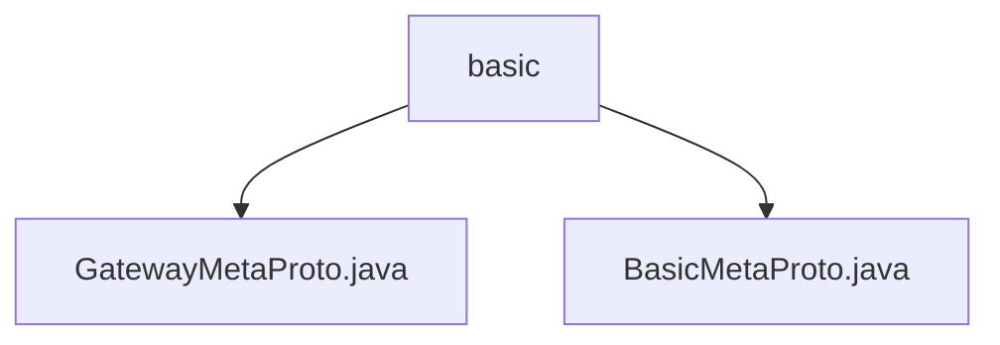

# 基础信息

|      |      |
|------|------|
| 名称 | basic |
| 编码语言 | .java |
| 代码路径 | WeFe/gateway/src/main/java/com/welab/wefe/gateway/api/meta/basic |
| 包名 | docs.gateway.src.main.java.com.welab.wefe.gateway.api.meta.basic |
| 概述说明 | 网关元数据协议包含传输状态枚举、成员信息、内容载体和传输元数据主结构，支持序列化/反序列化。基础元数据协议定义端点、返回状态和键值对结构，均使用Protocol Buffers实现。 |

# 说明

## 概述  
该模块定义了网关服务的核心元数据协议，采用Protocol Buffers实现结构化数据传输和状态管理。核心职责包括跨服务成员信息交换、内容传输状态跟踪及大数据分片处理，类似消息中间件的信封协议。  

接口规范包含GatewayMetaProto和BasicMetaProto两个协议文件，提供TransferStatus枚举、Member/Content消息体等数据结构。关键结构包括传输元数据(TransferMeta)、端点信息(Endpoint)和键值对(KeyValueData)，支持二进制/字符串/键值对多种数据载体。  

外部依赖仅为Protocol Buffers序列化库。例如TransferMeta支持分片传输(sequenceNo字段)，Member消息体包含终端节点信息，Content支持byteData二进制传输。

## 主要业务场景  
模块支撑网关服务间的结构化数据交换，典型流程为：发送方构造TransferMeta（包含Member端点、Content数据体和状态标记），通过序列化传输后由接收方反序列化处理。  

交互模式采用构建器模式创建消息体，例如通过BasicMetaProto.Builder构造Endpoint。完整功能覆盖数据传输全生命周期，从初始化(TransferStatus.INIT)到完成/错误状态跟踪。  

典型应用包括跨节点大数据分片传输（使用sequenceIsEnd标记分片结束）、带状态的内容路由（通过processor字段指定处理器）。API类型包含元数据构造接口和序列化接口，例如KeyValueData支持字节数组形式的键值存储。

### 包内部结构视图

该流程图展示了WeFe网关项目中basic目录下的文件结构关系。basic作为父节点，包含两个协议文件：GatewayMetaProto.java和BasicMetaProto.java。这两个文件都属于网关API元数据基础模块，用于定义网关通信的基本协议结构。

# 文件列表

| 名称   | 类型  | 说明 |
|-------|------|-------------|
| [GatewayMetaProto.java](GatewayMetaProto.md) | file | GatewayMetaProto定义了网关传输元数据的协议结构，包含Member、Content、TransferMeta三个核心消息类型和TransferStatus枚举。关键点如下：1. Member表示成员信息，包含memberId、memberName和endpoint字段2. Content是传输内容载体，支持字符串(strData)、二进制(byteData)和键值对列表(keyValueDatas)三种数据形式3. TransferMeta是网关传输的主消息结构，包含：   - 发送方(src)和接收方(dst)   - 传输内容(content)   - 处理器名称(processor)   - 传输状态(transferStatus)   - 会话ID(sessionId)   - 时间戳(receiveDate/expireDate)   - 大数据分片信息(sequenceNo/sequenceIsEnd)TransferStatus枚举定义了6种传输状态：未处理、初始化中、处理中、完成、错误和已取消。 |
| [BasicMetaProto.java](BasicMetaProto.md) | file | BasicMetaProto定义了网络端点、状态返回和键值数据的基本结构。包含Endpoint（IP、端口、主机名）、Endpoints（端点列表）、ReturnStatus（状态码、消息、会话ID和数据）以及KeyValueData（键值对）等核心消息类型。 |

