# 基础信息

|      |      |
|------|------|
| 名称 | StorageMetaProto |
| 编码语言 | .java |
| 代码路径 | WeFe/gateway/src/main/java/com/welab/wefe/gateway/api/meta/storage/StorageMetaProto.java |
| 包名 | com.welab.wefe.gateway.api.meta.storage |
| 依赖项 | [] |
| 概述说明 | StorageMetaProto定义了存储元数据协议，包含StorageLocator消息和StorageType枚举。StorageLocator包含类型、命名空间、名称和分片字段。StorageType枚举支持LMDB和CLICK_HOUSE两种存储类型。 |

# 说明

该内容定义了一个Protobuf协议文件，主要包含两个部分：StorageType枚举和StorageLocator消息类型。StorageType枚举定义了两种存储类型：LMDB和CLICK_HOUSE，分别对应数值0和1。StorageLocator消息类型包含四个字段：type表示存储类型，namespace和name是字符串类型字段，fragment是整型字段。该文件还包含了完整的序列化、反序列化、构建器等实现逻辑，用于处理StorageLocator消息的编解码操作。整体结构遵循Protobuf标准格式，适用于跨语言数据交换场景。

# 类列表 Class Summary

| 名称   | 类型  | 说明 |
|-------|------|-------------|
| StorageMetaProto | class | StorageMetaProto定义了存储元数据协议，包含StorageLocator消息体和StorageType枚举（LMDB和CLICK_HOUSE），用于描述存储类型、命名空间、名称和分片信息。 |


## 类 StorageMetaProto

|      |      |
|------|------|
| 访问范围 | public final |
| 类型 | class |
| 名称 | StorageMetaProto |
| 说明 | StorageMetaProto定义了存储元数据协议，包含StorageLocator消息体和StorageType枚举（LMDB和CLICK_HOUSE），用于描述存储类型、命名空间、名称和分片信息。 |


### UML类图

```mermaid
classDiagram
    class StorageMetaProto {
        <<final>>
        -StorageMetaProto()
        +registerAllExtensions(ExtensionRegistryLite registry) void
        +registerAllExtensions(ExtensionRegistry registry) void
    }

    class StorageType {
        <<enum>>
        +LMDB = 0
        +CLICK_HOUSE = 1
        +UNRECOGNIZED = -1
        -int value
        +getNumber() int
        +valueOf(int value) StorageType
        +forNumber(int value) StorageType
        +internalGetValueMap() EnumLiteMap~StorageType~
        +getValueDescriptor() EnumValueDescriptor
        +getDescriptorForType() EnumDescriptor
        +getDescriptor() EnumDescriptor
        +valueOf(EnumValueDescriptor desc) StorageType
    }

    interface StorageLocatorOrBuilder {
        <<Interface>>
        +getTypeValue() int
        +getType() StorageType
        +getNamespace() String
        +getNamespaceBytes() ByteString
        +getName() String
        +getNameBytes() ByteString
        +getFragment() int
    }

    class StorageLocator {
        <<final>>
        -int type_
        -String namespace_
        -String name_
        -int fragment_
        -StorageLocator()
        +getTypeValue() int
        +getType() StorageType
        +getNamespace() String
        +getNamespaceBytes() ByteString
        +getName() String
        +getNameBytes() ByteString
        +getFragment() int
        +writeTo(CodedOutputStream output) void
        +getSerializedSize() int
        +equals(Object obj) boolean
        +hashCode() int
        +parseFrom(ByteBuffer data) StorageLocator
        +newBuilder() Builder
    }

    class StorageLocator.Builder {
        -int type_
        -String namespace_
        -String name_
        -int fragment_
        +Builder()
        +setTypeValue(int value) Builder
        +setType(StorageType value) Builder
        +setNamespace(String value) Builder
        +setName(String value) Builder
        +setFragment(int value) Builder
        +build() StorageLocator
    }

    StorageMetaProto --> StorageType : 包含枚举
    StorageMetaProto --> StorageLocator : 包含消息
    StorageLocator ..|> StorageLocatorOrBuilder : 实现
    StorageLocator --> StorageLocator.Builder : 构建
    StorageLocator.Builder --> StorageLocator : 生成
```

该代码是Google Protocol Buffers定义的存储元数据协议，包含StorageLocator消息类型和StorageType枚举。StorageLocator描述存储定位信息，包含类型、命名空间、名称和分片编号，通过Builder模式构建。类图展示了协议的核心结构，包括不可变消息类、构建器模式实现和枚举类型的关系，体现了Protobuf强类型和代码生成特性。


### 内部方法调用关系图

```mermaid
graph TD
    A["类StorageMetaProto"]
    B["静态方法: registerAllExtensions(ExtensionRegistryLite)"]
    C["静态方法: registerAllExtensions(ExtensionRegistry)"]
    D["枚举StorageType"]
    E["枚举值: LMDB=0"]
    F["枚举值: CLICK_HOUSE=1"]
    G["枚举值: UNRECOGNIZED=-1"]
    H["枚举方法: getNumber()"]
    I["枚举方法: valueOf()/forNumber()"]
    J["枚举方法: internalGetValueMap()"]
    K["接口StorageLocatorOrBuilder"]
    L["方法: getTypeValue()/getType()"]
    M["方法: getNamespace()/getNamespaceBytes()"]
    N["方法: getName()/getNameBytes()"]
    O["方法: getFragment()"]
    P["内部类StorageLocator"]
    Q["构造方法: StorageLocator()"]
    R["方法: getTypeValue()/getType()"]
    S["方法: getNamespace()/getNamespaceBytes()"]
    T["方法: getName()/getNameBytes()"]
    U["方法: getFragment()"]
    V["内部类Builder"]
    W["构造方法: Builder()"]
    X["方法: setType()/clearType()"]
    Y["方法: setNamespace()/clearNamespace()"]
    Z["方法: setName()/clearName()"]
    AA["方法: setFragment()/clearFragment()"]

    A --> B
    A --> C
    A --> D
    D --> E
    D --> F
    D --> G
    D --> H
    D --> I
    D --> J
    A --> K
    K --> L
    K --> M
    K --> N
    K --> O
    A --> P
    P --> Q
    P --> R
    P --> S
    P --> T
    P --> U
    P --> V
    V --> W
    V --> X
    V --> Y
    V --> Z
    V --> AA
```



该流程图展示了StorageMetaProto类的完整结构，包含静态扩展注册方法、StorageType枚举定义、StorageLocatorOrBuilder接口及其实现类StorageLocator。重点突出了枚举值的定义和转换方法，以及Builder模式实现的属性操作方法。类之间通过清晰的箭头连接显示继承和包含关系，特别是StorageLocator与其内部Builder的构造关系。所有方法调用路径均完整呈现，包括参数处理和类型转换等关键操作节点。

### 字段列表 Field List

| 名称  | 类型  | 说明 |
|-------|-------|------|
| internal_static_com_welab_wefe_gateway_api_meta_storage_StorageLocator_descriptor | com.google.protobuf.Descriptors.Descriptor | 私有静态终态描述符变量，定义存储定位器的内部结构描述。 |
| internal_static_com_welab_wefe_gateway_api_meta_storage_StorageLocator_fieldAccessorTable | com.google.protobuf.GeneratedMessageV3.FieldAccessorTable | Protobuf生成的StorageLocator字段访问器表，用于元数据存储定位。 |
| descriptor | com.google.protobuf.Descriptors.FileDescriptor | 静态私有变量，类型为com.google.protobuf.Descriptors.FileDescriptor，用于描述文件。 |

### 方法列表

| 名称  | 类型  | 说明 |
|-------|-------|------|
| registerAllExtensions | void | 这是一个静态方法，用于将所有扩展注册到给定的Protobuf扩展注册表中。方法内部调用了另一个重载方法，将注册表转换为Lite版本进行处理。 |
| registerAllExtensions | void | 静态方法registerAllExtensions用于向Protobuf的ExtensionRegistryLite注册扩展，当前为空实现。 |
| getDescriptor | com.google.protobuf.Descriptors.FileDescriptor | 这是一个静态方法，返回Protocol Buffers文件描述符对象descriptor。 |


