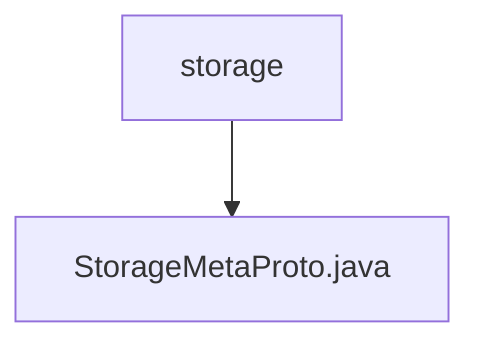

# 基础信息

|      |      |
|------|------|
| 名称 | storage |
| 编码语言 | .java |
| 代码路径 | WeFe/gateway/src/main/java/com/welab/wefe/gateway/api/meta/storage |
| 包名 | docs.gateway.src.main.java.com.welab.wefe.gateway.api.meta.storage |
| 概述说明 | StorageMetaProto定义了存储元数据协议，包含StorageLocator消息和StorageType枚举。StorageLocator包含类型、命名空间、名称和分片字段。StorageType枚举支持LMDB和CLICK_HOUSE两种存储类型。 |

# 说明

该内容定义了一个Protobuf协议文件，主要包含两个部分：StorageType枚举和StorageLocator消息类型。StorageType枚举定义了两种存储类型：LMDB和CLICK_HOUSE，分别对应数值0和1。StorageLocator消息类型包含四个字段：type表示存储类型，namespace和name是字符串类型字段，fragment是整型字段。该文件还包含了完整的序列化、反序列化、构建器等实现逻辑，用于处理StorageLocator消息的编解码操作。整体结构遵循Protobuf标准格式，适用于跨语言数据交换场景。

### 包内部结构视图

该流程图展示了WeFe网关项目中存储元数据相关的文件结构。顶层节点"storage"表示存储元数据目录，其下包含一个Java文件"StorageMetaProto.java"，该文件可能用于定义存储相关的协议缓冲区元数据。整个结构简洁明了，体现了单一目录下的文件层级关系。

# 文件列表

| 名称   | 类型  | 说明 |
|-------|------|-------------|
| [StorageMetaProto.java](StorageMetaProto.md) | file | StorageMetaProto定义了存储元数据协议，包含StorageLocator消息和StorageType枚举。StorageLocator包含类型、命名空间、名称和分片字段。StorageType枚举支持LMDB和CLICK_HOUSE两种存储类型。 |

