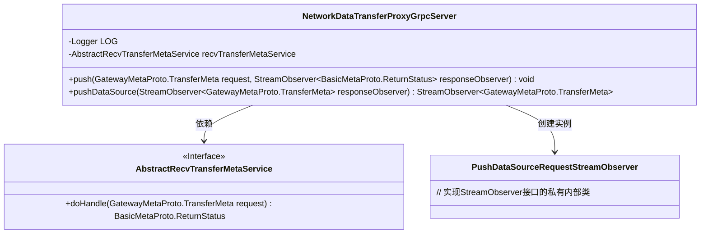
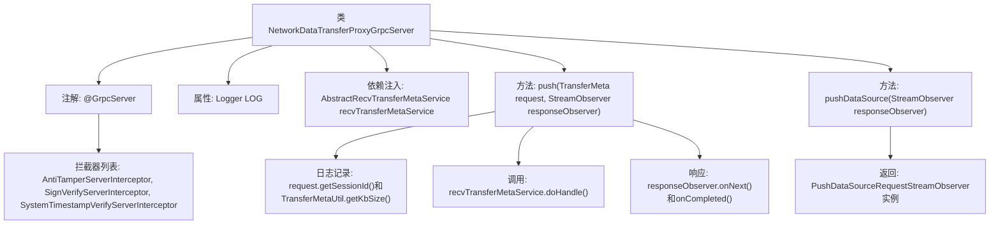

# 基础信息

|      |      |
|------|------|
| 名称 | NetworkDataTransferProxyGrpcServer |
| 编码语言 | .java |
| 代码路径 | WeFe/gateway/src/main/java/com/welab/wefe/gateway/api/service/NetworkDataTransferProxyGrpcServer.java |
| 包名 | com.welab.wefe.gateway.api.service |
| 依赖项 | ['com.welab.wefe.gateway.api.meta.basic.BasicMetaProto', 'com.welab.wefe.gateway.api.meta.basic.GatewayMetaProto', 'com.welab.wefe.gateway.api.service.proto.NetworkDataTransferProxyServiceGrpc', 'com.welab.wefe.gateway.api.streammessage.PushDataSourceRequestStreamObserver', 'com.welab.wefe.gateway.base.GrpcServer', 'com.welab.wefe.gateway.common.GrpcServerScopeEnum', 'com.welab.wefe.gateway.interceptor.AntiTamperServerInterceptor', 'com.welab.wefe.gateway.interceptor.SignVerifyServerInterceptor', 'com.welab.wefe.gateway.interceptor.SystemTimestampVerifyServerInterceptor', 'com.welab.wefe.gateway.service.base.AbstractRecvTransferMetaService', 'com.welab.wefe.gateway.util.TransferMetaUtil', 'io.grpc.stub.StreamObserver', 'org.slf4j.Logger', 'org.slf4j.LoggerFactory', 'org.springframework.beans.factory.annotation.Autowired'] |
| 概述说明 | Grpc服务类NetworkDataTransferProxyGrpcServer，包含拦截器和日志记录，提供push和pushDataSource方法处理数据传输请求，调用recvTransferMetaService处理元数据。 |

# 说明

这是一个名为NetworkDataTransferProxyGrpcServer的gRPC服务类，继承自NetworkDataTransferProxyServiceGrpc的基类。该类使用了三个拦截器：AntiTamperServerInterceptor、SignVerifyServerInterceptor和SystemTimestampVerifyServerInterceptor。主要功能包括处理推送数据请求和建立数据源推送流。其中push方法接收TransferMeta请求并返回处理状态，通过recvTransferMetaService处理请求数据；pushDataSource方法返回一个用于处理数据流传输的StreamObserver实例。类中还包含日志记录功能，记录会话ID和数据大小等信息。

# 类列表 Class Summary

| 名称   | 类型  | 说明 |
|-------|------|-------------|
| NetworkDataTransferProxyGrpcServer | class | Grpc服务类NetworkDataTransferProxyGrpcServer，包含拦截器和日志，通过recvTransferMetaService处理推送请求，支持单次和流式数据传输。 |

## 类 NetworkDataTransferProxyGrpcServer

|      |      |
|------|------|
| 访问范围 | @GrpcServer(interceptors = {AntiTamperServerInterceptor.class, SignVerifyServerInterceptor.class, SystemTimestampVerifyServerInterceptor.class});public |
| 类型 | class |
| 名称 | NetworkDataTransferProxyGrpcServer |
| 说明 | Grpc服务类NetworkDataTransferProxyGrpcServer，包含拦截器和日志，通过recvTransferMetaService处理推送请求，支持单次和流式数据传输。 |

### UML类图

这段代码展示了一个gRPC服务端实现类NetworkDataTransferProxyGrpcServer，它继承自NetworkDataTransferProxyServiceGrpc的基类，并通过@GrpcServer注解配置了三个拦截器。该类主要提供两个gRPC方法：push用于处理单次请求响应模式的数据传输，pushDataSource用于处理流式数据传输。其中push方法依赖AbstractRecvTransferMetaService接口来处理业务逻辑，而pushDataSource方法则创建并返回一个PushDataSourceRequestStreamObserver实例来处理流式请求。类图中清晰地展示了这些类之间的关系和依赖。

### 内部方法调用关系图

该流程图展示了NetworkDataTransferProxyGrpcServer类的核心结构和调用流程。类通过@GrpcServer注解配置了三个安全拦截器，包含两个主要方法：push()处理单次请求并返回状态，涉及日志记录、元数据处理和响应发送；pushDataSource()返回一个流式观察器实例用于处理数据流。关键依赖通过@Autowired注入，日志系统记录会话和数据处理量。

### 字段列表 Field List

| 名称  | 类型  | 说明 |
|-------|-------|------|
| recvTransferMetaService | AbstractRecvTransferMetaService | 自动注入接收传输元数据的抽象服务实例。 |
| LOG = LoggerFactory.getLogger(NetworkDataTransferProxyGrpcServer.class) | Logger | 声明NetworkDataTransferProxyGrpcServer类的私有静态日志对象LOG。 |

### 方法列表

| 名称  | 类型  | 说明 |
|-------|-------|------|
| push | void | Grpc服务端推送方法，处理传输元数据并返回状态，记录会话ID和数据大小。 |
| pushDataSource | StreamObserver<GatewayMetaProto.TransferMeta> | 这是一个Java方法重写，用于推送数据源。它接收一个响应观察者参数，返回一个新的PushDataSourceRequestStreamObserver实例，处理数据传输元信息。 |

