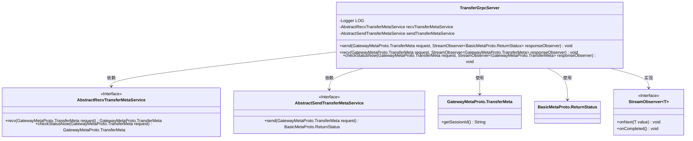
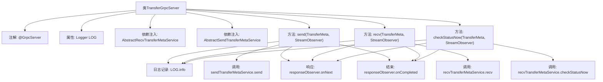

# 基础信息

|      |      |
|------|------|
| 名称 | TransferGrpcServer |
| 编码语言 | .java |
| 代码路径 | WeFe/gateway/src/main/java/com/welab/wefe/gateway/api/service/TransferGrpcServer.java |
| 包名 | com.welab.wefe.gateway.api.service |
| 依赖项 | ['com.welab.wefe.gateway.api.meta.basic.BasicMetaProto', 'com.welab.wefe.gateway.api.meta.basic.GatewayMetaProto', 'com.welab.wefe.gateway.api.service.proto.TransferServiceGrpc', 'com.welab.wefe.gateway.base.GrpcServer', 'com.welab.wefe.gateway.common.GrpcServerScopeEnum', 'com.welab.wefe.gateway.interceptor.IpAddressWhiteListServerInterceptor', 'com.welab.wefe.gateway.service.base.AbstractRecvTransferMetaService', 'com.welab.wefe.gateway.service.base.AbstractSendTransferMetaService', 'com.welab.wefe.gateway.util.TransferMetaUtil', 'io.grpc.stub.StreamObserver', 'org.slf4j.Logger', 'org.slf4j.LoggerFactory', 'org.springframework.beans.factory.annotation.Autowired'] |
| 概述说明 | TransferGrpcServer是内部gRPC服务，包含发送、接收和检查数据状态功能，使用IpAddressWhiteListServerInterceptor拦截器，依赖AbstractRecv和AbstractSend服务处理请求。 |

# 说明

TransferGrpcServer是一个内部使用的gRPC服务类，通过GrpcServer注解标记，并配置了IP白名单拦截器。该类继承自TransferServiceGrpc.TransferServiceImplBase，包含三个核心方法：send用于发送消息到远程，记录会话ID和数据大小；recv为客户端提供拉取数据的接口；checkStatusNow允许客户端检查数据状态。每个方法都通过自动注入的服务类处理请求，并返回响应结果，同时记录相关日志信息。

# 类列表 Class Summary

| 名称   | 类型  | 说明 |
|-------|------|-------------|
| TransferGrpcServer | class | TransferGrpcServer是内部gRPC服务，包含发送、接收和检查数据状态功能，使用IP白名单拦截器，依赖发送和接收元数据服务处理请求。 |

## 类 TransferGrpcServer

|      |      |
|------|------|
| 访问范围 | @GrpcServer(useScope = GrpcServerScopeEnum.INTERNAL, interceptors = {IpAddressWhiteListServerInterceptor.class});public |
| 类型 | class |
| 名称 | TransferGrpcServer |
| 说明 | TransferGrpcServer是内部gRPC服务，包含发送、接收和检查数据状态功能，使用IP白名单拦截器，依赖发送和接收元数据服务处理请求。 |

### UML类图

这段代码展示了一个gRPC服务端实现类TransferGrpcServer，它继承自TransferServiceGrpc.TransferServiceImplBase，提供了send、recv和checkStatusNow三个gRPC服务方法。该类依赖两个抽象服务接口AbstractRecvTransferMetaService和AbstractSendTransferMetaService来处理具体业务逻辑，并使用StreamObserver接口来实现gRPC的异步响应机制。类图中清晰地展示了这些类之间的依赖关系和接口实现关系。

### 内部方法调用关系图

该流程图展示了TransferGrpcServer类的核心结构和调用流程。类通过@GrpcServer注解标记为gRPC服务端，包含三个主要RPC方法：send、recv和checkStatusNow。每个方法均遵循相同模式：先记录请求日志，然后调用对应的Service层方法处理业务逻辑，最后通过StreamObserver返回响应并结束调用。两个Service依赖（AbstractRecv/SendTransferMetaService）通过@Autowired注入，体现了清晰的层级调用关系。

### 字段列表 Field List

| 名称  | 类型  | 说明 |
|-------|-------|------|
| sendTransferMetaService | AbstractSendTransferMetaService | 自动注入发送转账元数据的抽象服务实例。 |
| recvTransferMetaService | AbstractRecvTransferMetaService | 自动注入接收传输元数据的抽象服务实例。 |
| LOG = LoggerFactory.getLogger(TransferGrpcServer.class) | Logger | 定义TransferGrpcServer类的私有静态日志对象LOG，使用LoggerFactory创建。 |

### 方法列表

| 名称  | 类型  | 说明 |
|-------|-------|------|
| send | void | Grpc服务端方法，处理传输请求，记录会话ID和数据大小，返回状态并结束响应。 |
| recv | void | Grpc服务接收请求并返回响应，记录日志后调用服务处理并完成响应。 |
| checkStatusNow | void | 方法checkStatusNow处理gRPC请求，记录日志并调用recvTransferMetaService检查状态，返回结果后关闭连接。 |

