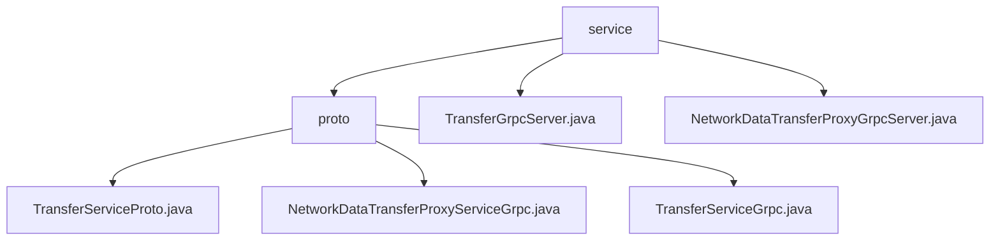

# 基础信息

|      |      |
|------|------|
| 名称 | service |
| 编码语言 | .java |
| 代码路径 | WeFe/gateway/src/main/java/com/welab/wefe/gateway/api/service |
| 包名 | docs.gateway.src.main.java.com.welab.wefe.gateway.api.service |
| 概述说明 | 基于gRPC和Protobuf的跨网络数据传输服务，提供单向和流式RPC接口（send/recv/push等），支持元数据传输和状态检查，含拦截器和日志功能。 |

# 说明

## 概述  
该模块是基于gRPC和Protobuf实现的跨网络数据传输服务，核心职责是提供数据传输代理和状态检查功能。接口规范包含两类服务：TransferService提供单向RPC方法（如send/recv/checkStatusNow），NetworkDataTransferProxyService支持流式RPC（如push/pushDataSource）。关键数据结构包括TransferMeta（传输元数据）和ReturnStatus（返回状态），依赖basic-meta.proto和gateway-meta.proto定义的消息格式。例如pushDataSource采用双向流式交互，类似管道传输模式。

## 主要业务场景  
模块适用于分布式系统间的数据同步，典型流程包括元数据传输（如send/push）、状态查询（checkStatusNow）和流式推送（pushDataSource）。支持UNARY和流式RPC交互，例如客户端通过阻塞存根调用send同步发送数据。功能涵盖异步、阻塞和Future三种调用方式，服务路径统一管理。例如TransferGrpcServer通过IP白名单拦截器保护，NetworkDataTransferProxyGrpcServer使用防篡改等三个拦截器确保安全传输。

### 包内部结构视图

该流程图展示了WeFe网关项目中API服务模块的层级结构。根节点为service目录，包含proto子目录和两个Grpc服务实现文件。proto目录下进一步包含三个协议文件，分别用于数据传输和服务定义。整体结构清晰体现了服务层与协议层的依赖关系，符合gRPC服务的典型架构设计。

# 文件列表

| 名称   | 类型  | 说明 |
|-------|------|-------------|
| [TransferGrpcServer.java](TransferGrpcServer.md) | file | TransferGrpcServer是内部gRPC服务，包含发送、接收和检查数据状态功能，使用IpAddressWhiteListServerInterceptor拦截器，依赖AbstractRecv和AbstractSend服务处理请求。 |
| [NetworkDataTransferProxyGrpcServer.java](NetworkDataTransferProxyGrpcServer.md) | file | Grpc服务类NetworkDataTransferProxyGrpcServer，包含拦截器和日志记录，提供push和pushDataSource方法处理数据传输请求，调用recvTransferMetaService处理元数据。 |
| [proto](proto/_module.md) | package | TransferServiceProto定义Protobuf接口，含注册扩展和描述符方法，提供TransferService和NetworkDataTransferProxyService两个gRPC服务，处理TransferMeta和ReturnStatus消息。NetworkDataTransferProxyServiceGrpc实现push单向和pushDataSource双向流式RPC，支持三种客户端存根。TransferServiceGrpc提供send、recv、checkStatusNow三种UNARY方法，支持异步、阻塞和Future调用。 |

