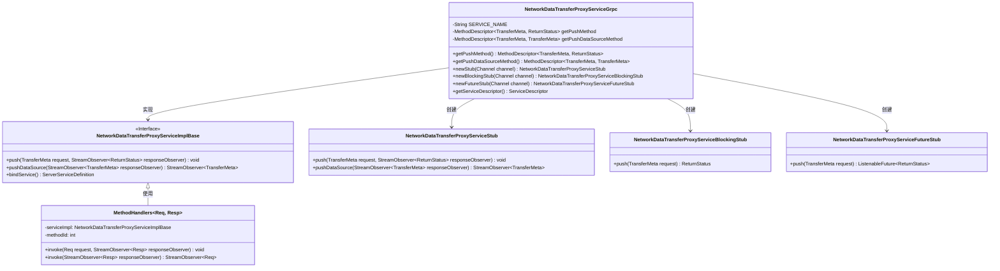
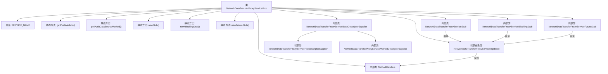

# 基础信息

|      |      |
|------|------|
| 名称 | NetworkDataTransferProxyServiceGrpc |
| 编码语言 | .java |
| 代码路径 | WeFe/gateway/src/main/java/com/welab/wefe/gateway/api/service/proto/NetworkDataTransferProxyServiceGrpc.java |
| 包名 | com.welab.wefe.gateway.api.service.proto |
| 依赖项 | ['io.grpc.MethodDescriptor.generateFullMethodName', 'io.grpc.stub.ClientCalls.asyncBidiStreamingCall', 'io.grpc.stub.ClientCalls.asyncUnaryCall', 'io.grpc.stub.ClientCalls', 'io.grpc.stub.ServerCalls.asyncBidiStreamingCall', 'io.grpc.stub.ServerCalls.asyncUnaryCall', 'io.grpc.stub.ServerCalls'] |
| 概述说明 | 这是一个gRPC服务类，提供数据传输代理功能，包含push和pushDataSource两个方法，分别支持单向和双向流式调用，用于处理网关元数据传递和状态返回。 |

# 说明

该代码定义了一个gRPC服务类NetworkDataTransferProxyServiceGrpc，包含两个主要方法：push和pushDataSource。push是单向RPC方法，接收TransferMeta请求返回ReturnStatus；pushDataSource是双向流式RPC方法，处理TransferMeta数据流。类中提供了三种客户端存根：异步、阻塞和Future风格，并实现了服务描述符构建逻辑。所有方法都基于protobuf定义的消息类型进行通信，服务名称为com.welab.wefe.gateway.api.service.proto.NetworkDataTransferProxyService。

# 类列表 Class Summary

| 名称   | 类型  | 说明 |
|-------|------|-------------|
| NetworkDataTransferProxyServiceGrpc | class | 这是一个gRPC服务类，提供网络数据传输代理功能，包含push和pushDataSource两个方法，支持异步、阻塞和Future调用方式。 |

## 类 NetworkDataTransferProxyServiceGrpc

|      |      |
|------|------|
| 访问范围 | @javax.annotation.Generated(;    value = "by gRPC proto compiler (version 1.29.0)",;    comments = "Source: gateway-service.proto");public final |
| 类型 | class |
| 名称 | NetworkDataTransferProxyServiceGrpc |
| 说明 | 这是一个gRPC服务类，提供网络数据传输代理功能，包含push和pushDataSource两个方法，支持异步、阻塞和Future调用方式。 |

### UML类图

这段代码是一个gRPC服务框架，定义了网络数据传输代理服务的核心结构。NetworkDataTransferProxyServiceGrpc是主类，包含服务描述符和三种stub创建方法。ServiceImplBase是抽象服务实现，三种stub分别支持异步、同步阻塞和Future调用模式。MethodHandlers类处理具体的RPC方法调用逻辑，通过方法ID路由到不同服务实现。整个架构实现了基于Protobuf的双向流式数据传输能力。

### 内部方法调用关系图

该流程图展示了gRPC服务类NetworkDataTransferProxyServiceGrpc的核心结构。类包含3个核心RPC方法(getPushMethod/getPushDataSourceMethod)和3种stub生成方法(newStub/newBlockingStub/newFutureStub)，通过内部抽象类NetworkDataTransferProxyServiceImplBase实现服务绑定，并由MethodHandlers处理具体调用逻辑。各类描述符(File/MethodDescriptorSupplier)构成服务的元数据体系，三种stub(异步/阻塞/Future)分别扩展了不同的调用方式。

### 字段列表 Field List

| 名称  | 类型  | 说明 |
|-------|-------|------|
| METHODID_PUSH_DATA_SOURCE = 1 | int | 私有静态常量METHODID_PUSH_DATA_SOURCE值为1。 |
| getPushMethod | io.grpc.MethodDescriptor<com.welab.wefe.gateway.api.meta.basic.GatewayMetaProto.TransferMeta,
      com.welab.wefe.gateway.api.meta.basic.BasicMetaProto.ReturnStatus> | 私有静态易变变量，用于gRPC方法描述，处理TransferMeta到ReturnStatus的传输。 |
| SERVICE_NAME = "com.welab.wefe.gateway.api.service.proto.NetworkDataTransferProxyService" | String | 定义静态常量SERVICE_NAME，值为网络数据传输代理服务的完整类路径名。 |
| serviceDescriptor | io.grpc.ServiceDescriptor | 私有静态易变变量，存储gRPC服务描述符。 |
| getPushDataSourceMethod | io.grpc.MethodDescriptor<com.welab.wefe.gateway.api.meta.basic.GatewayMetaProto.TransferMeta,
      com.welab.wefe.gateway.api.meta.basic.GatewayMetaProto.TransferMeta> | 私有静态易变变量，存储gRPC方法描述符，用于传输元数据的推送数据源方法。 |
| METHODID_PUSH = 0 | int | 私有静态常量METHODID_PUSH值为0。 |

### 方法列表

| 名称  | 类型  | 说明 |
|-------|-------|------|
| getPushDataSourceMethod | io.grpc.MethodDescriptor<com.welab.wefe.gateway.api.meta.basic.GatewayMetaProto.TransferMeta,
      com.welab.wefe.gateway.api.meta.basic.GatewayMetaProto.TransferMeta> | 定义gRPC双向流方法pushDataSource，请求和响应类型均为TransferMeta，通过同步块确保方法描述符单例初始化。 |
| getPushMethod | io.grpc.MethodDescriptor<com.welab.wefe.gateway.api.meta.basic.GatewayMetaProto.TransferMeta,
      com.welab.wefe.gateway.api.meta.basic.BasicMetaProto.ReturnStatus> | 定义gRPC方法push，请求类型TransferMeta，响应类型ReturnStatus，方法类型UNARY，通过双重检查锁确保线程安全。 |
| newStub | NetworkDataTransferProxyServiceStub | 创建gRPC客户端存根，通过工厂模式实例化NetworkDataTransferProxyServiceStub，接收通道参数并返回新存根实例。 |
| newBlockingStub | NetworkDataTransferProxyServiceBlockingStub | 创建gRPC阻塞存根，通过工厂模式生成NetworkDataTransferProxyServiceBlockingStub实例，传入Channel参数。 |
| newFutureStub | NetworkDataTransferProxyServiceFutureStub | 创建一个gRPC异步存根工厂，通过给定通道生成NetworkDataTransferProxyServiceFutureStub实例。 |
| getServiceDescriptor | io.grpc.ServiceDescriptor | 这是一个gRPC服务描述符的懒加载方法，通过双重检查锁确保线程安全，包含两个方法（Push和PushDataSource）并设置文件描述符。 |

