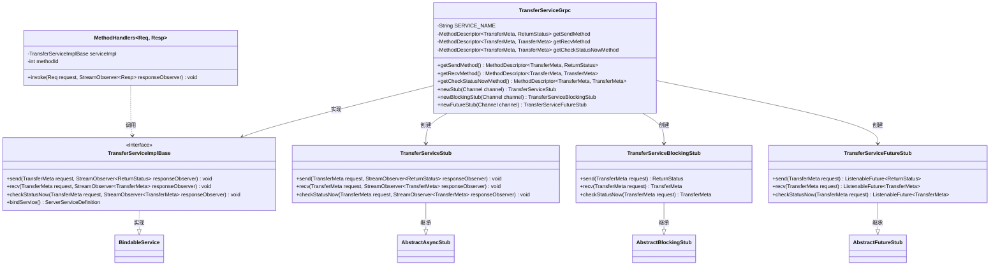

# 基础信息

|      |      |
|------|------|
| 名称 | TransferServiceGrpc |
| 编码语言 | .java |
| 代码路径 | WeFe/gateway/src/main/java/com/welab/wefe/gateway/api/service/proto/TransferServiceGrpc.java |
| 包名 | com.welab.wefe.gateway.api.service.proto |
| 依赖项 | ['io.grpc.MethodDescriptor.generateFullMethodName', 'io.grpc.stub.ClientCalls.asyncUnaryCall', 'io.grpc.stub.ClientCalls.blockingUnaryCall', 'io.grpc.stub.ClientCalls.futureUnaryCall', 'io.grpc.stub.ServerCalls.asyncUnaryCall', 'io.grpc.stub.ServerCalls.asyncUnimplementedUnaryCall'] |
| 概述说明 | TransferServiceGrpc类提供gRPC服务，包含send、recv和checkStatusNow三个方法，支持异步、阻塞和Future调用方式。 |

# 说明

该内容定义了一个基于gRPC的TransferServiceGrpc类，包含三个主要方法：send用于发送传输元数据并返回状态，recv用于接收传输元数据，checkStatusNow用于立即检查传输状态。类中提供了异步、阻塞和Future三种调用方式的支持，并通过方法描述符和ServiceDescriptor进行服务配置。所有方法均为UNARY类型，使用TransferMeta作为请求或响应类型。

# 类列表 Class Summary

| 名称   | 类型  | 说明 |
|-------|------|-------------|
| TransferServiceGrpc | class | TransferServiceGrpc类定义了gRPC服务，包含send、recv和checkStatusNow三个方法，用于处理TransferMeta消息和返回状态。支持异步、阻塞和Future三种调用方式。 |

## 类 TransferServiceGrpc

|      |      |
|------|------|
| 访问范围 | @javax.annotation.Generated(;    value = "by gRPC proto compiler (version 1.29.0)",;    comments = "Source: gateway-service.proto");public final |
| 类型 | class |
| 名称 | TransferServiceGrpc |
| 说明 | TransferServiceGrpc类定义了gRPC服务，包含send、recv和checkStatusNow三个方法，用于处理TransferMeta消息和返回状态。支持异步、阻塞和Future三种调用方式。 |

### UML类图

这段代码是gRPC服务TransferService的Java实现，包含服务端基类、三种客户端存根（异步/阻塞/Future风格）以及方法处理器。核心类TransferServiceGrpc提供静态方法描述符和存根创建方法，TransferServiceImplBase定义服务接口，三个存根类分别实现不同调用方式。通过MethodHandlers实现服务方法的路由调用，整体采用双重检查锁实现线程安全的懒加载模式。

### 内部方法调用关系图

```mermaid
graph TD
    A["类TransferServiceGrpc"]
    B["常量: SERVICE_NAME"]
    C["静态方法: getSendMethod()"]
    D["静态方法: getRecvMethod()"]
    E["静态方法: getCheckStatusNowMethod()"]
    F["静态方法: newStub()"]
    G["静态方法: newBlockingStub()"]
    H["静态方法: newFutureStub()"]
    I["内部类: TransferServiceImplBase"]
    J["内部类: TransferServiceStub"]
    K["内部类: TransferServiceBlockingStub"]
    L["内部类: TransferServiceFutureStub"]
    M["内部类: MethodHandlers"]
    N["内部类: TransferServiceBaseDescriptorSupplier"]
    O["内部类: TransferServiceFileDescriptorSupplier"]
    P["内部类: TransferServiceMethodDescriptorSupplier"]

    A --> B
    A --> C
    A --> D
    A --> E
    A --> F
    A --> G
    A --> H
    A --> I
    A --> J
    A --> K
    A --> L
    A --> M
    A --> N
    N --> O
    N --> P
    I -->|实现| M
    J -->|继承| io.grpc.stub.AbstractAsyncStub
    K -->|继承| io.grpc.stub.AbstractBlockingStub
    L -->|继承| io.grpc.stub.AbstractFutureStub
```

这段代码是gRPC服务框架生成的Java类，主要功能是提供传输服务的gRPC接口定义和实现。类结构包含核心服务描述符生成方法(getSendMethod/getRecvMethod等)、三种stub创建方法(newStub/newBlockingStub/newFutureStub)以及多个内部类。内部类实现了服务基类、各种调用方式的stub以及方法处理器等核心组件，通过双重检查锁定模式保证线程安全的方法描述符初始化，支持UNARY调用类型的RPC通信。

### 字段列表 Field List

| 名称  | 类型  | 说明 |
|-------|-------|------|
| METHODID_CHECK_STATUS_NOW = 2 | int | 私有静态常量METHODID_CHECK_STATUS_NOW值为2。 |
| getSendMethod | io.grpc.MethodDescriptor<com.welab.wefe.gateway.api.meta.basic.GatewayMetaProto.TransferMeta,
      com.welab.wefe.gateway.api.meta.basic.BasicMetaProto.ReturnStatus> | 私有静态易变变量，存储gRPC方法描述，用于传输GatewayMetaProto.TransferMeta并返回BasicMetaProto.ReturnStatus。 |
| getRecvMethod | io.grpc.MethodDescriptor<com.welab.wefe.gateway.api.meta.basic.GatewayMetaProto.TransferMeta,
      com.welab.wefe.gateway.api.meta.basic.GatewayMetaProto.TransferMeta> | 私有静态易变变量getRecvMethod，类型为io.grpc.MethodDescriptor，处理GatewayMetaProto.TransferMeta的传输元数据。 |
| serviceDescriptor | io.grpc.ServiceDescriptor | 声明一个私有静态易变的gRPC服务描述符变量。 |
| SERVICE_NAME = "com.welab.wefe.gateway.api.service.proto.TransferService" | String | 定义静态常量SERVICE_NAME，值为TransferService的完整服务路径。 |
| METHODID_SEND = 0 | int | 私有静态常量METHODID_SEND值为0。 |
| METHODID_RECV = 1 | int | 私有静态常量METHODID_RECV值为1，用于标识方法。 |
| getCheckStatusNowMethod | io.grpc.MethodDescriptor<com.welab.wefe.gateway.api.meta.basic.GatewayMetaProto.TransferMeta,
      com.welab.wefe.gateway.api.meta.basic.GatewayMetaProto.TransferMeta> | 私有静态易变变量，存储gRPC方法描述符，用于处理TransferMeta类型的请求和响应。 |

### 方法列表

| 名称  | 类型  | 说明 |
|-------|-------|------|
| newFutureStub | TransferServiceFutureStub | 创建TransferServiceFutureStub的静态方法，通过gRPC通道和工厂模式实例化异步存根。 |
| newStub | TransferServiceStub | 创建TransferServiceStub的静态方法，通过gRPC Channel和工厂模式实例化并返回新Stub。 |
| getSendMethod | io.grpc.MethodDescriptor<com.welab.wefe.gateway.api.meta.basic.GatewayMetaProto.TransferMeta,
      com.welab.wefe.gateway.api.meta.basic.BasicMetaProto.ReturnStatus> | 定义gRPC的send方法，请求类型为TransferMeta，响应类型为ReturnStatus，方法类型为UNARY，通过双重检查锁确保线程安全。 |
| newBlockingStub | TransferServiceBlockingStub | 创建一个阻塞式gRPC客户端存根，通过工厂模式实例化并返回TransferServiceBlockingStub对象。 |
| getRecvMethod | io.grpc.MethodDescriptor<com.welab.wefe.gateway.api.meta.basic.GatewayMetaProto.TransferMeta,
      com.welab.wefe.gateway.api.meta.basic.GatewayMetaProto.TransferMeta> | 定义gRPC方法getRecvMethod，用于处理TransferMeta类型的UNARY请求和响应，通过双重检查锁确保线程安全初始化。 |
| getCheckStatusNowMethod | io.grpc.MethodDescriptor<com.welab.wefe.gateway.api.meta.basic.GatewayMetaProto.TransferMeta,
      com.welab.wefe.gateway.api.meta.basic.GatewayMetaProto.TransferMeta> | 定义gRPC方法checkStatusNow，使用TransferMeta类作为请求和响应类型，方法类型为UNARY，通过双重检查锁确保线程安全初始化。 |
| getServiceDescriptor | io.grpc.ServiceDescriptor | 这是一个gRPC服务描述符的懒加载方法，通过双重检查锁确保线程安全，初始化包含三个方法（Send、Recv、CheckStatusNow）的服务描述符并返回。 |

