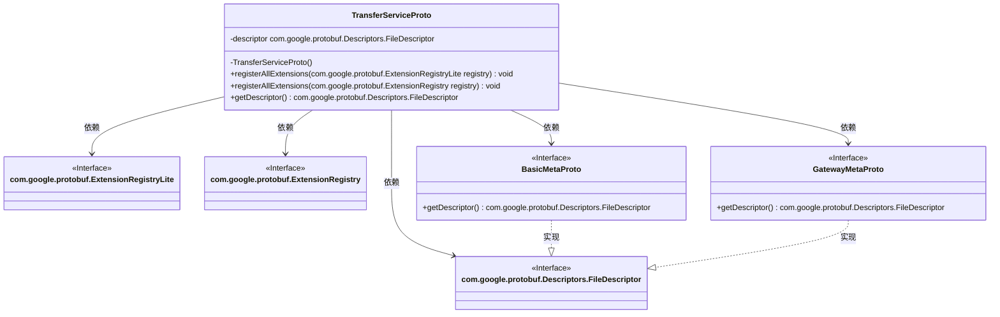
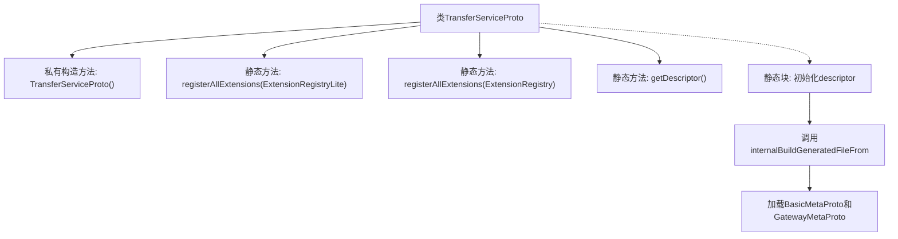

# 基础信息

|      |      |
|------|------|
| 名称 | TransferServiceProto |
| 编码语言 | .java |
| 代码路径 | WeFe/gateway/src/main/java/com/welab/wefe/gateway/api/service/proto/TransferServiceProto.java |
| 包名 | com.welab.wefe.gateway.api.service.proto |
| 依赖项 | [] |
| 概述说明 | TransferServiceProto类定义了数据传输服务，包含send、recv和checkStatusNow方法，用于处理TransferMeta和ReturnStatus消息。同时提供NetworkDataTransferProxyService服务，支持push和pushDataSource操作。 |

# 说明

这是一个名为TransferServiceProto的Java类，用于定义Protobuf服务接口。该类包含静态方法registerAllExtensions用于注册扩展，getDescriptor获取文件描述符。描述符数据定义了TransferService和NetworkDataTransferProxyService两个gRPC服务，分别提供send、recv、checkStatusNow和push、pushDataSource方法，处理TransferMeta和ReturnStatus消息类型。类初始化时加载了basic-meta.proto和gateway-meta.proto依赖。

# 类列表 Class Summary

| 名称   | 类型  | 说明 |
|-------|------|-------------|
| TransferServiceProto | class | TransferServiceProto类定义了数据传输服务，包含send、recv和checkStatusNow方法，用于处理TransferMeta和ReturnStatus消息。同时包含NetworkDataTransferProxyService服务，支持push和pushDataSource方法。基于Protocol Buffers实现。 |

## 类 TransferServiceProto

|      |      |
|------|------|
| 访问范围 | public final |
| 类型 | class |
| 名称 | TransferServiceProto |
| 说明 | TransferServiceProto类定义了数据传输服务，包含send、recv和checkStatusNow方法，用于处理TransferMeta和ReturnStatus消息。同时包含NetworkDataTransferProxyService服务，支持push和pushDataSource方法。基于Protocol Buffers实现。 |

### UML类图

这段代码是Google Protocol Buffers生成的TransferServiceProto类，主要用于处理网络数据传输服务的协议定义。它是一个final工具类，包含静态方法用于注册扩展和获取文件描述符，依赖多个Protocol Buffers接口。类通过静态初始化块加载proto文件描述符，并与BasicMetaProto和GatewayMetaProto两个接口交互。整个结构展示了Protocol Buffers生成的Java代码典型模式，强调不可变性和静态工具方法。

### 内部方法调用关系图

这段代码是Google Protocol Buffers生成的Java类，用于定义TransferService的协议结构。主要包含静态初始化块来构建文件描述符，注册扩展方法，以及提供获取描述符的方法。流程图展示了类结构、初始化流程和外部依赖加载关系，核心是通过descriptorData字符串构建协议描述符并关联其他proto文件。

### 字段列表 Field List

| 名称  | 类型  | 说明 |
|-------|-------|------|
| descriptor | com.google.protobuf.Descriptors.FileDescriptor | 私有静态变量descriptor，类型为com.google.protobuf.Descriptors.FileDescriptor。 |

### 方法列表

| 名称  | 类型  | 说明 |
|-------|-------|------|
| registerAllExtensions | void | 静态方法registerAllExtensions用于向Protobuf的ExtensionRegistryLite注册扩展，当前实现为空。 |
| registerAllExtensions | void | 这是一个Java静态方法，用于将所有扩展注册到Protobuf的ExtensionRegistry中。方法内部调用了另一个重载方法，将registry转换为ExtensionRegistryLite类型进行处理。 |
| getDescriptor | com.google.protobuf.Descriptors.FileDescriptor | 这是一个静态方法，返回Google Protocol Buffers的文件描述符对象descriptor。 |

