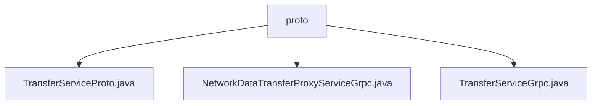

# 基础信息

|      |      |
|------|------|
| 名称 | proto |
| 编码语言 | .java |
| 代码路径 | WeFe/gateway/src/main/java/com/welab/wefe/gateway/api/service/proto |
| 包名 | docs.gateway.src.main.java.com.welab.wefe.gateway.api.service.proto |
| 概述说明 | TransferServiceProto定义Protobuf接口，含注册扩展和描述符方法，提供TransferService和NetworkDataTransferProxyService两个gRPC服务，处理TransferMeta和ReturnStatus消息。NetworkDataTransferProxyServiceGrpc实现push单向和pushDataSource双向流式RPC，支持三种客户端存根。TransferServiceGrpc提供send、recv、checkStatusNow三种UNARY方法，支持异步、阻塞和Future调用。 |

# 说明

## 概述  
该模块是基于gRPC和Protobuf实现的跨网络数据传输服务，核心职责是提供数据传输代理和状态检查功能。接口规范包含两类服务：TransferService提供单向RPC方法（send/recv/checkStatusNow），NetworkDataTransferProxyService支持单向和双向流式RPC（push/pushDataSource）。关键数据结构为TransferMeta（传输元数据）和ReturnStatus（返回状态），依赖basic-meta.proto和gateway-meta.proto定义的消息格式。例如，pushDataSource采用双向流式交互类似管道传输模式。

## 主要业务场景  
模块适用于分布式系统间的数据同步场景，典型流程包括元数据传输（如send/push）、状态查询（checkStatusNow）和流式数据推送（pushDataSource）。交互模式涵盖UNARY和流式RPC，例如客户端通过阻塞存根调用send方法同步发送数据。完整功能支持异步、阻塞和Future三种调用方式，服务名称通过com.welab.wefe.gateway.api.service.proto路径统一管理。

### 包内部结构视图

该流程图展示了WeFe网关项目中proto目录下的三个关键文件：TransferServiceProto.java定义服务接口，NetworkDataTransferProxyServiceGrpc.java和TransferServiceGrpc.java分别实现gRPC通信功能。这些文件共同构成了网关服务的核心通信层，用于处理数据传输和服务调用。

# 文件列表

| 名称   | 类型  | 说明 |
|-------|------|-------------|
| [TransferServiceProto.java](TransferServiceProto.md) | file | TransferServiceProto类定义了数据传输服务，包含send、recv和checkStatusNow方法，用于处理TransferMeta和ReturnStatus消息。同时提供NetworkDataTransferProxyService服务，支持push和pushDataSource操作。 |
| [NetworkDataTransferProxyServiceGrpc.java](NetworkDataTransferProxyServiceGrpc.md) | file | 这是一个gRPC服务类，提供数据传输代理功能，包含push和pushDataSource两个方法，分别支持单向和双向流式调用，用于处理网关元数据传递和状态返回。 |
| [TransferServiceGrpc.java](TransferServiceGrpc.md) | file | TransferServiceGrpc类提供gRPC服务，包含send、recv和checkStatusNow三个方法，支持异步、阻塞和Future调用方式。 |

