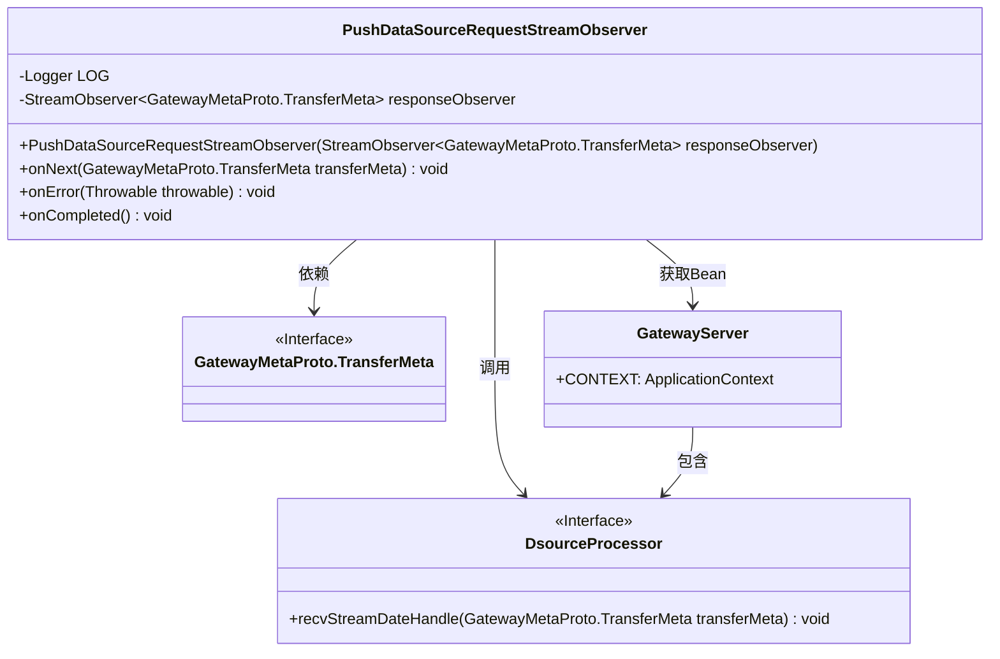
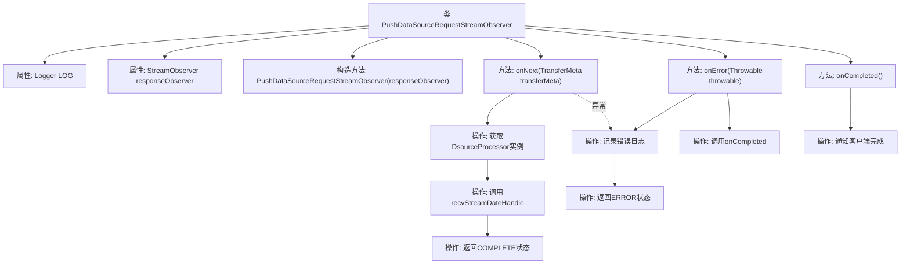

# 基础信息

|      |      |
|------|------|
| 名称 | PushDataSourceRequestStreamObserver |
| 编码语言 | .java |
| 代码路径 | WeFe/gateway/src/main/java/com/welab/wefe/gateway/api/streammessage/PushDataSourceRequestStreamObserver.java |
| 包名 | com.welab.wefe.gateway.api.streammessage |
| 依赖项 | ['com.welab.wefe.gateway.GatewayServer', 'com.welab.wefe.gateway.api.meta.basic.GatewayMetaProto', 'com.welab.wefe.gateway.service.processors.DsourceProcessor', 'io.grpc.stub.StreamObserver', 'org.slf4j.Logger', 'org.slf4j.LoggerFactory'] |
| 概述说明 | PushDataSourceRequestStreamObserver类处理数据传输，保存数据到数据库并返回状态，异常时记录错误并通知客户端。 |

# 说明

PushDataSourceRequestStreamObserver类实现了StreamObserver接口，用于处理GatewayMetaProto.TransferMeta类型的数据流。它通过构造函数接收一个响应观察器，并在onNext方法中处理接收到的数据：调用DsourceProcessor保存数据到数据库，并通过响应观察器返回处理状态（成功为COMPLETE，失败为ERROR）。onError和onCompleted方法分别处理错误和完成事件，记录日志并通知客户端。整个过程包含异常处理和状态反馈机制。

# 类列表 Class Summary

| 名称   | 类型  | 说明 |
|-------|------|-------------|
| PushDataSourceRequestStreamObserver | class | PushDataSourceRequestStreamObserver类处理数据传输流，接收TransferMeta数据并保存到数据库，成功或失败时更新状态并通知客户端，同时处理错误和完成事件。 |

## 类 PushDataSourceRequestStreamObserver

|      |      |
|------|------|
| 访问范围 | public |
| 类型 | class |
| 名称 | PushDataSourceRequestStreamObserver |
| 说明 | PushDataSourceRequestStreamObserver类处理数据传输流，接收TransferMeta数据并保存到数据库，成功或失败时更新状态并通知客户端，同时处理错误和完成事件。 |

### UML类图

这段代码展示了一个实现StreamObserver接口的PushDataSourceRequestStreamObserver类，用于处理GatewayMetaProto.TransferMeta类型的数据流。主要功能包括：通过onNext方法接收并处理传输元数据（调用DsourceProcessor保存到数据库），通过onError和onCompleted方法处理错误和完成状态。类图中清晰地展示了与GatewayMetaProto.TransferMeta接口、DsourceProcessor接口及GatewayServer类的关系，体现了数据流处理的核心逻辑和异常处理机制。

### 内部方法调用关系图

该流程图展示了PushDataSourceRequestStreamObserver类的核心结构和处理流程。类通过StreamObserver接口实现双向流式通信，主要处理数据传输的三种状态：正常处理(onNext)、错误处理(onError)和完成处理(onCompleted)。在onNext方法中，通过DsourceProcessor处理接收到的数据，并根据处理结果返回不同的传输状态。整个过程包含异常处理和日志记录机制，确保数据传输的可靠性。

### 字段列表 Field List

| 名称  | 类型  | 说明 |
|-------|-------|------|
| responseObserver | StreamObserver<GatewayMetaProto.TransferMeta> | 私有流观察器，用于处理GatewayMetaProto.TransferMeta类型的响应。 |
| LOG = LoggerFactory.getLogger(PushDataSourceRequestStreamObserver.class) | Logger | 类PushDataSourceRequestStreamObserver中定义了一个私有不可变的日志记录器LOG，用于记录日志信息。 |

### 方法列表

| 名称  | 类型  | 说明 |
|-------|-------|------|
| onError | void | 方法onError处理异常，记录错误日志并调用onCompleted。 |
| onCompleted | void | 方法重写完成事件，调用responseObserver通知客户端数据处理完成。 |
| onNext | void | 处理传输元数据：保存到数据库并更新状态为完成或错误。异常时记录日志并返回错误状态。 |

