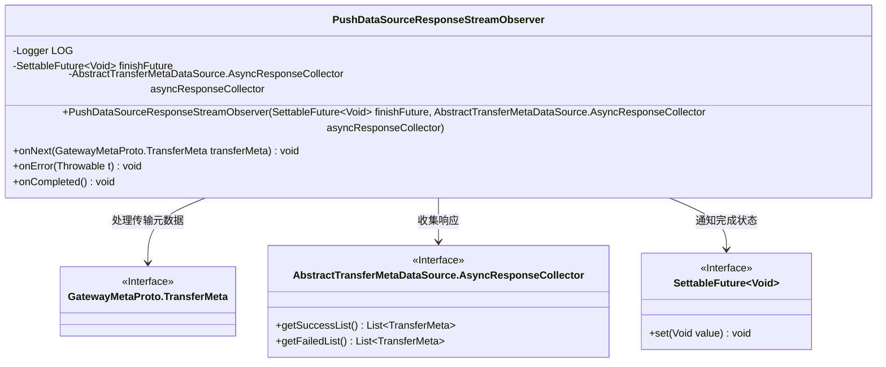
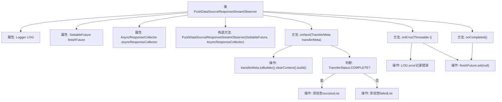

# 基础信息

|      |      |
|------|------|
| 名称 | PushDataSourceResponseStreamObserver |
| 编码语言 | .java |
| 代码路径 | WeFe/gateway/src/main/java/com/welab/wefe/gateway/api/streammessage/PushDataSourceResponseStreamObserver.java |
| 包名 | com.welab.wefe.gateway.api.streammessage |
| 依赖项 | ['com.google.common.util.concurrent.SettableFuture', 'com.welab.wefe.gateway.api.meta.basic.GatewayMetaProto', 'com.welab.wefe.gateway.service.base.AbstractTransferMetaDataSource', 'io.grpc.stub.StreamObserver', 'org.slf4j.Logger', 'org.slf4j.LoggerFactory'] |
| 概述说明 | PushDataSourceResponseStreamObserver类实现StreamObserver接口，处理TransferMeta流数据。根据传输状态分类存储成功或失败请求，错误时记录日志并完成future，流结束时标记future完成。 |

# 说明

PushDataSourceResponseStreamObserver类实现了StreamObserver接口，用于处理GatewayMetaProto.TransferMeta类型的流式响应。它包含一个日志记录器和两个成员变量：SettableFuture用于标记完成状态，AsyncResponseCollector用于异步收集响应。onNext方法根据传输状态将清理后的transferMeta分类存入成功或失败列表。onError方法记录错误并标记完成，onCompleted方法直接标记完成。

# 类列表 Class Summary

| 名称   | 类型  | 说明 |
|-------|------|-------------|
| PushDataSourceResponseStreamObserver | class | PushDataSourceResponseStreamObserver类实现了StreamObserver接口，处理TransferMeta数据流，根据状态分类存储到成功或失败列表，错误时记录日志并完成future，流结束时也完成future。 |

## 类 PushDataSourceResponseStreamObserver

|      |      |
|------|------|
| 访问范围 | public |
| 类型 | class |
| 名称 | PushDataSourceResponseStreamObserver |
| 说明 | PushDataSourceResponseStreamObserver类实现了StreamObserver接口，处理TransferMeta数据流，根据状态分类存储到成功或失败列表，错误时记录日志并完成future，流结束时也完成future。 |

### UML类图

这段代码展示了一个实现StreamObserver接口的类PushDataSourceResponseStreamObserver，用于处理异步数据流。它通过三个核心方法(onNext/onError/onCompleted)处理传输元数据，将结果分类存储到AsyncResponseCollector中，并通过SettableFuture通知完成状态。类图清晰地展示了它与三个接口的依赖关系，体现了响应式编程中观察者模式的应用。

### 内部方法调用关系图

这段代码实现了一个响应式流观察者，用于处理数据传输的三种状态：正常数据（onNext）、错误（onError）和完成（onCompleted）。当收到数据时会清空内容并根据传输状态分类存储，错误时记录日志并终止Future，完成时直接终止Future。流程图清晰展示了状态判断分支和异步回调处理逻辑，体现了对gRPC流式调用的完整生命周期管理。

### 字段列表 Field List

| 名称  | 类型  | 说明 |
|-------|-------|------|
| LOG = LoggerFactory.getLogger(PushDataSourceResponseStreamObserver.class) | Logger | 类PushDataSourceResponseStreamObserver中定义了一个私有不可变的Logger实例LOG，用于记录日志。 |
| finishFuture | SettableFuture<Void> | 私有可设置Future对象，用于表示完成状态。 |
| asyncResponseCollector | AbstractTransferMetaDataSource.AsyncResponseCollector | 私有成员变量asyncResponseCollector，类型为AbstractTransferMetaDataSource的内部类AsyncResponseCollector。 |

### 方法列表

| 名称  | 类型  | 说明 |
|-------|-------|------|
| onError | void | 方法重写，处理错误时记录日志并设置完成状态。 |
| onNext | void | 方法处理传输元数据，清空内容后根据状态分类：成功状态存入成功列表，其他存入失败列表。 |
| onCompleted | void | 方法重写完成回调，设置future为null表示操作结束。 |

