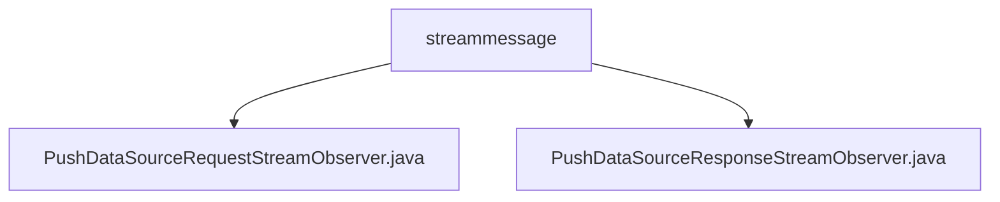

# 基础信息

|      |      |
|------|------|
| 名称 | streammessage |
| 编码语言 | .java |
| 代码路径 | WeFe/gateway/src/main/java/com/welab/wefe/gateway/api/streammessage |
| 包名 | docs.gateway.src.main.java.com.welab.wefe.gateway.api.streammessage |
| 概述说明 | PushDataSourceRequestStreamObserver处理数据流，保存数据并反馈状态，含异常处理。PushDataSourceResponseStreamObserver处理流式响应，分类存储结果并标记完成状态。 |

# 说明

## 概述  
该模块核心职责是实现基于StreamObserver的双向流式数据处理，负责TransferMeta类型数据的传输、存储及状态反馈。接口规范遵循异步响应模式，包含PushDataSourceRequestStreamObserver（处理请求流）和PushDataSourceResponseStreamObserver（处理响应流）。关键数据结构为GatewayMetaProto.TransferMeta，依赖SettableFuture和AsyncResponseCollector实现异步协调。例如请求流通过DsourceProcessor持久化数据，响应流则分类存储处理结果。

## 主要业务场景  
典型场景为数据网关的流式传输：客户端推送TransferMeta数据流，服务端异步处理并返回状态码（如COMPLETE/ERROR）。交互模式类似生产者-消费者模型，请求流负责数据存储与异常处理，响应流通过Future机制聚合结果。例如onNext触发数据库操作，onError统一记录日志，整体流程强调端到端状态追踪与资源清理。

### 包内部结构视图

该流程图展示了streammessage目录下的两个Java文件：PushDataSourceRequestStreamObserver.java和PushDataSourceResponseStreamObserver.java。这两个文件都直接隶属于streammessage目录，没有更深层级的子目录结构。图表清晰地呈现了文件与父目录之间的直接包含关系，符合给定的路径信息要求。

# 文件列表

| 名称   | 类型  | 说明 |
|-------|------|-------------|
| [PushDataSourceRequestStreamObserver.java](PushDataSourceRequestStreamObserver.md) | file | PushDataSourceRequestStreamObserver类处理数据传输，保存数据到数据库并返回状态，异常时记录错误并通知客户端。 |
| [PushDataSourceResponseStreamObserver.java](PushDataSourceResponseStreamObserver.md) | file | PushDataSourceResponseStreamObserver类实现StreamObserver接口，处理TransferMeta流数据。根据传输状态分类存储成功或失败请求，错误时记录日志并完成future，流结束时标记future完成。 |

