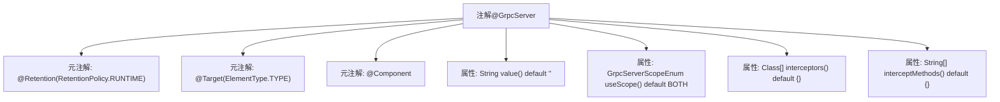

# 基础信息

|      |      |
|------|------|
| 名称 | GrpcServer |
| 编码语言 | .java |
| 代码路径 | WeFe/gateway/src/main/java/com/welab/wefe/gateway/base/GrpcServer.java |
| 包名 | com.welab.wefe.gateway.base |
| 依赖项 | ['com.welab.wefe.gateway.common.GrpcServerScopeEnum', 'io.grpc.ServerInterceptor', 'org.springframework.stereotype.Component', 'java.lang.annotation.ElementType', 'java.lang.annotation.Retention', 'java.lang.annotation.RetentionPolicy', 'java.lang.annotation.Target'] |
| 概述说明 | GrpcServer注解定义gRPC服务，包含bean名称、作用域、拦截器类和拦截方法等配置项。 |

# 说明

这是一个名为GrpcServer的Java注解，用于标记gRPC服务器相关组件。该注解具有运行时保留策略，只能应用于类级别。它包含四个可配置属性：value用于指定bean名称，默认空字符串；useScope定义服务器使用范围，默认为BOTH；interceptors可设置拦截器类数组，默认空数组；interceptMethods指定要拦截的方法名数组，默认空数组，未设置时拦截目标类所有方法。该注解需与interceptor属性配合使用。

# 类列表 Class Summary

| 名称   | 类型  | 说明 |
|-------|------|-------------|
| GrpcServer | annotation | GrpcServer注解用于定义gRPC服务，包含bean名称、作用域、拦截器列表及拦截方法等配置项。 |


## 类 GrpcServer

|      |      |
|------|------|
| 访问范围 | @Retention(RetentionPolicy.RUNTIME);@Target(ElementType.TYPE);@Component;public |
| 类型 | annotation |
| 名称 | GrpcServer |
| 说明 | GrpcServer注解用于定义gRPC服务，包含bean名称、作用域、拦截器列表及拦截方法等配置项。 |


### UML类图

```mermaid
classDiagram
    class GrpcServer {
        <<Interface>>
        +String value() default ""
        +GrpcServerScopeEnum useScope() default GrpcServerScopeEnum.BOTH
        +Class~ServerInterceptor~[] interceptors() default {}
        +String[] interceptMethods() default {}
    }
    class GrpcServerScopeEnum {
        <<Enumeration>>
        +BOTH
        // 其他枚举值未在代码中显示
    }
    class ServerInterceptor {
        <<Interface>>
    }

    GrpcServer --> GrpcServerScopeEnum : 使用枚举类型
    GrpcServer --> ServerInterceptor : 使用拦截器类型
```

该代码定义了一个名为GrpcServer的注解接口，用于标记gRPC服务端组件，包含四个可配置属性：bean名称(value)、服务范围(useScope)、拦截器列表(interceptors)和需拦截的方法名(interceptMethods)。注解通过GrpcServerScopeEnum枚举限定服务范围，并支持ServerInterceptor类型的拦截器类数组。类图清晰展示了注解与枚举、拦截器接口之间的依赖关系，体现了gRPC服务端的核心配置能力。


### 内部方法调用关系图



该流程图展示了GrpcServer注解的结构，包含三个元注解声明和四个可配置属性。元注解定义了注解的保留策略（RUNTIME）、作用目标（TYPE）和组件标识，而属性分别控制bean名称、服务范围、拦截器列表和特定方法拦截配置。这种设计允许通过注解灵活配置gRPC服务器的行为，同时保持代码简洁性。

### 字段列表 Field List

| 名称  | 类型  | 说明 |
|-------|-------|------|
| value | String | 定义字符串类型默认值为空字符串。 |
| useScope | GrpcServerScopeEnum | GrpcServerScopeEnum默认值为BOTH，用于定义使用范围。 |
| interceptors | Class<? extends ServerInterceptor>[] | 声明一个返回ServerInterceptor子类数组的interceptors方法，默认值为空数组。 |
| interceptMethods | String[] | 定义了一个名为interceptMethods的字符串数组参数，默认值为空数组。 |

### 方法列表

| 名称  | 类型  | 说明 |
|-------|-------|------|


