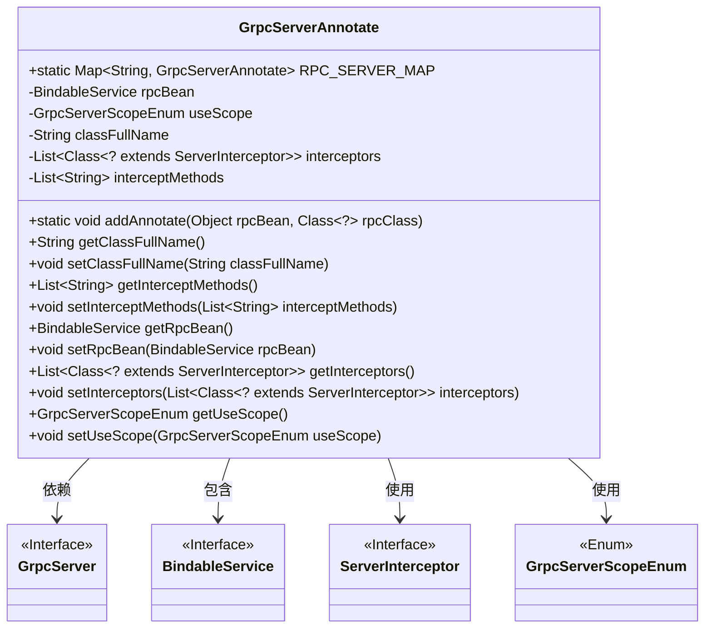
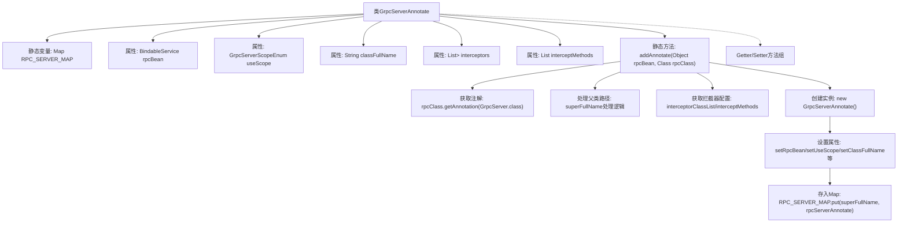

# 基础信息

|      |      |
|------|------|
| 名称 | GrpcServerAnnotate |
| 编码语言 | .java |
| 代码路径 | WeFe/gateway/src/main/java/com/welab/wefe/gateway/base/GrpcServerAnnotate.java |
| 包名 | com.welab.wefe.gateway.base |
| 依赖项 | ['com.welab.wefe.gateway.common.GrpcServerScopeEnum', 'io.grpc.BindableService', 'io.grpc.ServerInterceptor', 'java.util'] |
| 概述说明 | GrpcServerAnnotate类用于管理带@RpcServer注解的gRPC服务，包含服务对象、作用域、类路径、拦截器及拦截方法，通过静态Map存储所有注解实例。 |

# 说明

GrpcServerAnnotate类用于管理带有@RpcServer注解的gRPC服务实体。核心功能包括维护全局映射RPC_SERVER_MAP，存储服务类全路径与对应注解对象的关联。类包含五个关键属性：rpcBean存储被注解的服务对象，useScope定义服务使用范围，classFullName记录服务类全路径（自动去除grpc后缀），interceptors保存拦截器列表，interceptMethods指定需拦截的方法名集合。核心方法addAnnotate负责解析注解信息，构建并注册注解实体到映射表。通过getter/setter方法提供各属性的访问和修改能力。

# 类列表 Class Summary

| 名称   | 类型  | 说明 |
|-------|------|-------------|
| GrpcServerAnnotate | class | GrpcServerAnnotate类用于管理带有@RpcServer注解的gRPC服务实体，包含服务对象、作用域、类路径、拦截器及拦截方法，通过addAnnotate方法注册到静态映射表中。 |

## 类 GrpcServerAnnotate

|      |      |
|------|------|
| 访问范围 | public |
| 类型 | class |
| 名称 | GrpcServerAnnotate |
| 说明 | GrpcServerAnnotate类用于管理带有@RpcServer注解的gRPC服务实体，包含服务对象、作用域、类路径、拦截器及拦截方法，通过addAnnotate方法注册到静态映射表中。 |

### UML类图

这段代码定义了一个`GrpcServerAnnotate`类，用于管理gRPC服务注解的元数据。核心功能是通过静态方法`addAnnotate`收集被`@RpcServer`标注的类信息，包括拦截器列表、作用域等，并存储在静态映射表`RPC_SERVER_MAP`中。该类与`GrpcServer`注解、`BindableService`接口、`ServerInterceptor`接口及`GrpcServerScopeEnum`枚举存在依赖关系，共同构成gRPC服务注册和拦截机制的基础设施。设计上采用面向接口编程，通过泛型保证类型安全，适合处理动态代理场景下的服务注册需求。

### 内部方法调用关系图

该流程图展示了GrpcServerAnnotate类的核心结构和addAnnotate方法处理流程。类通过静态Map维护所有@RpcServer注解的实体对象，addAnnotate方法负责解析注解配置（包括拦截器设置和作用域），处理后存入静态Map。属性包含gRPC服务实例、作用域枚举、类全路径等关键信息，通过标准Getter/Setter方法暴露访问接口。

### 字段列表 Field List

| 名称  | 类型  | 说明 |
|-------|-------|------|
| rpcBean | BindableService | 私有RPC服务绑定对象。 |
| RPC_SERVER_MAP = new HashMap<>(16) | Map<String, GrpcServerAnnotate> | 静态Map变量RPC_SERVER_MAP，初始容量16，存储GrpcServerAnnotate对象，键为String类型。 |
| interceptors = new ArrayList<>() | List<Class<? extends ServerInterceptor>> | 声明一个私有列表变量interceptors，用于存储ServerInterceptor类的子类类型。 |
| useScope | GrpcServerScopeEnum | 私有GrpcServerScopeEnum类型变量useScope。 |
| interceptMethods | List<String> | 私有字符串列表，存储拦截方法名。 |
| classFullName | String | 私有字符串变量，存储类的完整名称。 |

### 方法列表

| 名称  | 类型  | 说明 |
|-------|-------|------|
| addAnnotate | void | 该方法为gRPC服务添加注解，处理父类路径、拦截器列表和方法，并存入全局映射表。 |
| setRpcBean | void | 设置RPC服务Bean，将传入的BindableService实例赋值给成员变量rpcBean。 |
| getInterceptMethods | List<String> | 获取拦截方法列表的方法，返回存储拦截方法名称的字符串列表。 |
| getRpcBean | BindableService | 获取RPC服务Bean的方法，返回BindableService类型对象rpcBean。 |
| getClassFullName | String | 获取类的全限定名方法，返回字符串类型的classFullName。 |
| setInterceptMethods | void | 设置需要拦截的方法列表。 |
| setClassFullName | void | 这是一个Java方法，用于设置类的全名属性。方法接收一个字符串参数classFullName，并将其赋值给当前对象的同名属性。 |
| getInterceptors | List<Class<? extends ServerInterceptor>> | 该方法返回一个包含ServerInterceptor子类的列表，用于获取拦截器集合。 |
| setInterceptors | void | 设置服务器拦截器列表方法，接收拦截器类列表并赋值给成员变量。 |
| getUseScope | GrpcServerScopeEnum | 获取GrpcServerScopeEnum类型的useScope属性值的方法。 |
| setUseScope | void | 定义了一个公共方法setUseScope，用于设置GrpcServerScopeEnum类型的useScope属性值。 |

