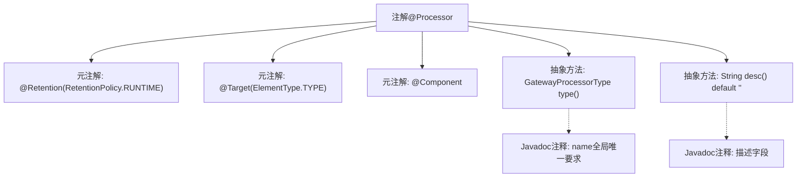

# 基础信息

|      |      |
|------|------|
| 名称 | Processor |
| 编码语言 | .java |
| 代码路径 | WeFe/gateway/src/main/java/com/welab/wefe/gateway/base/Processor.java |
| 包名 | com.welab.wefe.gateway.base |
| 依赖项 | ['com.welab.wefe.common.wefe.enums.GatewayProcessorType', 'org.springframework.stereotype.Component', 'java.lang.annotation.ElementType', 'java.lang.annotation.Retention', 'java.lang.annotation.RetentionPolicy', 'java.lang.annotation.Target'] |
| 概述说明 | 定义了一个运行时保留的注解@Processor，用于类上，包含必填的type字段和可选的desc描述字段。 |

# 说明

这是一个名为Processor的Java注解定义，使用元注解指定其保留策略为运行时且目标为类。注解包含两个元素：type()方法返回GatewayProcessorType枚举且要求全局唯一名称，desc()方法返回描述字符串且默认值为空字符串。该注解同时被标记为Spring的@Component组件注解。

# 类列表 Class Summary

| 名称   | 类型  | 说明 |
|-------|------|-------------|
| Processor | annotation | 定义了一个运行时保留的处理器注解，包含类型和描述字段，类型需全局唯一。 |


## 类 Processor

|      |      |
|------|------|
| 访问范围 | @Retention(RetentionPolicy.RUNTIME);@Target(ElementType.TYPE);@Component;public |
| 类型 | annotation |
| 名称 | Processor |
| 说明 | 定义了一个运行时保留的处理器注解，包含类型和描述字段，类型需全局唯一。 |


### UML类图

```mermaid
classDiagram
    class Processor {
        <<Interface>>
        +GatewayProcessorType type()
        +String desc() default ""
    }
    // @Component注解表示这是一个Spring组件
    // @Retention和@Target注解指定了该注解的保留策略和作用目标
    Processor ..> GatewayProcessorType : 依赖
```

这段代码定义了一个名为`Processor`的注解接口，主要用于标记处理器类型组件。该注解包含两个方法：`type()`返回`GatewayProcessorType`枚举（必须全局唯一），`desc()`返回描述字符串（默认为空）。通过`@Component`表明这是一个Spring组件，`@Retention(RetentionPolicy.RUNTIME)`确保注解在运行时可用，`@Target(ElementType.TYPE)`限定该注解只能用于类/接口上。类图清晰展示了注解的结构及其与`GatewayProcessorType`的依赖关系。


### 内部方法调用关系图



这段代码定义了一个名为`@Processor`的Java注解，该注解包含运行时保留策略、类级别目标限定和Spring组件标记三个元注解。核心功能通过两个抽象方法实现：`type()`方法强制要求返回网关处理器类型枚举（需全局唯一），`desc()`方法可选返回描述字符串（默认空值）。流程图清晰展示了注解结构、元数据约束和功能方法的层级关系，适用于网关处理器类型的标识场景。

### 字段列表 Field List

| 名称  | 类型  | 说明 |
|-------|-------|------|
| type | GatewayProcessorType | 获取网关处理器类型的方法。 |
| desc | String | 方法默认返回空字符串描述。 |

### 方法列表

| 名称  | 类型  | 说明 |
|-------|-------|------|


