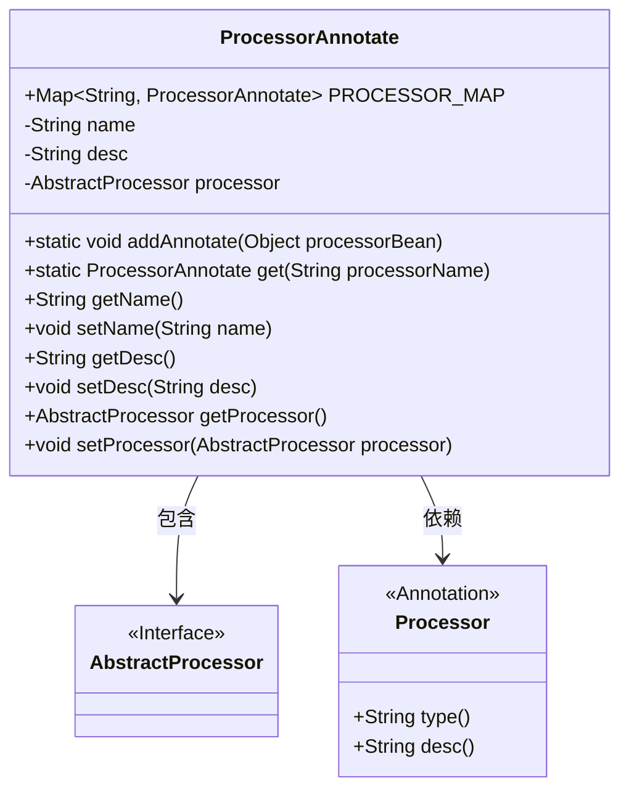
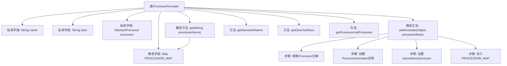

# 基础信息

|      |      |
|------|------|
| 名称 | ProcessorAnnotate |
| 编码语言 | .java |
| 代码路径 | WeFe/gateway/src/main/java/com/welab/wefe/gateway/base/ProcessorAnnotate.java |
| 包名 | com.welab.wefe.gateway.base |
| 依赖项 | ['com.welab.wefe.gateway.service.processors.AbstractProcessor', 'java.util.HashMap', 'java.util.Map'] |
| 概述说明 | ProcessorAnnotate类用于管理带@Processor注解的实体对象，包含名称、描述和处理器实例，提供添加和获取功能。 |

# 说明

ProcessorAnnotate类用于管理带有@Processor注解的实体对象。该类包含一个静态Map PROCESSOR_MAP，用于存储所有处理器注解信息，键为注解名称，值为对应的ProcessorAnnotate对象。每个ProcessorAnnotate对象包含三个属性：name（注解类型名称）、desc（注解描述）和processor（被注解的AbstractProcessor对象）。提供addAnnotate方法将处理器对象添加到Map中，以及get方法根据名称获取对应的ProcessorAnnotate对象。此外，还包含各属性的getter和setter方法。

# 类列表 Class Summary

| 名称   | 类型  | 说明 |
|-------|------|-------------|
| ProcessorAnnotate | class | ProcessorAnnotate类用于管理带@Processor注解的实体对象，包含名称、描述和处理器对象，提供添加和获取功能。 |

## 类 ProcessorAnnotate

|      |      |
|------|------|
| 访问范围 | public |
| 类型 | class |
| 名称 | ProcessorAnnotate |
| 说明 | ProcessorAnnotate类用于管理带@Processor注解的实体对象，包含名称、描述和处理器对象，提供添加和获取功能。 |

### UML类图

这段代码定义了一个`ProcessorAnnotate`类，用于管理带有`@Processor`注解的处理器对象。该类包含静态映射`PROCESSOR_MAP`存储注解名称与处理器对象的对应关系，提供`addAnnotate`方法添加新处理器，以及`get`方法根据名称获取处理器。`ProcessorAnnotate`类与`AbstractProcessor`接口和`Processor`注解存在关联，前者存储具体处理器实例，后者提供注解元数据。整体设计实现了基于注解的处理器注册与查找机制。

### 内部方法调用关系图

该流程图展示了ProcessorAnnotate类的完整结构，包含静态映射表PROCESSOR_MAP的核心处理逻辑。重点描述了addAnnotate方法的4个关键步骤：通过反射获取注解、创建注解包装对象、填充属性字段、存储到静态映射表。类通过静态方法管理所有处理器注解实例，同时提供标准getter/setter访问私有字段，实现了对处理器注解信息的集中存储和按名称检索的功能。

### 字段列表 Field List

| 名称  | 类型  | 说明 |
|-------|-------|------|
| PROCESSOR_MAP = new HashMap<>(16) | Map<String, ProcessorAnnotate> | 静态哈希映射，键为字符串，值为处理器注解对象，初始容量16。 |
| processor | AbstractProcessor | 私有成员变量processor，类型为AbstractProcessor。 |
| name | String | 私有字符串类型变量name。 |
| desc | String | 私有字符串类型变量desc，用于描述信息。 |

### 方法列表

| 名称  | 类型  | 说明 |
|-------|-------|------|
| getDesc | String | 获取描述信息的方法，返回字符串类型的desc值。 |
| addAnnotate | void | 方法`addAnnotate`通过注解获取处理器信息，创建并填充`ProcessorAnnotate`对象，最后存入`PROCESSOR_MAP`。 |
| setName | void | 设置对象名称的方法，将参数name赋值给对象的name属性。 |
| get | ProcessorAnnotate | 静态方法get通过processorName从PROCESSOR_MAP获取对应的ProcessorAnnotate实例。 |
| getName | String | 获取名称的方法，返回字符串类型的name变量值。 |
| setDesc | void | 这是一个Java方法，用于设置对象的描述信息。方法接收字符串参数desc，并将其赋值给对象的desc属性。 |
| getProcessor | AbstractProcessor | 获取处理器实例的方法，返回AbstractProcessor类型对象。 |
| setProcessor | void | 设置处理器方法，将传入的AbstractProcessor实例赋值给当前对象的processor属性。 |

