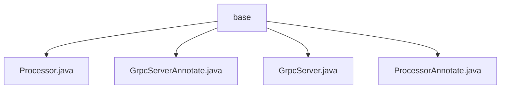

# 基础信息

|      |      |
|------|------|
| 名称 | base |
| 编码语言 | .java |
| 代码路径 | WeFe/gateway/src/main/java/com/welab/wefe/gateway/base |
| 包名 | docs.gateway.src.main.java.com.welab.wefe.gateway.base |
| 概述说明 | Processor注解标记类，含类型和描述元素，是Spring组件。GrpcServerAnnotate管理带GrpcServer注解的服务，维护全局映射，含服务对象、范围、拦截器等属性。GrpcServer注解标记gRPC组件，含名称、范围、拦截器等配置。ProcessorAnnotate管理带Processor注解的处理器，维护全局映射，含名称、描述和处理器对象。 |

# 说明

## 概述  
该模块核心职责是通过自定义注解（@Processor和@GrpcServer）实现组件注册与管理，类似Spring的Bean容器模式。接口规范包含两类注解：@Processor要求声明唯一类型和描述，@GrpcServer需配置服务范围/拦截规则等。关键数据结构包括全局映射表（PROCESSOR_MAP/RPC_SERVER_MAP）和注解实体类（如GrpcServerAnnotate）。外部依赖仅涉及Spring框架的@Component注解。例如@Processor用于标记处理器类，@GrpcServer管理gRPC服务实例。

## 主要业务场景  
模块主要支持两类业务：处理器注册（通过@Processor收集AbstractProcessor子类）和gRPC服务管理（通过@GrpcServer注册服务实例）。交互模式均为注解驱动，例如GrpcServerAnnotate解析拦截器配置，ProcessorAnnotate维护处理器映射。典型应用包括动态加载处理器（如GatewayProcessorType枚举类）和gRPC方法拦截（通过interceptMethods属性）。API类型集中为注解配置型，例如@GrpcServer(interceptors={AuthInterceptor.class})实现权限校验。

### 包内部结构视图

该流程图展示了WeFe网关项目中base目录下的文件结构关系。base作为根节点，直接包含四个Java文件：Processor.java、GrpcServerAnnotate.java、GrpcServer.java和ProcessorAnnotate.java。这些文件都属于网关基础组件，用于实现gRPC服务相关功能，没有更深层级的子目录结构。整个结构呈现扁平化特征，所有文件均位于同一层级。

# 文件列表

| 名称   | 类型  | 说明 |
|-------|------|-------------|
| [Processor.java](Processor.md) | file | 定义了一个运行时保留的注解@Processor，用于类上，包含必填的type字段和可选的desc描述字段。 |
| [GrpcServerAnnotate.java](GrpcServerAnnotate.md) | file | GrpcServerAnnotate类用于管理带@RpcServer注解的gRPC服务，包含服务对象、作用域、类路径、拦截器及拦截方法，通过静态Map存储所有注解实例。 |
| [GrpcServer.java](GrpcServer.md) | file | GrpcServer注解定义gRPC服务，包含bean名称、作用域、拦截器类和拦截方法等配置项。 |
| [ProcessorAnnotate.java](ProcessorAnnotate.md) | file | ProcessorAnnotate类用于管理带@Processor注解的实体对象，包含名称、描述和处理器实例，提供添加和获取功能。 |

