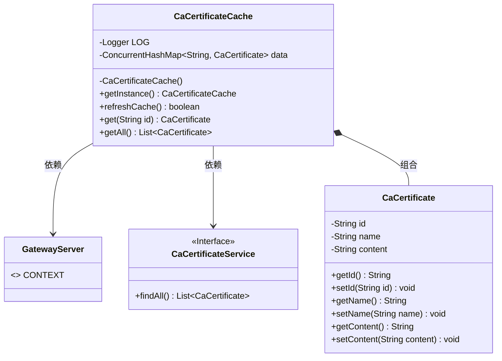
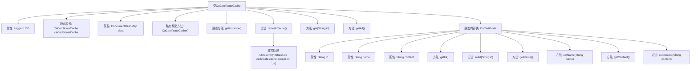

# 基础信息

|      |      |
|------|------|
| 名称 | CaCertificateCache |
| 编码语言 | .java |
| 代码路径 | WeFe/gateway/src/main/java/com/welab/wefe/gateway/cache/CaCertificateCache.java |
| 包名 | com.welab.wefe.gateway.cache |
| 依赖项 | ['com.welab.wefe.gateway.GatewayServer', 'com.welab.wefe.gateway.service.CaCertificateService', 'org.apache.commons.collections4.CollectionUtils', 'org.slf4j.Logger', 'org.slf4j.LoggerFactory', 'java.util.ArrayList', 'java.util.List', 'java.util.concurrent.ConcurrentHashMap'] |
| 概述说明 | CaCertificateCache类是一个单例缓存，用于存储CaCertificate对象，提供刷新缓存、获取单个或全部证书的功能。 |

# 说明

CaCertificateCache是一个单例类，用于缓存CA证书数据。它使用ConcurrentHashMap存储CaCertificate对象，提供get和getAll方法获取证书。refreshCache方法通过CaCertificateService更新缓存数据，包括新增、更新和删除操作。CaCertificate是内部类，包含id、name和content属性及对应的getter和setter方法。类中包含日志记录和异常处理机制。

# 类列表 Class Summary

| 名称   | 类型  | 说明 |
|-------|------|-------------|
| CaCertificateCache | class | CaCertificateCache类实现单例模式，使用ConcurrentHashMap缓存CaCertificate对象，提供刷新缓存、获取单个或全部证书的方法。CaCertificate包含id、name和content属性。 |

## 类 CaCertificateCache

|      |      |
|------|------|
| 访问范围 | public |
| 类型 | class |
| 名称 | CaCertificateCache |
| 说明 | CaCertificateCache类实现单例模式，使用ConcurrentHashMap缓存CaCertificate对象，提供刷新缓存、获取单个或全部证书的方法。CaCertificate包含id、name和content属性。 |

### UML类图

类图描述：CaCertificateCache是一个单例类，用于管理CaCertificate对象的缓存，通过ConcurrentHashMap存储数据。它依赖GatewayServer获取Spring上下文，并通过CaCertificateService接口查询证书数据。内部类CaCertificate表示证书实体，包含id、name和content字段及对应getter/setter。refreshCache()方法实现了缓存更新逻辑，包括数据加载和过期清理。

### 内部方法调用关系图

该流程图展示了CaCertificateCache类的完整结构，包含单例模式实现、缓存刷新逻辑和内部CaCertificate类的属性方法。核心方法refreshCache()通过GatewayServer获取证书列表，更新ConcurrentHashMap缓存并清理无效数据，整个过程包含异常处理。内部类CaCertificate封装了证书ID、名称和内容三个基本属性及对应的getter/setter方法。

### 字段列表 Field List

| 名称  | 类型  | 说明 |
|-------|-------|------|
| LOG = LoggerFactory.getLogger(CaCertificateCache.class) | Logger | 类CaCertificateCache中声明了一个私有不可变的日志记录器LOG，用于记录日志信息。 |
| caCertificateCache = new CaCertificateCache() | CaCertificateCache | 声明一个私有静态常量caCertificateCache，初始化为CaCertificateCache实例。 |
| data = new ConcurrentHashMap<>() | ConcurrentHashMap<String, CaCertificate> | 使用线程安全的ConcurrentHashMap存储字符串到CaCertificate的映射。 |

### 方法列表

| 名称  | 类型  | 说明 |
|-------|-------|------|
| getInstance | CaCertificateCache | 获取CaCertificateCache单例实例的方法。 |
| refreshCache | boolean | 刷新缓存方法：获取证书列表，若为空则清空缓存；否则更新缓存数据，移除无效条目，成功返回true，失败记录错误并返回false。 |
| get | CaCertificate | 获取指定ID的证书对象。 |
| getAll | List<CaCertificate> | 该方法返回一个包含所有CaCertificate对象的列表，通过复制data集合中的值生成新ArrayList。 |

