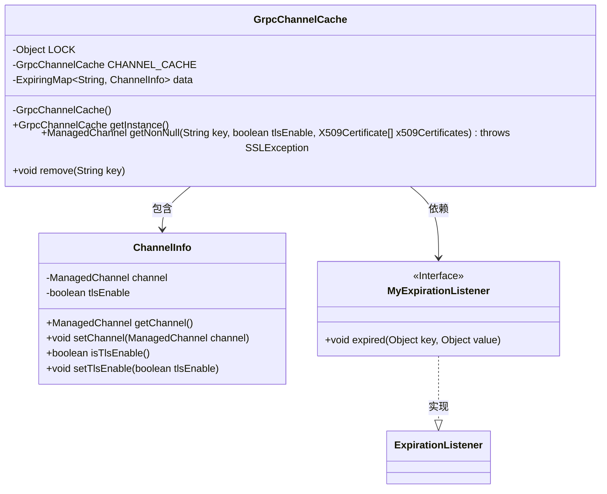

# 基础信息

|      |      |
|------|------|
| 名称 | GrpcChannelCache |
| 编码语言 | .java |
| 代码路径 | WeFe/gateway/src/main/java/com/welab/wefe/gateway/cache/GrpcChannelCache.java |
| 包名 | com.welab.wefe.gateway.cache |
| 依赖项 | ['com.welab.wefe.common.util.StringUtil', 'com.welab.wefe.gateway.common.EndpointBuilder', 'com.welab.wefe.gateway.util.GrpcUtil', 'io.grpc.ManagedChannel', 'net.jodah.expiringmap.ExpirationListener', 'net.jodah.expiringmap.ExpirationPolicy', 'net.jodah.expiringmap.ExpiringMap', 'javax.net.ssl.SSLException', 'java.security.cert.X509Certificate', 'java.util.concurrent.TimeUnit'] |
| 概述说明 | GrpcChannelCache类实现单例模式，使用ExpiringMap缓存gRPC通道，支持TLS配置，24小时无访问自动过期并关闭通道。 |

# 说明

GrpcChannelCache是一个单例类，用于缓存和管理gRPC通道。它使用ExpiringMap存储通道信息，键为网关URI（host:port格式），值为ChannelInfo对象，包含ManagedChannel和TLS启用标志。缓存策略为24小时未访问则过期，过期时自动关闭通道。提供getNonNull方法获取或创建通道，支持TLS和非TLS模式，确保线程安全。remove方法用于手动移除并关闭通道。内部类ChannelInfo封装通道和TLS状态，MyExpirationListener处理过期通道关闭。

# 类列表 Class Summary

| 名称   | 类型  | 说明 |
|-------|------|-------------|
| GrpcChannelCache | class | GrpcChannelCache是单例类，使用ExpiringMap缓存gRPC通道，键为网关URI，24小时未访问则过期。支持TLS和非TLS通道，自动清理旧连接。 |


## 类 GrpcChannelCache

|      |      |
|------|------|
| 访问范围 | public |
| 类型 | class |
| 名称 | GrpcChannelCache |
| 说明 | GrpcChannelCache是单例类，使用ExpiringMap缓存gRPC通道，键为网关URI，24小时未访问则过期。支持TLS和非TLS通道，自动清理旧连接。 |


### UML类图



类图描述：GrpcChannelCache是一个单例类，用于缓存gRPC通道，内部使用ExpiringMap存储ChannelInfo对象，并通过双重检查锁机制保证线程安全。ChannelInfo封装了ManagedChannel和TLS启用标志，MyExpirationListener实现过期监听自动关闭通道。整体设计实现了通道的缓存、自动清理和线程安全访问。


### 内部方法调用关系图

```mermaid
graph TD
    A["类GrpcChannelCache"]
    B["静态属性: Object LOCK"]
    C["静态属性: GrpcChannelCache CHANNEL_CACHE"]
    D["属性: ExpiringMap<String, ChannelInfo> data"]
    E["私有构造方法: GrpcChannelCache()"]
    F["静态方法: getInstance()"]
    G["方法: getNonNull(String key, boolean tlsEnable, X509Certificate[] x509Certificates)"]
    H["方法: remove(String key)"]
    I["内部类: MyExpirationListener"]
    J["内部类: ChannelInfo"]
    K["操作: 检查key有效性"]
    L["操作: 获取ChannelInfo"]
    M["操作: 检查TLS匹配"]
    N["操作: 同步块内二次检查"]
    O["操作: 移除旧channel"]
    P["操作: 创建新channel"]
    Q["操作: 更新data缓存"]
    R["操作: 关闭channel连接"]

    A --> B
    A --> C
    A --> D
    A --> E
    A --> F
    A --> G
    A --> H
    A --> I
    A --> J
    G --> K["'检查key是否为空'"]
    G --> L["'从data获取ChannelInfo'"]
    G --> M["'检查TLS配置匹配'"]
    G --> N["'同步块内重复检查'"]
    G --> O["'调用remove方法'"]
    G --> P["'创建新ManagedChannel'"]
    G --> Q["'更新data缓存'"]
    H --> R["'关闭channel连接'"]
    I -->|"监听过期事件"| R
    P -->|"条件分支"| "'非TLS模式'"
    P -->|"条件分支"| "'TLS模式'"
```

该流程图展示了GrpcChannelCache类的核心结构和执行流程。类采用单例模式管理gRPC通道缓存，通过ExpiringMap实现带过期时间的缓存机制。主要流程包括：获取通道时检查缓存有效性，同步创建新通道，自动处理过期连接。内部类MyExpirationListener实现过期回调，ChannelInfo封装通道和TLS状态。整个设计实现了线程安全的通道复用和自动清理机制。

### 字段列表 Field List

| 名称  | 类型  | 说明 |
|-------|-------|------|
| CHANNEL_CACHE = new GrpcChannelCache() | GrpcChannelCache | 私有静态GrpcChannelCache实例CHANNEL_CACHE，初始化为新实例。 |
| data = ExpiringMap            .builder()            .expirationListener(new MyExpirationListener())            .expirationPolicy(ExpirationPolicy.ACCESSED)            .expiration(24, TimeUnit.HOURS)            .build() | ExpiringMap<String, ChannelInfo> | 使用ExpiringMap存储ChannelInfo，键为String，设置24小时访问过期策略，并添加自定义过期监听器。 |
| LOCK = new Object() | Object | 定义静态不可变对象锁，用于同步控制。 |

### 方法列表

| 名称  | 类型  | 说明 |
|-------|-------|------|
| getNonNull | ManagedChannel | 获取或创建指定键的ManagedChannel，支持TLS配置。若键为空返回null，存在匹配则返回现有通道，否则同步创建新通道并存储。 |
| getInstance | GrpcChannelCache | 获取GrpcChannelCache单例实例的方法，直接返回静态变量CHANNEL_CACHE。 |
| remove | void | 该方法移除指定键对应的通道信息，并关闭关联的通道。若通道信息存在则关闭其通道，否则不执行关闭操作。 |


