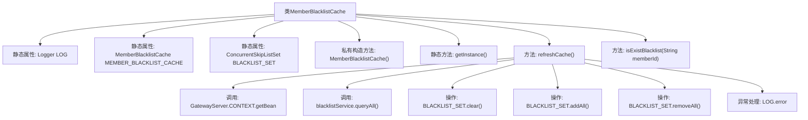

# 基础信息

|      |      |
|------|------|
| 名称 | MemberBlacklistCache |
| 编码语言 | .java |
| 代码路径 | WeFe/gateway/src/main/java/com/welab/wefe/gateway/cache/MemberBlacklistCache.java |
| 包名 | com.welab.wefe.gateway.cache |
| 依赖项 | ['com.welab.wefe.gateway.GatewayServer', 'com.welab.wefe.gateway.entity.BlacklistEntity', 'com.welab.wefe.gateway.service.BlacklistService', 'org.apache.commons.collections4.CollectionUtils', 'org.slf4j.Logger', 'org.slf4j.LoggerFactory', 'java.util.ArrayList', 'java.util.HashSet', 'java.util.List', 'java.util.Set', 'java.util.concurrent.ConcurrentSkipListSet'] |
| 概述说明 | MemberBlacklistCache类用于管理成员黑名单缓存，提供单例访问、缓存刷新和成员存在性检查功能。通过ConcurrentSkipListSet存储黑名单ID，refreshCache方法从数据库更新缓存数据，isExistBlacklist检查成员是否在黑名单中。 |

# 说明

该代码定义了一个名为MemberBlacklistCache的单例类，用于管理成员黑名单缓存。类中包含一个静态的ConcurrentSkipListSet集合BLACKLIST_SET存储黑名单成员ID。提供了refreshCache方法从BlacklistService获取最新黑名单数据并更新缓存，包括添加新成员和移除已删除成员。同时提供了isExistBlacklist方法检查指定成员是否存在于黑名单中。整个类通过单例模式确保全局唯一实例，并使用线程安全集合保证并发访问安全。

# 类列表 Class Summary

| 名称   | 类型  | 说明 |
|-------|------|-------------|
| MemberBlacklistCache | class | 成员黑名单缓存类，单例模式，使用并发集合存储黑名单ID，提供刷新缓存和查询成员是否在黑名单中的功能。刷新时从数据库同步数据并清理无效条目。 |


## 类 MemberBlacklistCache

|      |      |
|------|------|
| 访问范围 | public |
| 类型 | class |
| 名称 | MemberBlacklistCache |
| 说明 | 成员黑名单缓存类，单例模式，使用并发集合存储黑名单ID，提供刷新缓存和查询成员是否在黑名单中的功能。刷新时从数据库同步数据并清理无效条目。 |


### UML类图

```mermaid
classDiagram
    class MemberBlacklistCache {
        -Logger LOG
        -static MemberBlacklistCache MEMBER_BLACKLIST_CACHE
        -static ConcurrentSkipListSet~String~ BLACKLIST_SET
        +MemberBlacklistCache()
        +static MemberBlacklistCache getInstance()
        +boolean refreshCache()
        +boolean isExistBlacklist(String memberId)
    }

    class BlacklistService {
        <<Interface>>
        +List~BlacklistEntity~ queryAll()
    }

    class BlacklistEntity {
        +String getBlacklistMemberId()
    }

    class GatewayServer {
        +static ApplicationContext CONTEXT
    }

    MemberBlacklistCache --> BlacklistService : 依赖: 通过GatewayServer获取实例
    MemberBlacklistCache --> BlacklistEntity : 依赖: 读取黑名单成员ID
    MemberBlacklistCache ..> GatewayServer : 依赖: 获取Spring上下文
```

这段代码实现了一个单例模式的黑名单缓存服务`MemberBlacklistCache`，通过`ConcurrentSkipListSet`存储黑名单成员ID。核心功能包括：1) 从`BlacklistService`刷新缓存数据；2) 检查成员是否在黑名单中。采用线程安全集合和双重校验机制保证数据一致性，通过Spring上下文动态获取服务实例，并处理数据库与缓存的差异同步。异常时会记录错误日志并返回操作状态。


### 内部方法调用关系图



这段代码实现了一个线程安全的会员黑名单缓存单例类，通过ConcurrentSkipListSet存储黑名单会员ID。核心功能包括：1) 通过refreshCache方法从数据库同步最新黑名单数据，包含增量更新和失效数据清理逻辑；2) 提供isExistBlacklist方法快速判断会员是否在黑名单中。流程图展示了类结构、方法调用关系和数据操作流程，特别注意其线程安全设计和异常处理机制。

### 字段列表 Field List

| 名称  | 类型  | 说明 |
|-------|-------|------|
| LOG = LoggerFactory.getLogger(MemberBlacklistCache.class) | Logger | 成员黑名单缓存类的静态日志记录器声明。 |
| MEMBER_BLACKLIST_CACHE = new MemberBlacklistCache() | MemberBlacklistCache | 成员黑名单缓存实例初始化为静态私有变量。 |
| BLACKLIST_SET = new ConcurrentSkipListSet<>() | ConcurrentSkipListSet<String> | 并发安全的有序字符串黑名单集合。 |

### 方法列表

| 名称  | 类型  | 说明 |
|-------|-------|------|
| getInstance | MemberBlacklistCache | 静态方法getInstance返回单例对象MEMBER_BLACKLIST_CACHE。 |
| refreshCache | boolean | 刷新黑名单缓存方法：查询数据库更新缓存，同步删除已移除成员，成功返回true，失败记录日志返回false。 |
| isExistBlacklist | boolean | 检查成员ID是否在黑名单中，存在返回true，否则false。 |


