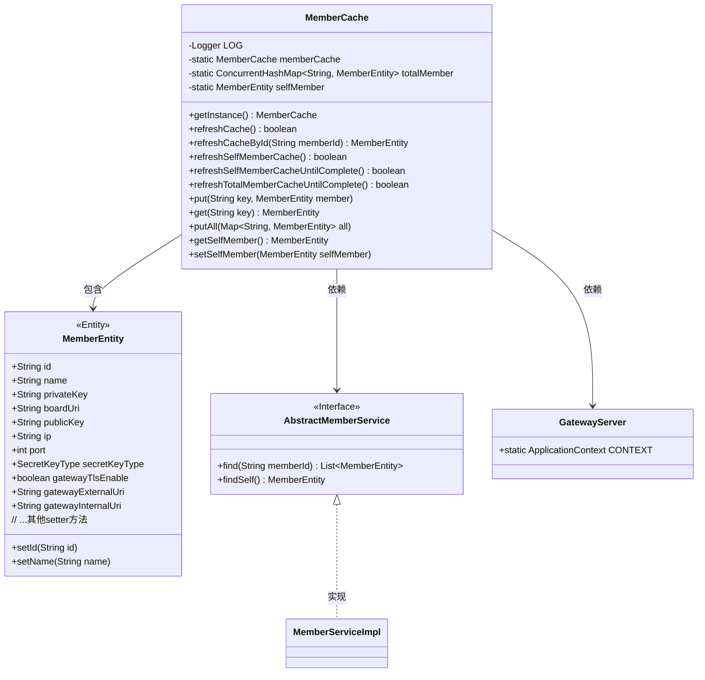
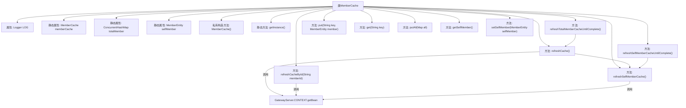

# 基础信息

|      |      |
|------|------|
| 名称 | MemberCache |
| 编码语言 | .java |
| 代码路径 | WeFe/gateway/src/main/java/com/welab/wefe/gateway/cache/MemberCache.java |
| 包名 | com.welab.wefe.gateway.cache |
| 依赖项 | ['com.welab.wefe.common.constant.SecretKeyType', 'com.welab.wefe.common.util.ThreadUtil', 'com.welab.wefe.gateway.GatewayServer', 'com.welab.wefe.gateway.entity.MemberEntity', 'com.welab.wefe.gateway.service.base.AbstractMemberService', 'org.apache.commons.collections4.CollectionUtils', 'org.slf4j.Logger', 'org.slf4j.LoggerFactory', 'java.util.ArrayList', 'java.util.List', 'java.util.Map', 'java.util.concurrent.ConcurrentHashMap'] |
| 概述说明 | MemberCache类实现单例模式，管理成员信息缓存，包含刷新全部或指定成员缓存、自身成员信息及持续刷新直至完成的功能。 |

# 说明

MemberCache是一个单例类，用于管理成员信息的缓存。它使用ConcurrentHashMap存储所有成员信息，键为成员ID，值为成员对象。类提供了刷新缓存的方法，包括刷新全部成员信息、指定成员信息和自身成员信息。刷新操作会从数据库获取最新数据并更新缓存，同时清理已删除的成员。类还提供了基本的缓存操作如添加、获取成员信息。自身成员信息有专门的属性和刷新方法，支持持续重试直到数据库初始化完成。所有操作都包含异常处理和日志记录。

# 类列表 Class Summary

| 名称   | 类型  | 说明 |
|-------|------|-------------|
| MemberCache | class | MemberCache类是一个单例缓存类，用于存储和更新成员信息，包括全局成员和网关自身成员，提供刷新缓存和查询功能。 |

## 类 MemberCache

|      |      |
|------|------|
| 访问范围 | public |
| 类型 | class |
| 名称 | MemberCache |
| 说明 | MemberCache类是一个单例缓存类，用于存储和更新成员信息，包括全局成员和网关自身成员，提供刷新缓存和查询功能。 |

### UML类图

类图描述：该图展示了一个单例模式的MemberCache类，用于管理成员信息的缓存。核心功能包括刷新全部/单个成员缓存、维护网关自身成员信息，并通过ConcurrentHashMap存储所有成员数据。MemberCache依赖AbstractMemberService接口获取数据，并与MemberEntity实体类交互。GatewayServer提供Spring上下文支持。整体设计体现了线程安全的缓存管理机制。

### 内部方法调用关系图

这段代码展示了一个单例模式的MemberCache类，用于管理成员信息的缓存。核心功能包括刷新整个缓存(refreshCache)、按ID刷新单个成员(refreshCacheById)、刷新自身成员信息(refreshSelfMemberCache)以及持续刷新直到完成的循环方法。类使用ConcurrentHashMap存储所有成员信息，并通过静态成员变量维护单例实例。流程图清晰地展示了类结构、属性关系和方法调用链，特别是刷新方法之间的依赖关系。

### 字段列表 Field List

| 名称  | 类型  | 说明 |
|-------|-------|------|
| LOG = LoggerFactory.getLogger(MemberCache.class) | Logger | 类MemberCache中定义了一个私有不可变的日志记录器LOG，使用LoggerFactory获取实例。 |
| totalMember = new ConcurrentHashMap<>() | ConcurrentHashMap<String, MemberEntity> | 定义线程安全的ConcurrentHashMap变量totalMember，键为String类型，值为MemberEntity类型。 |
| selfMember = null | MemberEntity | 静态成员变量selfMember，类型为MemberEntity，初始值为null。 |
| memberCache = new MemberCache() | MemberCache | 声明一个静态私有的MemberCache类实例memberCache。 |

### 方法列表

| 名称  | 类型  | 说明 |
|-------|-------|------|
| refreshCache | boolean | 刷新缓存方法：优先加载自身成员信息，查询所有成员并更新缓存，清理已删除成员，成功返回true，失败或异常返回false。 |
| putAll | void | 方法putAll将输入Map的所有成员实体合并到totalMember中。 |
| refreshSelfMemberCache | boolean | 刷新成员缓存方法：获取当前成员信息，若存在则更新或初始化selfMember对象属性，成功返回true，失败返回false并记录错误日志。 |
| put | void | 向映射表totalMember中添加键值对，键为key字符串，值为member对象。 |
| refreshCacheById | MemberEntity | 方法refreshCacheById通过memberId刷新缓存：查询成员信息，存在则更新缓存，不存在则移除缓存项，异常时记录日志并返回null。 |
| refreshTotalMemberCacheUntilComplete | boolean | 该方法持续尝试刷新成员缓存，成功则返回true，失败则等待3秒后重试并记录日志。 |
| getSelfMember | MemberEntity | 获取当前成员实体对象。 |
| refreshSelfMemberCacheUntilComplete | boolean | 该方法持续刷新自身成员缓存直至成功。若刷新失败，则提示成员信息未初始化需登录完善，并等待3秒后重试。 |
| getInstance | MemberCache | 这是一个静态方法，返回成员缓存实例memberCache。 |
| setSelfMember | void | 该方法用于设置当前成员实体，将其存储在MemberCache的静态变量selfMember中。 |
| get | MemberEntity | 获取指定键对应的成员实体。 |

