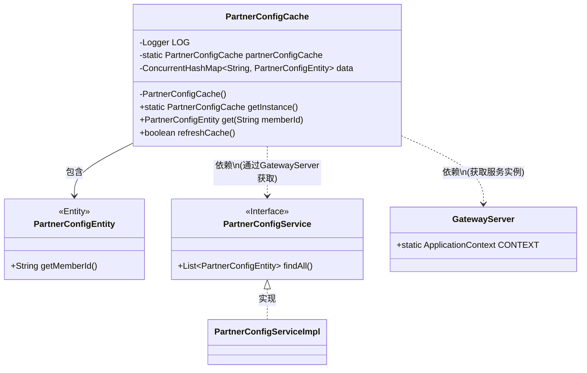
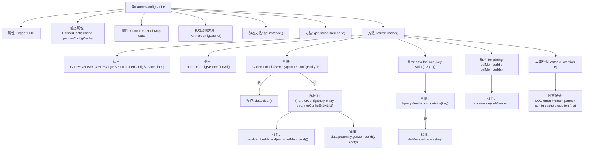

# 基础信息

|      |      |
|------|------|
| 名称 | PartnerConfigCache |
| 编码语言 | .java |
| 代码路径 | WeFe/gateway/src/main/java/com/welab/wefe/gateway/cache/PartnerConfigCache.java |
| 包名 | com.welab.wefe.gateway.cache |
| 依赖项 | ['com.welab.wefe.gateway.GatewayServer', 'com.welab.wefe.gateway.entity.PartnerConfigEntity', 'com.welab.wefe.gateway.service.PartnerConfigService', 'org.slf4j.Logger', 'org.slf4j.LoggerFactory', 'org.springframework.util.CollectionUtils', 'java.util.ArrayList', 'java.util.List', 'java.util.concurrent.ConcurrentHashMap'] |
| 概述说明 | PartnerConfigCache是单例类，使用ConcurrentHashMap缓存PartnerConfigEntity数据，提供获取和刷新缓存功能。刷新时从服务获取数据并更新缓存，处理删除项。异常时记录日志并返回失败。 |

# 说明

PartnerConfigCache是一个单例类，用于缓存合作伙伴配置信息。它使用ConcurrentHashMap存储PartnerConfigEntity对象，键为memberId。类提供了获取单例实例的getInstance方法和根据memberId获取配置的get方法。refreshCache方法用于刷新缓存，通过PartnerConfigService获取所有配置，更新到data中，并清理已删除的memberId对应数据。操作失败时会记录错误日志并返回false。

# 类列表 Class Summary

| 名称   | 类型  | 说明 |
|-------|------|-------------|
| PartnerConfigCache | class | PartnerConfigCache是单例类，用于缓存PartnerConfigEntity数据，提供get和refreshCache方法更新缓存，线程安全。 |

## 类 PartnerConfigCache

|      |      |
|------|------|
| 访问范围 | public |
| 类型 | class |
| 名称 | PartnerConfigCache |
| 说明 | PartnerConfigCache是单例类，用于缓存PartnerConfigEntity数据，提供get和refreshCache方法更新缓存，线程安全。 |

### UML类图

类图描述：PartnerConfigCache是一个单例模式的配置缓存类，使用ConcurrentHashMap存储PartnerConfigEntity对象，通过成员ID进行快速查找。该类依赖GatewayServer获取PartnerConfigService接口实例来刷新缓存数据，会清理已删除的成员配置。PartnerConfigService接口由PartnerConfigServiceImpl实现，PartnerConfigEntity是包含成员ID等配置信息的实体类。

### 内部方法调用关系图

该流程图展示了PartnerConfigCache类的核心结构和refreshCache方法的完整逻辑流程。作为单例模式实现的配置缓存类，其核心功能是通过refreshCache方法从PartnerConfigService获取最新配置数据，更新内部ConcurrentHashMap缓存，并清理已删除的成员信息。流程包含服务调用、数据遍历、条件判断、异常处理等关键步骤，完整反映了线程安全的缓存更新机制。

### 字段列表 Field List

| 名称  | 类型  | 说明 |
|-------|-------|------|
| partnerConfigCache = new PartnerConfigCache() | PartnerConfigCache | 私有静态变量partnerConfigCache初始化为PartnerConfigCache实例。 |
| LOG = LoggerFactory.getLogger(PartnerConfigCache.class) | Logger | 声明一个私有不可变的日志对象LOG，用于PartnerConfigCache类的日志记录。 |
| data = new ConcurrentHashMap<>() | ConcurrentHashMap<String, PartnerConfigEntity> | 使用线程安全的ConcurrentHashMap存储PartnerConfigEntity对象，键为String类型。 |

### 方法列表

| 名称  | 类型  | 说明 |
|-------|-------|------|
| get | PartnerConfigEntity | 获取指定会员ID的合作伙伴配置实体。 |
| getInstance | PartnerConfigCache | 这是一个静态方法，返回PartnerConfigCache类的单例实例partnerConfigCache。 |
| refreshCache | boolean | 刷新缓存方法：获取所有合作伙伴配置，更新数据并清理无效成员信息，成功返回true，失败记录日志并返回false。 |

