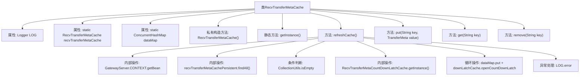

# 基础信息

|      |      |
|------|------|
| 名称 | RecvTransferMetaCache |
| 编码语言 | .java |
| 代码路径 | WeFe/gateway/src/main/java/com/welab/wefe/gateway/cache/RecvTransferMetaCache.java |
| 包名 | com.welab.wefe.gateway.cache |
| 依赖项 | ['com.welab.wefe.gateway.GatewayServer', 'com.welab.wefe.gateway.api.meta.basic.GatewayMetaProto', 'com.welab.wefe.gateway.service.base.AbstractRecvTransferMetaCachePersistentService', 'org.apache.commons.collections4.CollectionUtils', 'org.slf4j.Logger', 'org.slf4j.LoggerFactory', 'java.util.List', 'java.util.concurrent.ConcurrentHashMap'] |
| 概述说明 | RecvTransferMetaCache类是一个单例模式实现的缓存管理器，使用ConcurrentHashMap存储传输元数据，提供刷新缓存、增删查等操作，并支持通过CountDownLatch同步数据加载状态。 |

# 说明

RecvTransferMetaCache是一个单例类，用于管理接收到的传输元数据缓存。它使用ConcurrentHashMap存储数据，键为字符串，值为TransferMeta对象。类提供了获取实例的静态方法getInstance。refreshCache方法从持久化服务加载数据，清空内容体并设置状态为COMPLETE后存入缓存，同时通过CountDownLatchCache通知数据就绪。还提供了基本的put、get和remove操作来管理缓存数据。异常时会记录错误日志。

# 类列表 Class Summary

| 名称   | 类型  | 说明 |
|-------|------|-------------|
| RecvTransferMetaCache | class | RecvTransferMetaCache是单例类，使用ConcurrentHashMap存储TransferMeta数据，提供缓存刷新、增删查功能，并通过CountDownLatch同步状态。 |


## 类 RecvTransferMetaCache

|      |      |
|------|------|
| 访问范围 | public |
| 类型 | class |
| 名称 | RecvTransferMetaCache |
| 说明 | RecvTransferMetaCache是单例类，使用ConcurrentHashMap存储TransferMeta数据，提供缓存刷新、增删查功能，并通过CountDownLatch同步状态。 |


### UML类图

```mermaid
classDiagram
    class RecvTransferMetaCache {
        -Logger LOG
        -static RecvTransferMetaCache recvTransferMetaCache
        -static ConcurrentHashMap~String, GatewayMetaProto.TransferMeta~ dataMap
        -RecvTransferMetaCache()
        +static RecvTransferMetaCache getInstance()
        +boolean refreshCache()
        +void put(String key, GatewayMetaProto.TransferMeta value)
        +GatewayMetaProto.TransferMeta get(String key)
        +GatewayMetaProto.TransferMeta remove(String key)
    }

    class GatewayMetaProto.TransferMeta {
        <<Interface>>
    }

    class AbstractRecvTransferMetaCachePersistentService {
        <<Interface>>
        +List~GatewayMetaProto.TransferMeta~ findAll()
    }

    class RecvTransferMetaCountDownLatchCache {
        +static RecvTransferMetaCountDownLatchCache getInstance()
        +void openCountDownLatch(String sessionId)
    }

    class GatewayServer {
        // 上下文容器
    }

    RecvTransferMetaCache --> GatewayMetaProto.TransferMeta : 存储
    RecvTransferMetaCache --> AbstractRecvTransferMetaCachePersistentService : 调用 : 依赖
    RecvTransferMetaCache --> RecvTransferMetaCountDownLatchCache : 协作 : 依赖
    AbstractRecvTransferMetaCachePersistentService <|.. GatewayServer : 实现
```

这段代码描述了一个接收传输元数据缓存类RecvTransferMetaCache，采用单例模式管理内存中的ConcurrentHashMap数据。核心功能包括缓存刷新(refreshCache)、数据存取(put/get/remove)操作，其中refreshCache会通过持久化服务获取数据并同步更新到内存缓存和计数锁存器。类间协作涉及GatewayMetaProto.TransferMeta数据传输协议、持久化服务抽象接口及计数锁存器缓存，整体构成一个线程安全的数据缓存管理系统。


### 内部方法调用关系图



这段代码展示了一个单例模式的缓存类RecvTransferMetaCache，主要用于管理传输元数据的缓存操作。核心功能包括通过refreshCache方法从持久层刷新缓存数据，使用ConcurrentHashMap线程安全地存储数据，并配合CountDownLatch机制实现同步控制。流程图清晰地展示了类结构、主要方法调用关系以及refreshCache方法内部的复杂处理流程，包括服务获取、数据查询、空值判断、循环处理和异常记录等关键步骤。

### 字段列表 Field List

| 名称  | 类型  | 说明 |
|-------|-------|------|
| dataMap = new ConcurrentHashMap<>() | ConcurrentHashMap<String, GatewayMetaProto.TransferMeta> | 私有静态并发哈希映射，键为字符串，值为传输元数据。 |
| recvTransferMetaCache = new RecvTransferMetaCache() | RecvTransferMetaCache | 私有静态变量recvTransferMetaCache初始化为RecvTransferMetaCache实例。 |
| LOG = LoggerFactory.getLogger(RecvTransferMetaCache.class) | Logger | 类RecvTransferMetaCache中定义了一个私有不可变的日志记录器LOG，用于记录日志信息。 |

### 方法列表

| 名称  | 类型  | 说明 |
|-------|-------|------|
| refreshCache | boolean | refreshCache方法刷新缓存，从持久化服务获取TransferMeta列表，若为空返回成功；否则清空内容并存入内存，设置状态为COMPLETE，更新倒计时锁缓存。成功返回true，失败记录错误并返回false。 |
| getInstance | RecvTransferMetaCache | 这是一个静态方法，返回单例对象recvTransferMetaCache的实例。 |
| put | void | 该方法将键值对存入dataMap，key为字符串，value为GatewayMetaProto.TransferMeta类型。 |
| get | GatewayMetaProto.TransferMeta | 方法get通过key从dataMap中获取对应的TransferMeta对象。 |
| remove | GatewayMetaProto.TransferMeta | 移除指定键对应的传输元数据并返回。 |


