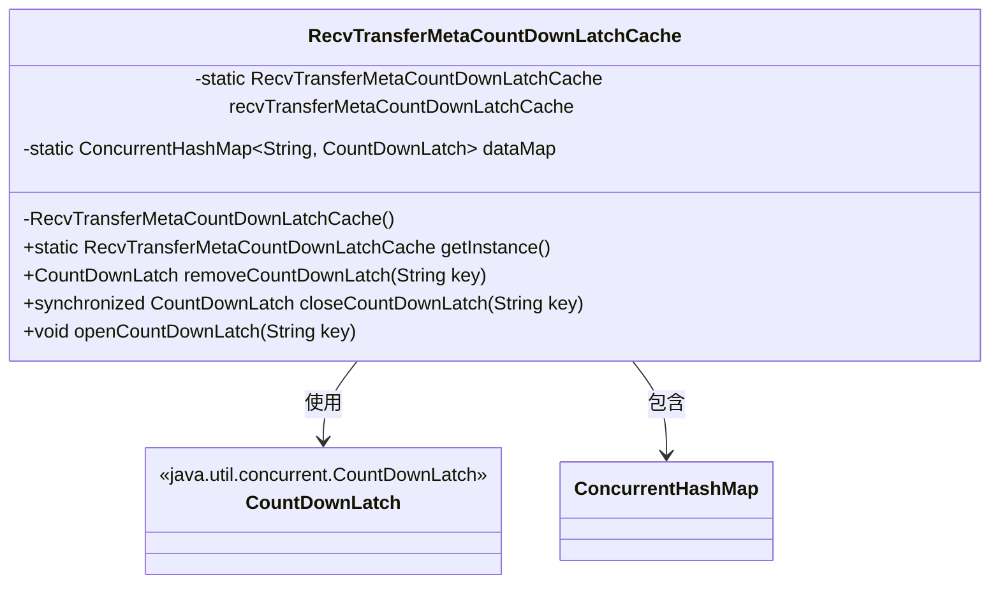
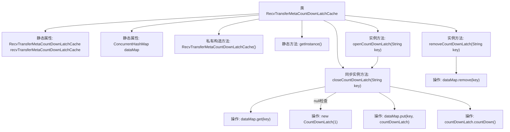

# 基础信息

|      |      |
|------|------|
| 名称 | RecvTransferMetaCountDownLatchCache |
| 编码语言 | .java |
| 代码路径 | WeFe/gateway/src/main/java/com/welab/wefe/gateway/cache/RecvTransferMetaCountDownLatchCache.java |
| 包名 | com.welab.wefe.gateway.cache |
| 依赖项 | ['java.util.concurrent.ConcurrentHashMap', 'java.util.concurrent.CountDownLatch'] |
| 概述说明 | 单例类RecvTransferMetaCountDownLatchCache，使用ConcurrentHashMap存储CountDownLatch，提供移除、关闭和打开锁存器的方法。 |

# 说明

该类实现了一个单例模式的缓存管理器，用于存储和管理基于字符串键的CountDownLatch对象。它通过私有构造函数确保单例，提供全局访问点getInstance。核心功能包括：通过removeCountDownLatch移除指定键的锁存器；closeCountDownLatch方法会同步创建或获取现有锁存器（初始计数为1）；openCountDownLatch则触发指定键锁存器的计数减1操作。所有锁存器存储在ConcurrentHashMap中确保线程安全。

# 类列表 Class Summary

| 名称   | 类型  | 说明 |
|-------|------|-------------|
| RecvTransferMetaCountDownLatchCache | class | 单例类RecvTransferMetaCountDownLatchCache管理ConcurrentHashMap中的CountDownLatch，提供移除、关闭和打开锁存器的方法。 |

## 类 RecvTransferMetaCountDownLatchCache

|      |      |
|------|------|
| 访问范围 | public |
| 类型 | class |
| 名称 | RecvTransferMetaCountDownLatchCache |
| 说明 | 单例类RecvTransferMetaCountDownLatchCache管理ConcurrentHashMap中的CountDownLatch，提供移除、关闭和打开锁存器的方法。 |

### UML类图

该代码实现了一个单例模式的CountDownLatch缓存管理器，使用ConcurrentHashMap存储键值对，提供线程安全的创建、移除和触发CountDownLatch功能。类图展示了核心数据结构依赖关系，其中私有静态实例和ConcurrentHashMap确保全局唯一性和线程安全，三个公开方法分别实现移除、创建/获取和触发计数器的功能。

### 内部方法调用关系图

这段代码实现了一个基于ConcurrentHashMap的CountDownLatch缓存单例类，主要用于线程间同步控制。核心功能包括：通过closeCountDownLatch创建/获取指定key的闭锁，openCountDownLatch触发闭锁释放，以及removeCountDownLatch移除闭锁。所有操作都线程安全，其中closeCountDownLatch采用同步方法保证原子性。流程图清晰展示了类结构、方法调用关系和数据操作流程，特别是闭锁创建和触发的关键路径。

### 字段列表 Field List

| 名称  | 类型  | 说明 |
|-------|-------|------|
| recvTransferMetaCountDownLatchCache = new RecvTransferMetaCountDownLatchCache() | RecvTransferMetaCountDownLatchCache | 静态变量recvTransferMetaCountDownLatchCache初始化为RecvTransferMetaCountDownLatchCache实例。 |
| dataMap = new ConcurrentHashMap<>() | ConcurrentHashMap<String, CountDownLatch> | 私有静态并发哈希映射，键为字符串，值为倒计时锁。 |

### 方法列表

| 名称  | 类型  | 说明 |
|-------|-------|------|
| closeCountDownLatch | CountDownLatch | 同步方法根据key获取或创建CountDownLatch并返回。若不存在则新建并存入map。 |
| getInstance | RecvTransferMetaCountDownLatchCache | 获取接收传输元数据倒计时锁缓存的单例实例。 |
| removeCountDownLatch | CountDownLatch | 移除指定键对应的倒计时锁并返回。 |
| openCountDownLatch | void | 该方法通过key关闭并触发倒计时锁的计数减一操作。 |

