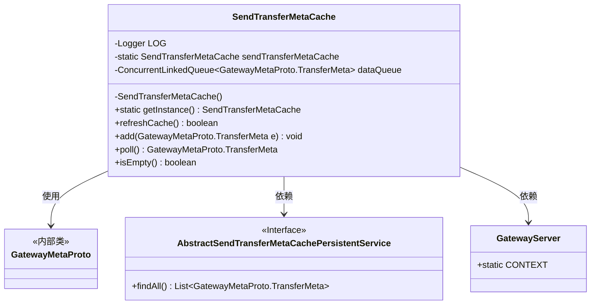
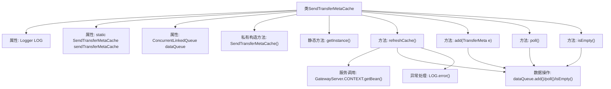

# 基础信息

|      |      |
|------|------|
| 名称 | SendTransferMetaCache |
| 编码语言 | .java |
| 代码路径 | WeFe/gateway/src/main/java/com/welab/wefe/gateway/cache/SendTransferMetaCache.java |
| 包名 | com.welab.wefe.gateway.cache |
| 依赖项 | ['com.welab.wefe.gateway.GatewayServer', 'com.welab.wefe.gateway.api.meta.basic.GatewayMetaProto', 'com.welab.wefe.gateway.service.base.AbstractSendTransferMetaCachePersistentService', 'org.apache.commons.collections4.CollectionUtils', 'org.slf4j.Logger', 'org.slf4j.LoggerFactory', 'java.util.List', 'java.util.concurrent.ConcurrentLinkedQueue'] |
| 概述说明 | SendTransferMetaCache类是一个单例缓存，使用ConcurrentLinkedQueue存储TransferMeta数据，提供刷新缓存、添加、获取和判空功能。 |

# 说明

SendTransferMetaCache是一个单例类，用于管理GatewayMetaProto.TransferMeta类型的数据队列。它包含一个线程安全的ConcurrentLinkedQueue用于存储数据，提供实例获取方法getInstance。核心功能包括refreshCache从持久化服务加载数据到队列，add添加元素，poll取出元素，isEmpty检查队列状态。异常时记录错误日志。

# 类列表 Class Summary

| 名称   | 类型  | 说明 |
|-------|------|-------------|
| SendTransferMetaCache | class | SendTransferMetaCache是单例类，使用并发队列存储TransferMeta数据，提供刷新缓存、添加、取出和判空功能。 |

## 类 SendTransferMetaCache

|      |      |
|------|------|
| 访问范围 | public |
| 类型 | class |
| 名称 | SendTransferMetaCache |
| 说明 | SendTransferMetaCache是单例类，使用并发队列存储TransferMeta数据，提供刷新缓存、添加、取出和判空功能。 |

### UML类图

这段代码展示了一个单例模式的`SendTransferMetaCache`类，用于管理传输元数据的缓存队列。它包含线程安全的队列操作、缓存刷新功能，并通过Spring上下文获取持久化服务接口实现。类图清晰地呈现了与`GatewayMetaProto`数据类、持久化服务接口及服务器上下文的依赖关系，体现了缓存管理核心功能与外部组件的交互方式。

### 内部方法调用关系图

该流程图展示了SendTransferMetaCache类的完整结构，这是一个采用单例模式设计的线程安全缓存类。核心功能包括通过refreshCache方法从持久化服务加载数据到队列，提供add/poll/isEmpty等队列操作方法，并内置异常日志记录。所有操作都基于ConcurrentLinkedQueue实现线程安全，其中refreshCache涉及Spring上下文获取服务和批量数据加载流程，其他方法直接操作队列。流程图清晰呈现了类属性、单例构造、主要方法调用关系及异常处理路径。

### 字段列表 Field List

| 名称  | 类型  | 说明 |
|-------|-------|------|
| LOG = LoggerFactory.getLogger(SendTransferMetaCache.class) | Logger | 类SendTransferMetaCache中定义了一个私有不可变的日志记录器LOG，使用LoggerFactory创建。 |
| sendTransferMetaCache = new SendTransferMetaCache() | SendTransferMetaCache | 私有静态变量sendTransferMetaCache初始化为SendTransferMetaCache实例。 |
| dataQueue = new ConcurrentLinkedQueue<>() | ConcurrentLinkedQueue<GatewayMetaProto.TransferMeta> | 并发安全队列，存储传输元数据。 |

### 方法列表

| 名称  | 类型  | 说明 |
|-------|-------|------|
| refreshCache | boolean | refreshCache方法尝试从持久化服务获取TransferMeta列表，若列表非空则加入dataQueue，成功返回true，失败记录错误并返回false。 |
| add | void | 方法`add`将`GatewayMetaProto.TransferMeta`类型参数`e`添加到`dataQueue`队列中。 |
| poll | GatewayMetaProto.TransferMeta | 方法poll从dataQueue取出并返回TransferMeta对象。 |
| isEmpty | boolean | 检查队列是否为空，返回布尔值。 |
| getInstance | SendTransferMetaCache | 这是一个Java静态方法，返回名为sendTransferMetaCache的实例。 |

