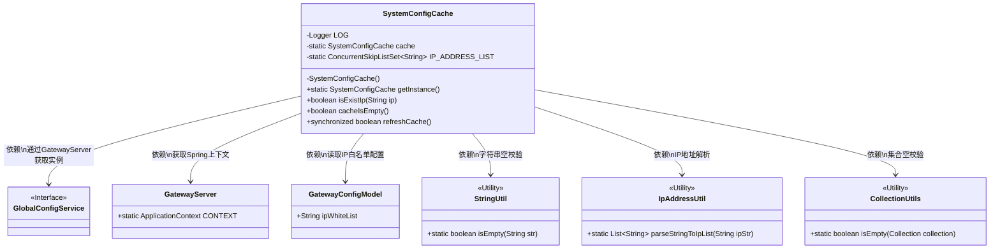
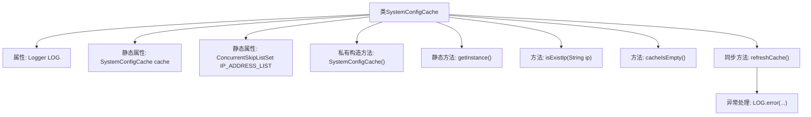

# 基础信息

|      |      |
|------|------|
| 名称 | SystemConfigCache |
| 编码语言 | .java |
| 代码路径 | WeFe/gateway/src/main/java/com/welab/wefe/gateway/cache/SystemConfigCache.java |
| 包名 | com.welab.wefe.gateway.cache |
| 依赖项 | ['com.welab.wefe.common.util.IpAddressUtil', 'com.welab.wefe.common.util.StringUtil', 'com.welab.wefe.common.wefe.dto.global_config.GatewayConfigModel', 'com.welab.wefe.gateway.GatewayServer', 'com.welab.wefe.gateway.service.GlobalConfigService', 'org.slf4j.Logger', 'org.slf4j.LoggerFactory', 'org.springframework.util.CollectionUtils', 'java.util.ArrayList', 'java.util.List', 'java.util.concurrent.ConcurrentSkipListSet'] |
| 概述说明 | SystemConfigCache类实现IP白名单功能，包含单例模式、IP存在检查、缓存刷新及空缓存判断方法。支持通配符匹配和同步更新。 |

# 说明

SystemConfigCache是一个单例类，用于管理系统IP白名单配置缓存。它使用ConcurrentSkipListSet存储IP地址列表，提供线程安全操作。主要功能包括：检查IP是否存在于白名单（支持通配符匹配）、判断缓存是否为空、以及同步刷新缓存数据。刷新时从GlobalConfigService获取最新配置，通过比对更新IP列表。异常时会记录日志并返回操作状态。

# 类列表 Class Summary

| 名称   | 类型  | 说明 |
|-------|------|-------------|
| SystemConfigCache | class | SystemConfigCache类是一个单例模式实现的IP白名单缓存，包含IP地址存在检查、缓存刷新和空缓存判断功能，支持通配符匹配。 |

## 类 SystemConfigCache

|      |      |
|------|------|
| 访问范围 | public |
| 类型 | class |
| 名称 | SystemConfigCache |
| 说明 | SystemConfigCache类是一个单例模式实现的IP白名单缓存，包含IP地址存在检查、缓存刷新和空缓存判断功能，支持通配符匹配。 |

### UML类图

这段代码展示了一个单例模式的系统配置缓存类SystemConfigCache，主要用于管理IP白名单。类中包含IP地址的校验、缓存刷新等功能，通过ConcurrentSkipListSet线程安全地存储IP列表。该类依赖Spring上下文获取GlobalConfigService来读取网关配置，并使用多个工具类进行字符串处理、IP解析和集合操作。refreshCache方法实现了同步机制保证线程安全，同时处理了配置为空的边缘情况。整体设计体现了线程安全和防御性编程思想。

### 内部方法调用关系图

这段代码实现了一个系统配置缓存类，采用单例模式管理IP地址白名单。核心功能包括：1) 通过isExistIp方法检查IP是否在白名单中，支持通配符匹配；2) 通过refreshCache方法同步更新缓存数据，从全局配置服务获取最新白名单；3) 线程安全设计，使用ConcurrentSkipListSet存储IP地址并采用同步方法更新。流程图展示了类结构和方法调用关系，包括属性初始化、IP验证逻辑和缓存刷新机制。

### 字段列表 Field List

| 名称  | 类型  | 说明 |
|-------|-------|------|
| IP_ADDRESS_LIST = new ConcurrentSkipListSet<>() | ConcurrentSkipListSet<String> | 定义一个线程安全的并发有序集合IP_ADDRESS_LIST，用于存储字符串类型的IP地址。 |
| LOG = LoggerFactory.getLogger(SystemConfigCache.class) | Logger | 系统配置缓存类中声明了一个不可变的日志记录器实例。 |
| cache = new SystemConfigCache() | SystemConfigCache | 私有静态变量cache初始化为SystemConfigCache实例。 |

### 方法列表

| 名称  | 类型  | 说明 |
|-------|-------|------|
| getInstance | SystemConfigCache | 这是一个静态方法，返回SystemConfigCache类的单例实例cache。 |
| isExistIp | boolean | 检查IP是否存在于列表中，支持通配符匹配。空IP返回false，通配符*匹配任意IP，部分匹配也有效。 |
| cacheIsEmpty | boolean | 检查IP地址列表是否为空，为空返回true，否则返回false。 |
| refreshCache | boolean | 同步方法刷新缓存：获取网关配置，解析IP白名单，更新IP地址列表，成功返回true，异常返回false并记录日志。 |

