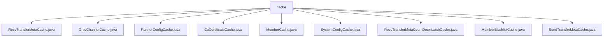

# 基础信息

|      |      |
|------|------|
| 名称 | cache |
| 编码语言 | .java |
| 代码路径 | WeFe/gateway/src/main/java/com/welab/wefe/gateway/cache |
| 包名 | docs.gateway.src.main.java.com.welab.wefe.gateway.cache |
| 概述说明 | RecvTransferMetaCache管理传输元数据缓存，GrpcChannelCache管理gRPC通道，PartnerConfigCache缓存合作伙伴配置，CaCertificateCache存储CA证书，MemberCache管理成员信息，SystemConfigCache处理IP白名单，CountDownLatchCache管理锁存器，MemberBlacklistCache维护黑名单，SendTransferMetaCache管理传输数据队列。均为单例线程安全实现。 |

# 说明

## 概述  
该模块是网关系统中的缓存管理组件，采用单例模式统一管理各类核心数据（如传输元数据、gRPC通道、合作伙伴配置等）。所有缓存均使用线程安全容器（如ConcurrentHashMap/ConcurrentSkipListSet）存储，支持动态刷新和过期清理。例如GrpcChannelCache采用ExpiringMap实现24小时自动过期，SystemConfigCache通过通配符匹配校验IP白名单。  

接口规范包含单例获取（getInstance）、数据存取（get/put）、缓存刷新（refreshCache）三类标准操作。关键数据结构包括TransferMeta（传输元数据）、ChannelInfo（gRPC通道信息）、PartnerConfigEntity（合作伙伴配置）等。依赖项涉及持久化服务（如PartnerConfigService）、TLS加密、日志组件，以及gRPC的ManagedChannel。  

## 主要业务场景  
模块主要支撑网关的数据中继与安全管控，类似消息中转站模式。例如RecvTransferMetaCache通过CountDownLatchCache同步元数据就绪状态，GrpcChannelCache维护跨节点通信的gRPC长连接。典型流程为：接收请求→校验黑名单（MemberBlacklistCache）→验证IP白名单（SystemConfigCache）→通过缓存通道（GrpcChannelCache）转发数据。  

业务交互包含两类模式：主动刷新（如PartnerConfigCache定时拉取最新配置）和事件驱动（如SendTransferMetaCache队列触发数据传输）。API集成案例涵盖TLS通道建立（GrpcChannelCache.getNonNull）、证书校验（CaCertificateCache.getAll）、成员信息同步（MemberCache持续重试初始化）等场景。所有操作均内置异常处理和日志追踪能力。

### 包内部结构视图

该流程图展示了WeFe网关项目中缓存模块的文件结构，以cache目录为根节点，包含9个缓存相关的Java类文件，涉及传输元数据、gRPC通道、合作伙伴配置、CA证书、成员信息等不同功能的缓存实现。所有文件均直接隶属于cache目录下，无次级目录层级。

# 文件列表

| 名称   | 类型  | 说明 |
|-------|------|-------------|
| [RecvTransferMetaCache.java](RecvTransferMetaCache.md) | file | RecvTransferMetaCache类是一个单例模式实现的缓存管理器，使用ConcurrentHashMap存储传输元数据，提供刷新缓存、增删查等操作，并支持通过CountDownLatch同步数据加载状态。 |
| [GrpcChannelCache.java](GrpcChannelCache.md) | file | GrpcChannelCache类实现单例模式，使用ExpiringMap缓存gRPC通道，支持TLS配置，24小时无访问自动过期并关闭通道。 |
| [PartnerConfigCache.java](PartnerConfigCache.md) | file | PartnerConfigCache是单例类，使用ConcurrentHashMap缓存PartnerConfigEntity数据，提供获取和刷新缓存功能。刷新时从服务获取数据并更新缓存，处理删除项。异常时记录日志并返回失败。 |
| [CaCertificateCache.java](CaCertificateCache.md) | file | CaCertificateCache类是一个单例缓存，用于存储CaCertificate对象，提供刷新缓存、获取单个或全部证书的功能。 |
| [MemberCache.java](MemberCache.md) | file | MemberCache类实现单例模式，管理成员信息缓存，包含刷新全部或指定成员缓存、自身成员信息及持续刷新直至完成的功能。 |
| [SystemConfigCache.java](SystemConfigCache.md) | file | SystemConfigCache类实现IP白名单功能，包含单例模式、IP存在检查、缓存刷新及空缓存判断方法。支持通配符匹配和同步更新。 |
| [RecvTransferMetaCountDownLatchCache.java](RecvTransferMetaCountDownLatchCache.md) | file | 单例类RecvTransferMetaCountDownLatchCache，使用ConcurrentHashMap存储CountDownLatch，提供移除、关闭和打开锁存器的方法。 |
| [MemberBlacklistCache.java](MemberBlacklistCache.md) | file | MemberBlacklistCache类用于管理成员黑名单缓存，提供单例访问、缓存刷新和成员存在性检查功能。通过ConcurrentSkipListSet存储黑名单ID，refreshCache方法从数据库更新缓存数据，isExistBlacklist检查成员是否在黑名单中。 |
| [SendTransferMetaCache.java](SendTransferMetaCache.md) | file | SendTransferMetaCache类是一个单例缓存，使用ConcurrentLinkedQueue存储TransferMeta数据，提供刷新缓存、添加、获取和判空功能。 |

