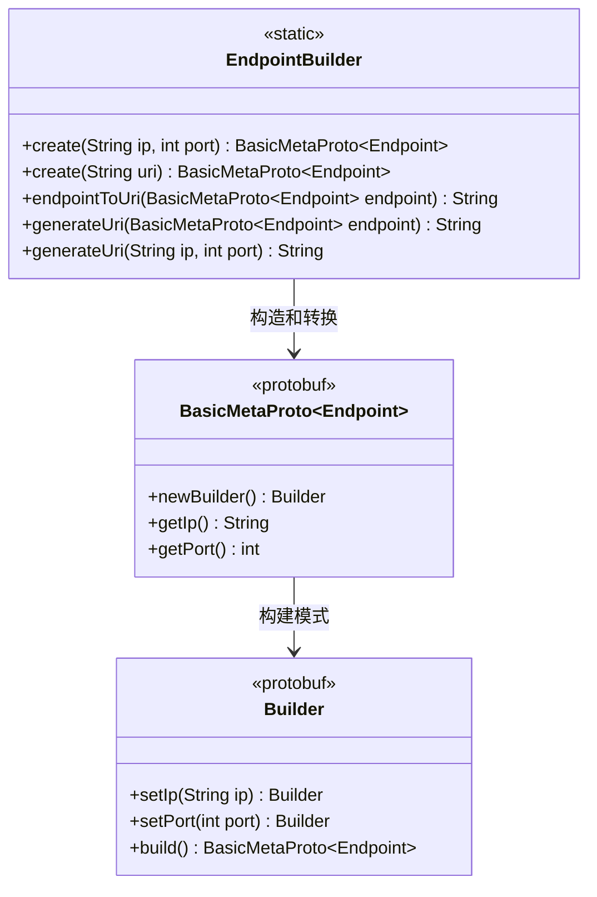
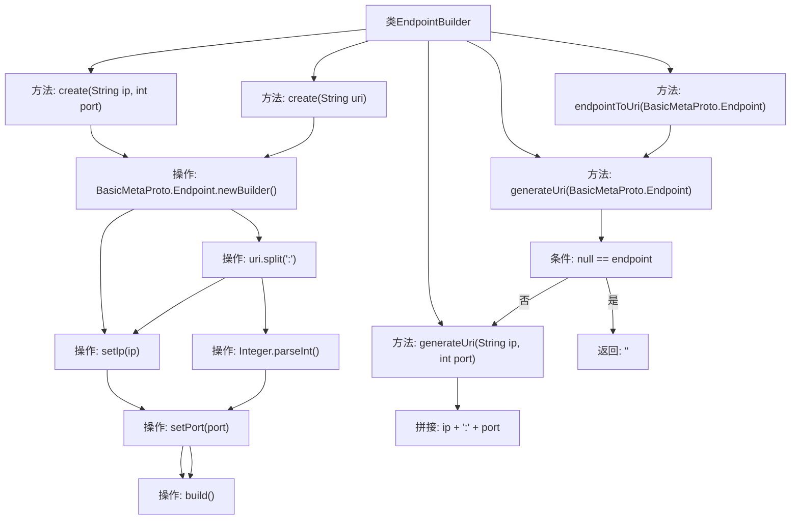

# 基础信息

|      |      |
|------|------|
| 名称 | EndpointBuilder |
| 编码语言 | .java |
| 代码路径 | WeFe/gateway/src/main/java/com/welab/wefe/gateway/common/EndpointBuilder.java |
| 包名 | com.welab.wefe.gateway.common |
| 依赖项 | ['com.welab.wefe.gateway.api.meta.basic.BasicMetaProto'] |
| 概述说明 | EndpointBuilder类提供静态方法创建和转换Endpoint对象，支持IP端口组合或URI字符串输入，并能将Endpoint对象转为URI格式。 |

# 说明

EndpointBuilder类提供了创建和转换网络端点的方法。包含两个静态create方法：一个通过IP和端口直接创建Endpoint对象，另一个通过解析URI字符串创建。提供endpointToUri和generateUri方法将Endpoint对象或IP端口对转换为URI字符串，格式为"IP:端口"。处理空端点时返回空字符串。所有方法均为静态工具方法，不涉及实例化。

# 类列表 Class Summary

| 名称   | 类型  | 说明 |
|-------|------|-------------|
| EndpointBuilder | class | EndpointBuilder类提供创建和转换Endpoint对象的方法，支持IP端口或URI格式输入，并能反向生成URI字符串。 |

## 类 EndpointBuilder

|      |      |
|------|------|
| 访问范围 | public |
| 类型 | class |
| 名称 | EndpointBuilder |
| 说明 | EndpointBuilder类提供创建和转换Endpoint对象的方法，支持IP端口或URI格式输入，并能反向生成URI字符串。 |

### UML类图

这段代码展示了一个端点构建工具类EndpointBuilder，它提供了多种静态方法来创建和转换BasicMetaProto.Endpoint对象。类图清晰地展示了三个核心组件：EndpointBuilder工具类、BasicMetaProto.Endpoint原型类及其内部Builder类。EndpointBuilder通过两种方式创建Endpoint对象（直接参数或URI字符串），并提供双向转换功能（端点对象与URI字符串互转）。整个设计采用构建者模式，通过链式调用设置属性，最后构建不可变对象，体现了良好的封装性和灵活性。

### 内部方法调用关系图

这段代码流程图展示了EndpointBuilder类的核心功能结构。该类提供两种创建Endpoint对象的方式（通过IP/端口或URI字符串），以及将Endpoint转换为URI字符串的方法。关键路径包括：1) 通过Builder模式构造Endpoint对象；2) URI字符串的解析与拼接处理；3) 空值安全校验逻辑。所有方法均为静态工具方法，体现了高内聚的设计原则，特别适合网络端点地址的标准化处理场景。

### 字段列表 Field List

| 名称  | 类型  | 说明 |
|-------|-------|------|

### 方法列表

| 名称  | 类型  | 说明 |
|-------|-------|------|
| create | BasicMetaProto.Endpoint | 静态方法create接收URI字符串，解析IP和端口，构建并返回Endpoint对象。 |
| create | BasicMetaProto.Endpoint | 静态方法创建Endpoint对象，传入IP和端口参数，返回构建的Endpoint实例。 |
| generateUri | String | 生成URI方法：拼接IP和端口为字符串，格式为"IP:端口"。 |
| generateUri | String | 静态方法生成URI，参数为Endpoint对象，若为空返回空字符串，否则调用重载方法传入IP和端口生成URI。 |
| endpointToUri | String | 静态方法将Endpoint对象转换为URI字符串，调用generateUri实现。 |

