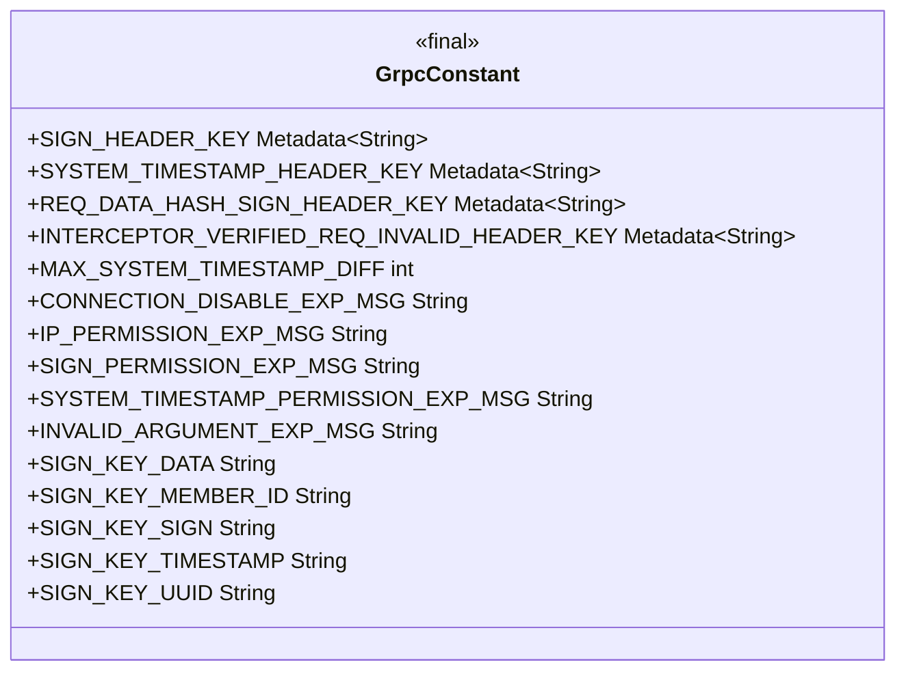

# 基础信息

|      |      |
|------|------|
| 名称 | GrpcConstant |
| 编码语言 | .java |
| 代码路径 | WeFe/gateway/src/main/java/com/welab/wefe/gateway/common/GrpcConstant.java |
| 包名 | com.welab.wefe.gateway.common |
| 依赖项 | ['io.grpc.Metadata'] |
| 概述说明 | GrpcConstant类定义了gRPC请求头常量、异常关键字和签名JSON结构键，包括签名验证、系统时间戳、请求数据哈希等头信息，以及最大时间差限制和各类权限异常提示。 |

# 说明

GrpcConstant类定义了gRPC通信中的常量，包括请求头键名和异常消息关键字。请求头键名涉及签名验证、系统时间戳、请求数据哈希和拦截器验证标识。系统时间戳最大允许差异为300秒。异常消息关键字涵盖连接不可用、IP白名单、签名验证失败、系统时间戳异常和数据篡改等情况。此外还定义了签名JSON结构中的键名，如数据、会员ID、签名、时间戳和UUID等。

# 类列表 Class Summary

| 名称   | 类型  | 说明 |
|-------|------|-------------|
| GrpcConstant | class | GrpcConstant类定义了gRPC请求头常量、异常关键字和签名JSON结构键，包括签名验证、系统时间戳、请求数据哈希等头信息，以及最大时间差和各类权限异常提示。 |

## 类 GrpcConstant

|      |      |
|------|------|
| 访问范围 | public |
| 类型 | class |
| 名称 | GrpcConstant |
| 说明 | GrpcConstant类定义了gRPC请求头常量、异常关键字和签名JSON结构键，包括签名验证、系统时间戳、请求数据哈希等头信息，以及最大时间差和各类权限异常提示。 |

### UML类图

类图描述：GrpcConstant是一个包含gRPC相关常量的工具类，定义了签名验证、系统时间戳、请求数据哈希等元数据键名，以及连接异常、IP白名单、签名验证等异常消息关键字，同时包含签名JSON结构的关键字段名。所有字段均为public static final类型，用于全局访问。

### 内部方法调用关系图

```mermaid
graph TD
    A["类GrpcConstant"]
    B["常量: SIGN_HEADER_KEY"]
    C["常量: SYSTEM_TIMESTAMP_HEADER_KEY"]
    D["常量: REQ_DATA_HASH_SIGN_HEADER_KEY"]
    E["常量: INTERCEPTOR_VERIFIED_REQ_INVALID_HEADER_KEY"]
    F["常量: MAX_SYSTEM_TIMESTAMP_DIFF"]
    G["常量: CONNECTION_DISABLE_EXP_MSG"]
    H["常量: IP_PERMISSION_EXP_MSG"]
    I["常量: SIGN_PERMISSION_EXP_MSG"]
    J["常量: SYSTEM_TIMESTAMP_PERMISSION_EXP_MSG"]
    K["常量: INVALID_ARGUMENT_EXP_MSG"]
    L["常量: SIGN_KEY_DATA"]
    M["常量: SIGN_KEY_MEMBER_ID"]
    N["常量: SIGN_KEY_SIGN"]
    O["常量: SIGN_KEY_TIMESTAMP"]
    P["常量: SIGN_KEY_UUID"]

    A --> B
    A --> C
    A --> D
    A --> E
    A --> F
    A --> G
    A --> H
    A --> I
    A --> J
    A --> K
    A --> L
    A --> M
    A --> N
    A --> O
    A --> P
```

该流程图展示了GrpcConstant类中定义的所有常量及其关系。GrpcConstant是一个包含gRPC相关常量的工具类，主要分为三类：请求头键常量（如签名验证、时间戳等）、异常消息常量（如连接不可用、IP白名单等）和签名JSON结构键常量（如memberId、timestamp等）。这些常量用于统一管理gRPC通信过程中的各种配置和错误消息，确保代码的一致性和可维护性。

### 字段列表 Field List

| 名称  | 类型  | 说明 |
|-------|-------|------|
| CONNECTION_DISABLE_EXP_MSG = "UNAVAILABLE" | String | 静态常量字符串，值为"UNAVAILABLE"，表示连接不可用的错误信息。 |
| SYSTEM_TIMESTAMP_HEADER_KEY = Metadata.Key.of("system_timestamp_header_key", Metadata.ASCII_STRING_MARSHALLER) | Metadata.Key<String> | 定义了一个静态常量SYSTEM_TIMESTAMP_HEADER_KEY，类型为Metadata.Key<String>，用于存储ASCII字符串格式的系统时间戳头键。 |
| MAX_SYSTEM_TIMESTAMP_DIFF = 300 | int | 静态常量MAX_SYSTEM_TIMESTAMP_DIFF值为300，表示系统时间戳最大允许差值。 |
| SIGN_KEY_MEMBER_ID = "memberId" | String | 定义常量SIGN_KEY_MEMBER_ID，值为"memberId"。 |
| INTERCEPTOR_VERIFIED_REQ_INVALID_HEADER_KEY = Metadata.Key.of("interceptor_verify_req_invalid_header_key", Metadata.ASCII_STRING_MARSHALLER) | Metadata.Key<String> | 定义了一个静态常量Metadata.Key，用于标识拦截器验证请求无效头的键，键名为"interceptor_verify_req_invalid_header_key"，使用ASCII字符串编组器。 |
| INVALID_ARGUMENT_EXP_MSG = "INVALID_ARGUMENT" | String | 定义常量字符串，表示无效参数异常消息。 |
| REQ_DATA_HASH_SIGN_HEADER_KEY = Metadata.Key.of("req_data_hash_sign_header_key", Metadata.ASCII_STRING_MARSHALLER) | Metadata.Key<String> | 定义静态常量REQ_DATA_HASH_SIGN_HEADER_KEY，类型为Metadata.Key<String>，用于存储ASCII字符串格式的请求数据哈希签名头键。 |
| SYSTEM_TIMESTAMP_PERMISSION_EXP_MSG = "FAILED_PRECONDITION" | String | 静态常量SYSTEM_TIMESTAMP_PERMISSION_EXP_MSG值为"FAILED_PRECONDITION"，表示系统时间戳权限过期错误。 |
| SIGN_KEY_DATA = "data" | String | 定义静态常量SIGN_KEY_DATA，值为"data"。 |
| SIGN_HEADER_KEY = Metadata.Key.of("sign_header_key", Metadata.ASCII_STRING_MARSHALLER) | Metadata.Key<String> | 定义了一个静态常量SIGN_HEADER_KEY，类型为Metadata.Key<String>，用于表示ASCII字符串的签名头键。 |
| SIGN_PERMISSION_EXP_MSG = "UNAUTHENTICATED" | String | 静态常量SIGN_PERMISSION_EXP_MSG值为"UNAUTHENTICATED"，表示未认证错误信息。 |
| SIGN_KEY_TIMESTAMP = "timestamp" | String | 定义静态常量SIGN_KEY_TIMESTAMP，值为"timestamp"。 |
| SIGN_KEY_SIGN = "sign" | String | 定义静态常量SIGN_KEY_SIGN，值为"sign"。 |
| IP_PERMISSION_EXP_MSG = "PERMISSION_DENIED" | String | 静态常量字符串IP_PERMISSION_EXP_MSG定义为权限拒绝提示信息"PERMISSION_DENIED"。 |
| SIGN_KEY_UUID = "uuid" | String | 定义静态常量SIGN_KEY_UUID，值为"uuid"。 |

### 方法列表

| 名称  | 类型  | 说明 |
|-------|-------|------|

