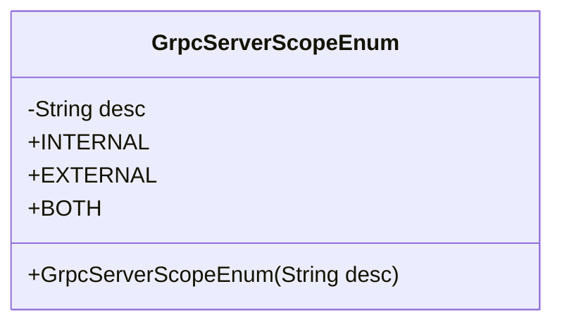
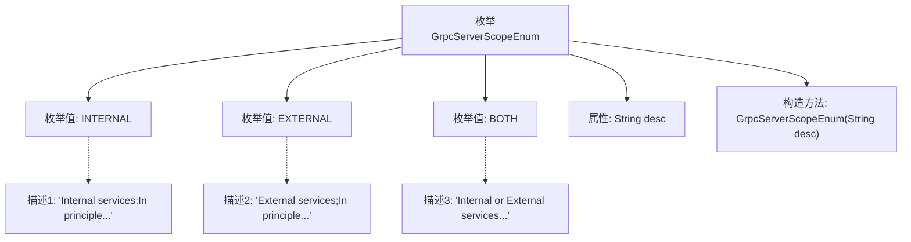

# 基础信息

|      |      |
|------|------|
| 名称 | GrpcServerScopeEnum |
| 编码语言 | .java |
| 代码路径 | WeFe/gateway/src/main/java/com/welab/wefe/gateway/common/GrpcServerScopeEnum.java |
| 包名 | com.welab.wefe.gateway.common |
| 依赖项 | [] |
| 概述说明 | GrpcServerScopeEnum定义了gRPC服务范围：INTERNAL仅内网调用，EXTERNAL供公网调用，BOTH支持内外网调用。 |

# 说明

GrpcServerScopeEnum是一个枚举类型，定义了三种gRPC服务器的服务范围。INTERNAL表示仅供内部网络调用的服务接口；EXTERNAL表示提供给公网调用的服务接口；BOTH表示同时支持内网和外网调用的服务接口。每种枚举值都包含对应的描述信息，用于说明其适用场景和调用原则。

# 类列表 Class Summary

| 名称   | 类型  | 说明 |
|-------|------|-------------|
| GrpcServerScopeEnum | enum | GrpcServerScopeEnum定义了gRPC服务范围：INTERNAL仅内网调用，EXTERNAL仅公网调用，BOTH支持内外网调用。 |

## 类 GrpcServerScopeEnum

|      |      |
|------|------|
| 访问范围 | public |
| 类型 | enum |
| 名称 | GrpcServerScopeEnum |
| 说明 | GrpcServerScopeEnum定义了gRPC服务范围：INTERNAL仅内网调用，EXTERNAL仅公网调用，BOTH支持内外网调用。 |

### UML类图

该代码定义了一个枚举类`GrpcServerScopeEnum`，用于表示gRPC服务器的三种作用域类型：内部服务(INTERNAL)、外部服务(EXTERNAL)和两者皆可(BOTH)。每个枚举值都有一个描述字段desc，通过构造函数初始化。这个枚举类主要用于标识gRPC服务的访问范围，区分仅内网调用、仅公网调用或两者皆可的服务类型。

### 内部方法调用关系图

该流程图展示了GrpcServerScopeEnum枚举的结构，包含三个枚举值(INTERNAL/EXTERNAL/BOTH)及其对应的描述文本，每个枚举值通过构造方法初始化desc属性。枚举通过私有构造器实现描述文本的封装，清晰地划分了gRPC服务的三种网络范围类型（仅内网/仅公网/混合网络）。

### 字段列表 Field List

| 名称  | 类型  | 说明 |
|-------|-------|------|

### 方法列表

| 名称  | 类型  | 说明 |
|-------|-------|------|

